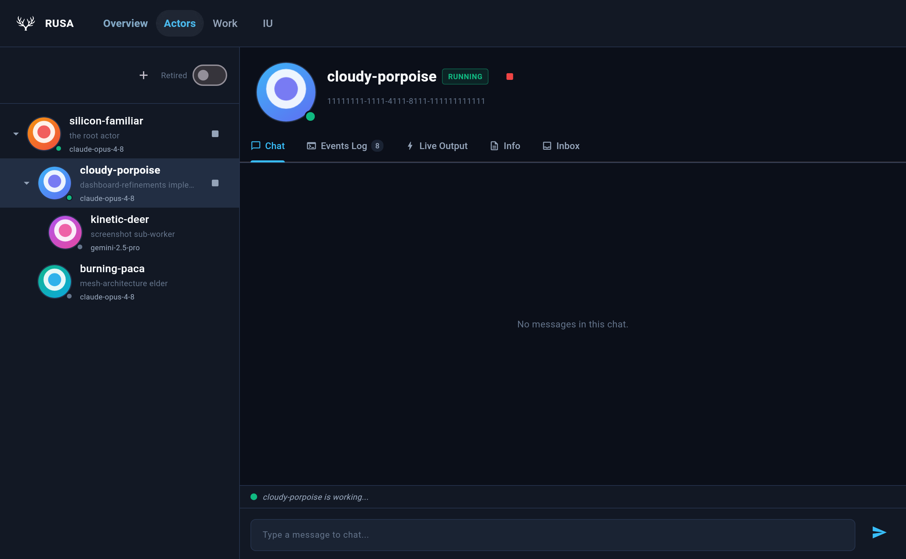

# Rusa

Rusa is an open-source autonomous agent system designed to handle high-level
complex tasks. It integrates with various tools and knowledge sources to provide
a virtual assistant that can do just about anything a human with a computer
could do.



*The dashboard's Actors view, rendered from dummy data by the screenshot
harness in `packages/rusa/flutter_dashboard/test/screenshots_test.dart`.*

- New here? Start with the [Quick Start](docs/quickstart.md): it builds and
  boots a local Docker instance and walks you through provider sign-in.
- Working on the code? Read [`agent.md`](agent.md) and the
  [Getting Started](#getting-started) section below.

## Vision

The vision for Rusa is that it should feel like working with a super-human
colleague. You should be able to interact with it in all of the surfaces that
you would normally with a human (gChat, GitHub, email, etc). You don't create new
separate chats, you just have a DM with them (You can if you want though!). You
don't have to worry about context, the system has enough context from your chats
to determine how to effectively split that up.

## Approach

There's a few different aspects to our approach that I'll break down separately:

- [Actors](#actors)
- [Inbox and Event Sources](#event-sources-and-actor-inboxes)
- [Providers and Models](#providers-and-models)
- [Quota](#quota)
- [Obligations](#obligations)

The [Dashboard](#dashboard) section describes the web UI that sits over all of
these, and [Getting Started](#getting-started) covers running and developing
Rusa.

## Actors

The fundamental building block of Rusa is the agents, which we refer to as
"actors". We intentionally use this word to distinguish it from agents because
they're different from traditional ideas of agents in a few important ways. But
first let's talk generally about what an actor is.

At bottom, an actor is just one continuous thread of conversation with a coding
CLI (Codex, Claude Code, etc) and a workspace. The CLI is invoked in headless
mode and is given a prompt. One "run" is the CLI running to completion and
producing a specific output. The next time the CLI is invoked, the previous
session is reused so the actor maintains its local context across restarts.

The most important difference between traditional ideas of agents and Rusa's
actors is identity. Every actor is given a human-facing handle (by default we
use the actor's UUID to generate a random adjective and animal (e.g.
cloudy-porpoise), and we generate an actor's image to match). We've found that
the typical experience of coding with a CLI can be frustrating because it's easy
to lose track of what part of the code was implemented in which coding session.
By establishing a strong concept of actor identity, you retain the ability to
know which actor implemented which feature and ask it to explain why it went
about something in a specific way.

A Rusa instance starts with a single actor which we refer to as the "root"
actor. As you start to use the system more, you may find certain, well-defined
topics that you are talking to your root actor about. At that point it may be
beneficial to create new actors underneath the root actor so you can keep the
responsibilities of your actors clear and your actors can start to specialize in
a particular domain.

### The actor tree

Actors form a tree. Every actor except the root has a parent, and every actor is
backed by a durable **actor repository record** (charter, parent, provider and
model, session handle, status). That record is the one piece of state that
can't be re-derived from the humans' tools, and it is what lets the mesh
reconstitute "who's working on what" after a restart. See
[`actor-repository.ts`](packages/rusa/src/repositories/actor-repository.ts) and
[`actor-record.ts`](packages/rusa/src/actor/actor-record.ts).

Actors talk to the mesh through an in-process MCP server with the actor's
identity baked in ([`agent-exec-mcp.ts`](packages/rusa/src/mcp/agent-exec-mcp.ts)),
so "who is acting" is the endpoint, never a tool argument the model fills in.
The core primitives:

| Primitive | What it does |
| --- | --- |
| `spawn_thread(charter, model_config, …)` | Create a child actor with its own charter and session. You become its parent. Non-blocking: the child runs asynchronously. `model_config` is required; there is no default model. |
| `send_message(thread_id, body)` | Deliver a message to another actor's inbox (parent, child, or an introduced peer). The recipient wakes on its own schedule and replies later as a new message. |
| `introduce(holder, target, role?)` | Grant one actor a handle to another so they can message directly (for example, let a coder reach a reviewer). The id is the capability. |
| `list_threads()` | List the actors you have spawned, with charter summaries and status. |
| `retire_thread(thread_id)` | Mark a descendant (and its subtree) done and stop it. Only a parent can retire its descendants. |
| `set_actor_model(actor_id, model_config)` | Replace a child's provider/model pool in place (parent or root only). Provider changes and multi-entry pools are only allowed for portable-context actors. |

Two rules keep the mesh safe:

1. **Ownership is a tree; messaging is a graph.** The parent edge decides who can
   retire whom. Messages follow handles, which can reach beyond the parent.
2. **Delegation is asynchronous.** A parent never blocks waiting on a child. It
   sends a message, ends its run, and the reply arrives as a fresh wake.

Per-actor work is serialized by each actor's trigger runner (debounce,
single-flight, dirty bit), and cross-actor capacity is bounded by one shared
[`ConcurrencyLimiter`](packages/rusa/src/actor/concurrency-limiter.ts), so the
whole mesh respects one global concurrency cap however many actors are live.

### Memory

Rusa keeps three tiers of memory, deliberately separated:

| Tier | Mechanism | Persistence |
| --- | --- | --- |
| **Working memory** | each actor's continued, compacting provider session | a losable cache |
| **Long-term memory** | the understanding library (durable judgment and decisions) | durable, authoritative |
| **Facts** | GitHub, Google Chat, and the other event sources | not ours; re-read each wake |

Sessions are reconstructable. The only state Rusa durably owns is the
long-term library, the actor repository, and the obligations described below.

### Scheduling on the host

Recurring actor wakes and obligation recurrence are reconciled into the host's
`cron` and one-shot `at` jobs, and scheduled messages live entirely in the `at`
queue. Host callbacks come back over the loopback MCP HTTP server with a
file-backed bearer token. Cron-backed features need `crontab` and a running
cron daemon; one-shot obligations and scheduled sends additionally need `at`,
`atq`, `atrm`, and `atd`. Startup and the dashboard surface missing
prerequisites without blocking cron-only work.

## Event Sources and Actor Inboxes

So we've described the concept of a "Run" but we haven't discussed the
circumstances under which a run occurs. The system that governs actor runs is
the actor's Inbox. It's really more of a notification system, than an inbox in
the traditional sense. When an item comes into an actor's inbox that enqueues a
run for that actor.

Inbox items can come from several different places, including but not limited:

- GitHub
- gChat
- Mesh Chat (the internal system for actors to message one another)

For example, an actor can be subscribed to the event source:
`github_issue:repo_owner/repo#1233`. If someone comments on that github issue,
the actor will get an inbox item regarding that comment.

Additionally, event sources are hierarchical. This means that an actor can be
subscribed to `github_repo:repo_owner/repo`, or even `github_org:repo_owner`.
Then (for specific events) if there is no actor subscribed to the specific
issue, an actor subscribed to the github_repo would get that inbox item. That
dovetails with the concept of "delegation" which means that if an actor owns a
github_repo event source, they can assign ownership of a child event source,
e.g. a github_issue, to another actor. It's worth calling out that the actor
receiving the event source need not be a direct child or even a descendant of
the delegating actor. In other words, an actor can delegate a child event
source to a sibling or even a parent.

In certain circumstances, an actor can automatically be delegated an event
source, for example, an actor that opens a PR or an issue, is automatically
delegated the corresponding event source.

Pull requests have their own `github_pr:` sources, and Google Chat spaces are
subscribed the same way (`gchat:spaces/…`). Inbox entries are durable: an actor
reads them with the inbox MCP tools, marks them handled when it has acted, and
unhandled entries survive restarts. GitHub events arrive over a webhook
listener; there is no polling fallback. See
[`event-subscriptions.ts`](packages/rusa/src/actor/event-subscriptions.ts) for
the source grammar.

## Providers and Models

The "provider" corresponds with the CLI that is used to run the actor. The
supported providers are Claude Code, Codex, Antigravity, and Kimi. Others may be
added if necessary. Every actor created in the system must explicitly specify
both a provider and a model. The system supports switching models within a
provider, but, by default, it does not support switching providers. The reason
for this relates to the preservation of context. By default, actors' context is
managed by the provider's native session system. When switching models within a
provider, context is preserved, but when switching across a provider, that
context would be lost which violates the expectation of a continuous context
across sessions.

The exception to that rule is with "Portable Context" actors. This is still an
experimental feature (let's be real, this whole project is one big experimental
feature) but it involves the system itself managing the context. This means
that the actor is not relying on the native session storage so it supports
switching providers in addition to models.

In code these are the actor's context modes: `native` (the provider's own
session), and the portable `ledger` and `tail` modes. Only portable actors may
carry a **pool** of `{provider, model, effort?}` entries, tried
earliest-available first, or be moved across providers with `set_actor_model`.

### Named model classes

Spelling out `{provider, model, effort}` at every spawn couples every caller to
specific model slugs. A **model class** gives an operator-chosen name to one
provider/model selection (a single tuple or an ordered pool):

```json
{ "charter": "fix the flaky test in packages/rusa", "model_config": { "class": "coder" } }
```

Classes are managed at runtime by the root actor with `set_model_class`,
`list_model_classes`, and `delete_model_class`; they live in the `model_classes`
table of the mesh database, not in `config.yaml`. A class reference is the whole
`model_config` value (it cannot nest inside a pool or another class), every
entry must name a configured provider and an explicit model, an unknown class is
an error, and a multi-entry class still requires a portable actor. Selection
snapshots the resolved pool onto the actor, so editing a class only affects
later spawns; move an existing actor with `set_actor_model`.

## Quota

One of the core value propositions of the system is that it allows users to
take full advantage of their quota while always remaining available for new
requests. It's obviously trivial to take full advantage of your quota by burning
through your weekly quota in a day.

This aspect is predicated on the idea that it's better for the system to remain
able to make forward progress throughout the whole time so it's preferable for
the system to slow down rather than burn through all of the quota and become
completely unresponsive.

To that end, the system seeks to throttle runs such that quota usage remains
evenly paced throughout the period. The CLIs don't all have a consistent API so
for some of the CLIs we scrape the TUI and have an LLM extract the remaining
quota and the period expiration time.

The dashboard's Overview charts each provider's quota headroom and the current
throttle period. For running several Rusa instances against one set of provider
accounts, see the shared quota coordinator
[design](docs/quota-coordinator-design.md) and
[operations](docs/quota-coordinator-operations.md) docs.

## Obligations

Obligations are the system's way to track who is supposed to do what and to
maintain a well organized and prioritized backlog. Obligations are a
hierarchical system for tracking work and dependencies. Obligations can
correspond with external entities such as GitHub issues or PRs. Obligations are
the latest addition to the system so the system is still being refined but the
intention is that all non-trivial work is tracked in the obligations system.

Each obligation has an owner (an actor, or `human:operator` for questions that
need a person), an optional parent, prerequisites that gate when it becomes
ready, an external reference, attached artifacts, and a checkpoint the owner
keeps current so a fresh run can pick the work back up. Recurring obligations
are scheduled through the host cron/`at` integration described above. Actors
manage them through the obligations MCP tools, and humans see and edit them in
the dashboard's Work view.

## Dashboard

Rusa ships a Flutter web dashboard (`packages/rusa/flutter_dashboard`) served
by the runtime. Its main views:

- **Overview**: your queue of ready obligations, quota pacing charts, and the
  actors running right now.
- **Actors**: the actor tree with each actor's chat, events log, live provider
  output, configuration, and inbox. This is where you DM an actor, spawn a
  child, or change its model.
- **Work**: the obligations forest.

The dashboard can be limited to admitted Google accounts; see
[Dashboard authentication](docs/dashboard-auth.md). The `rusa dashboard`
command opens it against a configured instance's persisted state.

## Getting Started

The fastest way to try Rusa is the containerized
[Quick Start](docs/quickstart.md) (`rusa quickstart`). For a host install, the
runtime needs:

- Node.js 20.19 or newer and pnpm (the workspace pins its pnpm version in
  `package.json`).
- **bubblewrap** (`apt install bubblewrap`): actor runs are sandboxed, and
  `rusa start` fails fast if the host can't sandbox.
- The vendor CLI for each provider you enable, signed in with its own login
  flow. Rusa never stores provider API keys.
- Optionally `cron` and `at` for host scheduling (see above).

### Development

Run from the repo root (pnpm workspace):

```bash
pnpm install          # install workspace dependencies
pnpm build            # build all packages (includes the Flutter dashboard)
pnpm test             # run the test suites
pnpm typecheck        # type-check all packages
pnpm lint             # Biome lint
pnpm format           # Biome format (write)
pnpm cli <args>       # build + run the rusa CLI against a test home
```

Dashboard changes also need the Flutter gates, run inside `packages/rusa`:

```bash
pnpm run analyze:dashboard-ui
pnpm run test:dashboard-ui
```

Key CLI commands (`rusa --help` lists them all): `init` and `configure` for
instance setup, `start` to boot the root actor over the live edge, `dev` for a
watch loop, `status`, `logs`, `dashboard`, `install-service` to run under
systemd, `forward-webhooks` for local GitHub delivery, and the
`quota-coordinator` family.

### End-to-end runner

Because every edge the actors touch is an MCP server, the difference between
production and end-to-end testing is which MCP implementations are wired. The
self-contained runner boots a disposable instance with real providers and fake
GitHub and chat edges:

```bash
pnpm e2e am-up                                  # provision and run a disposable mesh
pnpm e2e am-up --root-driver external           # boot without a root run, for scripted scenarios
pnpm e2e hydrate --scenario dashboard-basic     # seed actors, chat, and an issue into it
pnpm e2e down --root <path>                     # stop it and remove its state
```

## Repository layout

This is a pnpm workspace. The agent itself lives in `packages/rusa`.

```
rusa/
├── packages/rusa/              # the rusa CLI + runtime
│   ├── src/
│   │   ├── actor/              # the mesh core: actors, scheduling, event subscriptions, context modes
│   │   ├── mcp/                # in-process MCP servers over a loopback HTTP endpoint
│   │   ├── providers/          # coding harnesses: claude, codex, antigravity, kimi (+ quota scrapers)
│   │   ├── obligations/        # the obligations model
│   │   ├── quota/              # quota pacing and the shared coordinator
│   │   ├── chat/ github/ email/ calendar/ drive/   # human-facing edges
│   │   ├── webhook/            # GitHub webhook + dashboard HTTP servers
│   │   ├── dashboard/          # dashboard backend
│   │   ├── principals/         # durable identities for actors and admitted users
│   │   ├── db/ repositories/   # SQLite schema, migrations, persistence contracts
│   │   ├── commands/           # CLI subcommands (start, init, quickstart, dashboard, e2e, …)
│   │   ├── e2e/                # self-contained end-to-end runner
│   │   └── understanding/      # long-term memory
│   └── flutter_dashboard/      # the Flutter web dashboard (+ screenshot harness)
├── docs/                       # quickstart, dashboard auth, principals, logging, quota coordinator
└── agent.md / CLAUDE.md        # repo conventions for agents working here
```

The boot path worth reading first is
[`commands/start.ts`](packages/rusa/src/commands/start.ts): it wires the MCP
servers, builds the mesh, creates the root actor, attaches the inbound edges,
and starts the lifecycle loop.

## Contributing

This repo is built largely by Rusa's own actors, so the working conventions
live in [`agent.md`](agent.md): quality gates, PR description requirements,
branch and merge rules, and the hygiene expected in a public repository. Longer
design material lives under [`docs/`](docs/).
