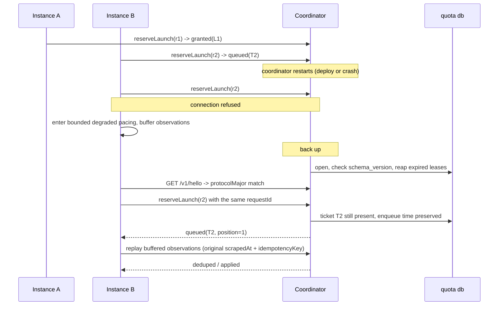

# Shared quota coordinator — design proposal

Design-only proposal for #178. It names a deployment model, states the
service contract, and defines the failure, compatibility and operational
semantics that must hold before any code moves. Nothing here is implemented.
No quota storage, schema, or pacing behaviour changes with this document.

Every source citation below is against `origin/staging` at `49656e2`. Paths are
repository-relative; line numbers are that commit's.

**Revision 2** incorporated review. Six things changed materially, and each is
recorded where it applies: the launch clock is now stamped on confirmation
rather than on grant (§5.5), which also removes the rollback machinery
entirely; multi-pool surface is gone (§5.1); degraded mode is bounded by pool
size and then fails closed (§5.7 — superseded in revision 4, below); old-writer exclusion is a path relocation
rather than a cooperative flag (§8.2); and the claim that centralising parsing
reduces PTY scrapes was wrong and is withdrawn (§3.1).

**Revision 3** settles the topology assumption, which revision 2 had left
conditional. Option 2 is now recommended outright (§4.1) on the evidence in
#237: remote instances are leader-authoritative, so followers execute provider
CLIs but never pace, and the coordinator's client set stays on one host. The
same ruling made the design's job harder in one place, and §8.4 is rewritten for
it — the processes that *consume* the shared account are a strictly larger set
than the processes that pace it, so observation ingestion may not assume a
same-host reporter (A1a). §4.3 keeps the Option 3 trigger, narrowed to a second
*leader* sharing credentials from another host.

**Revision 4** answers three correctness findings against revision 3, and the
answer to each is a narrower claim rather than more machinery. The spacing bound
is restated over *normal* starts only, because a responsive start is by
construction unheld and can land beside an outstanding hold (§5.5). The premise
that a launch cannot begin after its lease has expired is demoted from a fact to
a stated client obligation, with a margin, a detection path and a repair (§5.5,
§6.2) — the coordinator hands out a duration and then sees nothing until the
confirm, so it cannot enforce it. And degraded local pacing is deleted outright:
the bounded formula was aggregate-safe only under a *total* outage and silently
over-launched under a partial one, so a disconnected instance now waits and then
fails closed (§5.7). That deletion removes the `poolInstances` knob and the
reasoning that depended on it; A7 is reused for the assumption the launch
deadline actually rests on.

## Contents

1. [What exists today](#1-what-exists-today)
2. [Assumptions](#2-assumptions)
3. [The three options](#3-the-three-options)
4. [Recommendation](#4-recommendation)
5. [Service contract](#5-service-contract)
6. [Sequences](#6-sequences)
7. [Storage schema](#7-storage-schema)
8. [Compatibility and rollout](#8-compatibility-and-rollout)
9. [Operations](#9-operations)
10. [Test criteria](#10-test-criteria)
11. [Implementation issues this would cut](#11-implementation-issues-this-would-cut)
12. [Open questions](#12-open-questions)

---

## 1. What exists today

### 1.1 Storage is already shared; nothing else is

`quota.databasePath` is the sharing boundary, and it is a plain filesystem path
(`packages/rusa/src/config/types.ts:101-111`). `quota.poolId` was removed
outright, so the file *is* the pool identity today
(`packages/rusa/src/config/loader.ts:299-303`). A database path is mandatory
once pacing is enabled (`loader.ts:314-318`).

Each instance opens that file directly and keeps the connection for its whole
life (`packages/rusa/src/quota/shared-store.ts:182-192`): WAL, a 10 s
`busy_timeout` (`packages/rusa/src/db/wal.ts:4`), foreign keys on.

### 1.2 Observation ingestion is already idempotent — by slot

Observations are keyed `(provider, kind, observed_slot)` where a slot is five
minutes (`shared-store.ts:11`, `:236`). Two instances scraping the same window
inside one slot collapse to one row, and the winner is decided by a stated
rule — a reading with a valid reset beats one without, then later
`observed_at` wins (`shared-store.ts:705-710`). A row already marked
`processed` is never overwritten (`shared-store.ts:704`).

There is no caller-supplied idempotency key and no record of *which* instance
reported a reading. `recordRaw` mints a fresh `randomUUID` per call
(`shared-store.ts:302-303`), so a retried report is a second raw row.

### 1.3 Controller advancement is already atomic across processes

`advancePendingController` runs inside `BEGIN IMMEDIATE`
(`shared-store.ts:394-409`), and so does the ad-hoc column widening
(`shared-store.ts:257-272`). Every unprocessed observation is reasoned about
exactly once across all connections; the PID decision is written back onto the
observation row (`shared-store.ts:527-543`).

This matters for the comparison below: **cross-process atomicity is not the
missing piece.** SQLite already provides it, and the code already uses it.

### 1.4 The launch clock is per-process, and that is the gap

`ProviderPacer` holds `lastStartedAt` and `nextAvailableAt` as instance fields
in memory (`packages/rusa/src/actor/provider-pacer.ts:45-46`), set when a run
actually starts (`:288-290`). One pacer per lane per process, created lazily
(`packages/rusa/src/commands/start.ts:1285-1292`).

What the shared file distributes is the *interval*
(`shared-store.getProviderThrottle` → `recordQuotaThrottleTick` →
`pacer.setInterval`, `start.ts:1335-1358`). What it does not distribute is the
*clock*. Two instances configured against the same `quota.db` both learn
"space normal starts 600 s apart" and then both start a run immediately, because
each one's `nextAvailableAt` is `0` at boot. The effective launch rate is
`N × 1/interval`, not `1/interval`.

That is precisely the "cross-instance throttling is not free" caveat #178 was
filed on. There is no reservation, lease, or ticket concept anywhere in the
tree today — the only occurrences of "reserved" are SQLite's own lock states.

Two further behaviours the design has to preserve rather than invent:

- **The clock is stamped at the actual start.** `start()` sets `lastStartedAt`
  and `nextAvailableAt` at the moment the run really begins
  (`provider-pacer.ts:285-292`), not when the request was admitted. §5.5 keeps
  this property; an earlier revision of this document did not, and was wrong.
- **Responsive runs bypass pacing but still charge the clock.** A responsive
  request skips the queue entirely (`provider-pacer.ts:173-175`) and lands in
  `start()`, which advances the clock like any other start.
- **The lane FIFO is a user-visible surface.** `getQueueSnapshot`
  (`provider-pacer.ts:91-117`) is projected to the dashboard
  (`start.ts:3047-3057`) with an explicit "never fabricate a time" contract
  (`provider-pacer.ts:67-90`).

### 1.5 Probing, parsing and inference are per-instance — and can disagree

`QuotaService` owns a TTL cache in a plain in-memory `Map`
(`packages/rusa/src/mcp/quota-mcp.ts:700`), 5 min for claude/agy/kimi and
30 min for codex (`:768-786`). One service per process
(`start.ts:1118-1124`), shared between the `get_quota` MCP tool and the
dashboard endpoint. So *N* instances run *N* independent PTY scrapes of the
same provider panel — and those scrapes are expensive tmux-driven captures
(`packages/rusa/src/providers/agy-usage-scrape.ts:43-100`).

Parsing is an LLM call, not a regex, gated on `geminiApiKey`
(`quota-mcp.ts:493-540`).

The disagreement risk is concrete, not hypothetical, and it has two independent
mechanisms:

1. **Inference is stateful in client memory.** `inferQuotaState` takes
   `prevState` (`quota-mcp.ts:555`), and production passes the calling
   process's own TTL-cache entry (`quota-mcp.ts:725`, consumed at `:733`).
   Rules like `carried_forward_bad_read` and `assumed_window_starts_now`
   (`quota-mcp.ts:543-554`) therefore resolve differently in two instances that
   happen to hold different previous readings. Two instances can write
   *different canonical observations* from the same provider panel.

2. **Controller state is read through whatever schema the local build knows.**
   `SharedQuotaStore` evolves the shared file's schema itself, on every open, by
   every instance, outside the migration runner — the code says so
   (`shared-store.ts:251-256`). An older build opening a widened file does not
   see the new column; `advanceObservation` reads
   `previous?.controllerIntegral ?? 0` (`shared-store.ts:492`), so a row written
   without an integral reads as a zeroed integral rather than as "unknown". A
   mixed-version pair silently disagrees about pacing.

These are exactly the two concerns raised in #173: backwards-incompatible schema
changes reaching production, and behavioural changes making the systems disagree
about pacing.

### 1.6 Topology as configured

Instances are user-level systemd units. The two environments are `production`
and `staging`, resolving to `~/.rusa` and `~/.rusa-staging` under one user home
(`packages/rusa/src/commands/service-instance.ts:43-49`). Loopback-only binding is
the established posture: the MCP HTTP server defaults to `127.0.0.1`
(`packages/rusa/src/mcp/http-server.ts:165`) and so does the dashboard
(`start.ts:2835`).

Quota lanes exist for four providers — `claude`, `codex`, `agy`, `kimi`
(`start.ts:263`) — keyed by `providerThrottleKey`
(`packages/rusa/src/providers/registry.ts:64-68`), which fans config aliases of
one CLI onto one lane.

The one piece of roadmap that changes this picture is #237, and it changes it
less than it first appears. Its remote instances are leader-authoritative — the
leader keeps records, durable inboxes, prompt assembly, admission, tool
execution, scheduling and accounting, while the follower contributes provider
execution and filesystem work. So a follower adds a host that *runs provider
CLIs* without adding a host that *decides when they start*. That distinction is
what A1 and A1a are built on, and §8.4 is where it stops being free.

---

## 2. Assumptions

Stated so they can be corrected. Each one is load-bearing for the
recommendation, and §4.3 says what changes if it is wrong.

- **A1 — Every coordinator client is on one host, under one user session.**
  Everything that *paces* — that reserves, confirms, and is bound by the lane
  clock — runs on the same host under the same user account, as it does today
  (§1.6). *Confidence: high for today; high for the roadmap as of #237.*

  The scoping is the load-bearing part, and it was sharpened when the topology
  assumption was settled on this proposal. #237's remote instances keep
  admission, scheduling and accounting leader-authoritative and leave followers
  executing provider CLIs only. A follower on another machine therefore never
  calls `reserveLaunch`; its leader does, on the leader's own host. Production
  and staging remain the full set of coordinator clients. §4.3 states what
  would reopen this.
- **A1a — Provider *consumption* is not confined to that host, and this design
  does not change that.** A follower's provider CLI on another machine bills the
  same account (#237), and so does interactive human use on any other machine.
  Neither is reachable by a reservation. The pacing boundary and the observation
  boundary are therefore different sizes. §8.4 is written to that, and explains
  why unpaced consumption has to be *observed* even though it cannot be
  reserved.
- **A2 — Launch rate is low.** Normal starts are spaced by a controller
  interval capped at `maxIntervalSeconds`, default 3600
  (`config/types.ts:96`), and the sensor ticks every `tickSeconds`, default 300
  (`start.ts:3393`). A reservation RPC is therefore a low-rate operation, not a
  hot path. *Confidence: high — read directly from configuration defaults.*
- **A3 — A reservation must survive a client crash.** An instance can die
  between reserving and starting, so reservation state has to be durable and
  self-healing, not in-memory. *Confidence: high.*
- **A4 — Credential sharing, not provider identity, defines a pool.** Two
  instances contend only when the provider would bill the same account. This is
  what `quota.databasePath` already encodes.
- **A5 — Provider scrape collection stays in the instance.** The PTY/tmux/
  sandbox harness works where it is; moving it is a separate, larger change and
  #178 explicitly wants collection separable from pacing. **Consequence: the
  number of PTY scrapes does not change under this design.** See §3.1.
- **A6 — One short, scheduled write-quiesce is acceptable once.** Flipping
  ingestion ownership needs a moment with no instance writing. Seconds, once,
  planned.
- **A7 — A client can bound the delay between deciding to spawn and the
  provider process actually starting.** This is what makes the launch deadline
  (§5.5) enforceable rather than decorative, and it is the weakest link in the
  spacing guarantee: it is an obligation on the client, not a property the
  coordinator can check. *Confidence: medium on one host — the gap is an
  event-loop turn plus process creation, but a loaded host or a slow sandbox
  widens it. Unestablished across a #237 leader-to-follower dispatch, which is
  Q9.*

  An earlier revision used A7 for a different claim — that the operator can
  state a maximum instance count — which existed only to bound the degraded
  pacer that §5.7 has now deleted.

---

## 3. The three options

### Option 1 — Keep the shared SQLite library and path

Add a reservations table to `quota.db` and have every instance take leases
through `BEGIN IMMEDIATE`, exactly as `advancePendingController` already does
(`shared-store.ts:409`).

This *does* close the launch-clock gap. It is the cheapest possible change and
it needs no new process, port, socket, unit, or credential.

It does not close the rest of #178. Four required contract items are
unreachable by construction:

| #178 requirement | Why Option 1 cannot meet it |
| --- | --- |
| "Quota parsing, inference, controller state, and pacing policy should have one owner. Clients should not retain a second implementation that can disagree." | Every client links the implementation. The two disagreement mechanisms in §1.5 remain live. |
| "versioned request/response compatibility" | There are no requests. The only contract is a schema shared by N writers, widened ad hoc on open (`shared-store.ts:251-272`). |
| "server-owned clock semantics" | Each writer stamps with its own `Date.now()`. On one host this is *de facto* satisfied by the shared OS clock; it is not a property of the design. |
| "health/readiness signals" | Nothing is running to be healthy. |

It also cannot express "the coordinator is unavailable" — the file is either
openable or it is not — so the degraded-mode semantics #178 asks for have no
place to live.

### Option 2 — Same-host sidecar over a Unix domain socket

One additional in-repo process (`rusa quota-coordinator`, a fourth
`systemd --user` unit) owns the quota database. It hosts today's
`SharedQuotaStore` and the parse/inference half of today's `QuotaService`, and
serves a small versioned JSON API over a Unix domain socket in the user's
runtime directory. Instances become thin clients: they still collect raw
provider scrapes, and they report that raw text; they never open the database.

Filesystem permissions on the socket are the authentication boundary — the same
trust model the repo already uses for loopback MCP and the dashboard (§1.6),
with a strictly smaller attack surface than a TCP port, since a Unix socket is
not reachable off-host at all.

Costs: a third unit to install, supervise, upgrade and back up; a new failure
mode ("coordinator down") that must have defined behaviour; an IPC hop on a
path that is currently a function call; and one more process holding
`geminiApiKey` (§5.3).

### Option 3 — Networked coordinator

Option 2's contract over TCP, plus: a bind address that is not loopback, TLS or
a tunnel, a shared secret or mTLS, firewall/tailnet policy, clock-skew handling
between hosts, and an availability story for the network path itself.

Everything Option 3 adds is machinery for a hop that does not exist yet (A1).
The request/response contract in §5 is transport-agnostic and carries over
unchanged; what has to be built is the authentication and transport layer, not
a new protocol.

### 3.1 What centralising parse and inference does and does not buy

Centralising parse and inference buys the thing #178 asks for: one owner, one
`prevState`, so the divergence in §1.5(1) becomes structurally impossible. It does **not** reduce the number of PTY
scrapes. A5 leaves collection in every instance and §8.4 keeps today's
in-instance collector working unchanged, so nothing here elects a single
collector or suppresses the other instances' TTL-driven probes. N instances
still scrape N times.

It does not reduce the number of LLM parses either, by default: one parse per
submitted scrape is still N parses per slot. The coordinator *could* skip
parsing when it already holds a canonical observation for that
`(provider, kind, slot)` and return `deduped` — but that trades away the
existing winner rule, which needs both readings parsed in order to prefer the
one with a valid reset (`shared-store.ts:705-710`). That trade is available
later; it is not claimed as a benefit of Option 2 here, and the comparison in
§3.2 is assessed without it.

### 3.2 Comparison

| Dimension | 1 — Shared SQLite | 2 — Same-host sidecar (UDS) | 3 — Networked |
| --- | --- | --- | --- |
| **Deployment** | Nothing new | +1 `systemd --user` unit, same host/user | +1 unit, +transport config, +certs/secret |
| **Operations** | No new supervision | One process to supervise; ordering with instances | Above, plus network policy and cross-host rollout |
| **Compatibility** | N writers all carrying the schema; ad-hoc widening on open | One writer; versioned wire contract; clients carry no schema | Same as 2 |
| **Latency** | In-process SQLite call (µs) | UDS round trip (sub-ms), at ≤ one reservation per interval (A2) | Network RTT plus TLS; still negligible at A2 rates |
| **Availability** | No new dependency; a corrupt or locked file stops everyone anyway | New SPOF; an unreachable coordinator stops normal launching (§5.7) | Same SPOF plus network partitions |
| **Security** | Filesystem ACL on one file | Filesystem ACL on one socket; unreachable off-host; one more holder of `geminiApiKey` | Authn/authz, transport encryption, exposed port |
| **Scrape / parse cost** | N scrapes, N parses | **N scrapes, N parses — unchanged** | Same as 2 |
| **Backup** | One SQLite file, but no single process owns quiescing it | One SQLite file with exactly one writer that can quiesce and `VACUUM INTO` | Same as 2 |
| **Observability** | Per-instance logs; no aggregate view | One place that sees every lane, lease and waiter | Same as 2 |
| **Rollback** | Config revert; but mixed-version writers are the hazard being rolled back *from* | Per-instance for pacing adoption; one flag for ingestion ownership | Same as 2, over more moving parts |
| **Meets #178's contract** | No (4 items unreachable) | Yes | Yes, with unused capability |

---

## 4. Recommendation

### 4.1 Option 2 — the same-host sidecar

**Adopt Option 2.** It is the smallest option that meets the contract #178 asks
for, and the topology assumption it rests on has been settled rather than
assumed: A1 is now high-confidence for the roadmap as well as for today.

An earlier revision of this document made the recommendation conditional,
because choosing a transport whose entire authentication model is *filesystem
permissions* is not something to do on an unverified assumption about where
instances will run. That question has since been decided, on the evidence in
#237: remote instances are leader-authoritative, so the leader keeps admission,
scheduling and accounting, and a follower only executes provider CLIs. Followers
are not coordinator clients and never will be under that design — which leaves
production and staging, on one host under one user, as the complete client set.
A Unix domain socket fits that set exactly.

The condition has therefore collapsed, but it has not disappeared. §4.3 keeps
the trigger that would move this to Option 3, and it is narrower than "more than
one host": it is a second *leader* sharing the same provider credentials from
another host. Nothing on the roadmap proposes that today.

Everything in §5 through §11 remains transport-agnostic — the wire contract,
reservation semantics, storage schema, rollout and tests are unchanged by the
choice; only §5.2's listener and §5.3's authentication depend on it. That is
deliberate, and it is what makes the Option 3 trigger survivable rather than a
rewrite.

Within Option 2, the recommendation is narrow:

- The coordinator is **one in-repo Node process**, not a service platform. It
  reuses `SharedQuotaStore` and the existing parse/infer functions rather than
  reimplementing them.
- It speaks **HTTP/JSON**, so the framing is the one the repo already knows
  (`packages/rusa/src/mcp/http-server.ts`) with the TCP listener swapped for a
  socket path. No new protocol, no new dependency.
- It **does not scrape**. Collection stays in the instance (A5), which satisfies
  #178's separability requirement by construction rather than by promise.

### 4.2 Implementation is staged, and stage 1 is Option 1's table

The reservation tables land in the quota database first, behind the
coordinator, before any instance stops writing directly. That means the
riskiest new logic — atomic grant, lease expiry, waiter ordering — is exercised
against the real file with the real `BEGIN IMMEDIATE` machinery before the
ownership flip, and can be tested with the multi-process harness that already
exists (`packages/rusa/src/quota/shared-store.test.ts:495`). Option 1 is a step
on the path, not a competing destination.

### 4.3 What would change this recommendation

- **A second leader shares these provider credentials from another host** →
  Option 3, and §5.3 must grow a real per-instance credential and transport
  before anything ships. This is the precise trigger, and it is narrower than
  "the mesh spans hosts": #237 already spans hosts without producing a second
  coordinator client, because followers do not pace. What breaks A1 is a second
  *authoritative* process reserving against the same account, not a second
  machine running provider CLIs.
- **A1a stops being tolerable** (unpaced consumption from followers or
  interactive use grows large enough that observation feedback cannot absorb
  it): that is not an argument for Option 3, which would not help. It is an
  argument for extending *reservation* to the follower dispatch path, which is
  a change to #237's admission model rather than to this coordinator's
  topology.
- **A3 is false** (a lost reservation is acceptable): Option 1 plus an
  in-memory advisory lock would do, and this proposal is over-built.
- **A6 is unacceptable** (no write-quiesce is ever schedulable): §8.3's
  ownership flip needs redesign — probably a coordinator that begins as a
  read-through proxy and takes the write lock only when it observes no other
  writer for a full tick. That is more machinery; it is not proposed here.
- **A7 is false** (a client cannot bound its own spawn latency — a stalled
  event loop, a slow sandbox, or a #237 dispatch that carries no deadline of its
  own): the launch deadline in §5.5 stops being enforceable, and the spacing
  guarantee weakens from "holds, given the client obligation" to "holds on
  average, with excursions detected after the fact". Late-confirm repair keeps
  those excursions from compounding, but the bound would have to be restated as
  a statistical one, and criterion 2 would have to be rewritten to match. Q9
  asks who owns this across the follower dispatch.
- **A2 is false** (launch rate stops being low): §5.7's "wait for the
  coordinator, then fail closed" stops being cheap, because a run would be
  waiting through a meaningful share of its own interval rather than a rounding
  error. Bounded local pacing would have to come back — and with it the
  partial-failure problem that deleting it solved, which would then need the
  client registry or heartbeats this design declined to build.

---

## 5. Service contract

Everything below is versioned as **protocol v1**.

### 5.1 One coordinator, one database, one pool

**v1 has no pool identity on the wire.** One coordinator process binds one
socket and owns exactly one quota database, which *is* the pool — the same
thing `quota.databasePath` means today (§1.1), and the reason `quota.poolId`
was removed in the first place (`loader.ts:299-303`).

An earlier revision threaded a `poolId` through every RPC and every new table
so that one process could later serve several credential sets. That was
anticipatory surface, and it was also incoherent: `quota_coordinator_meta` is a
singleton, and the preserved `quota_observations` primary key
(`shared-store.ts:236`) has no pool dimension, so one coordinator over today's
one database could not actually have isolated two pools without the larger
schema change this design is committed to avoiding.

Two credential sets therefore mean two coordinators, two sockets and two
databases — which is what two `quota.databasePath` values mean today. If a
second real pool ever needs to share one process, multiplexing can be added
then, as a protocol-minor addition, with the observation key extended in the
same change.

A **lane** is `providerThrottleKey(provider, config)`, reusing
`registry.ts:64-68` unchanged so config aliases of one CLI keep collapsing onto
one lane, as they do now.

### 5.2 Transport, framing, versioning

- **Transport:** Unix domain socket at `quota.coordinator.socketPath`, default
  `$XDG_RUNTIME_DIR/rusa-quota/coordinator.sock`, mode `0600`, owned by the
  service user. Under Option 3 this is a TCP listener instead; nothing else in
  this section changes.
- **Framing:** HTTP/1.1 + JSON. Paths are prefixed `/v1/`.
- **Handshake:** `GET /v1/hello` → `{ protocolMajor, protocolMinor,
  serverVersion, schemaVersion, databasePath, serverTime }`. Every client calls
  it at startup and after every reconnect.
- **Compatibility rule:** `protocolMajor` must match exactly; a mismatch is a
  hard refusal on both sides with a message naming both versions.
  `protocolMinor` is additive-only — a client ignores response fields it does
  not know, and the server treats absent optional request fields as their
  documented defaults. No field is ever repurposed; removal requires a major
  bump.
- **Schema guard:** the coordinator refuses to open a database whose recorded
  `schema_version` is *newer* than the version it knows, and exits non-zero with
  that message. Note what this does and does not do: it stops a **rolled-back
  coordinator** from writing to a file a newer one has widened. It cannot stop
  a pre-coordinator build, which reads no version at all (§8.2).

### 5.3 Authentication and scope

v1 authenticates by **filesystem permission on the socket**: `0600`, service
user only. There is no token, because on a Unix socket a token would be a second
copy of the same fact.

The coordinator records the peer credentials of each connection (`SO_PEERCRED`)
on lease rows, so an operator can see which process holds what.

**Key exposure moves in the wrong direction, and should be stated plainly.**
The coordinator must hold `geminiApiKey` in order to parse
(`quota-mcp.ts:493-540`). Instances cannot drop it in exchange, because they
use the same key for unrelated features — dashboard avatar generation
(`packages/rusa/src/dashboard/api.ts:767-777`), ledger compaction
(`config/loader.ts:588`) and voice (`config/types.ts:385`). So the number of
processes holding the key goes from N to N+1, and the coordinator additionally
aggregates raw provider panel text from every instance, which today never
leaves the instance that scraped it. Both are same-user processes on one host,
so this is a concentration-of-blast-radius change rather than a new trust
boundary — but it is a real cost of Option 2 and it is counted as one in §3.2.

Under Option 3 this section is what grows: a per-instance shared secret in
config, presented as a bearer credential, over TLS or an existing private
tunnel — never an unauthenticated bind.

### 5.4 Clock

**The coordinator's clock is the only clock.** Every timestamp that participates
in a decision — start time, lease expiry, lane availability, staleness — is
stamped by the coordinator. Clients send `scrapedAt` for observations (because
only the client knows when its scrape ran) and the coordinator records both that
and its own `receivedAt`.

Clients never compare their own `Date.now()` to a coordinator timestamp. Waits
are expressed by the coordinator as **durations** (`retryAfterMs`,
`leaseTtlMs`), never as absolute instants, so client clock skew cannot make a
client start early. Absolute instants appear only in read-only display fields,
alongside `serverTime`, so the dashboard can render them honestly.

### 5.5 Operations

#### `POST /v1/observations`

Ingests raw provider evidence. The coordinator parses and infers; the client
does neither.

```jsonc
{
  "source": "rusa-staging",           // stable instance id, recorded on the row
  "provider": "claude",
  "scrapedAt": "2026-09-05T16:00:00.000Z",  // client's real scrape instant
  "rawOutput": "...",                 // the captured panel text
  "idempotencyKey": "..."             // caller-minted, stable across retries
}
```

Response: `{ "result": "applied" | "deduped" | "rejected", "observations": [...],
"reason": "..." }`.

- `idempotencyKey` is stored and unique per provider. A replay returns the
  *original* result without re-parsing — this is what makes the degraded-mode
  replay buffer (§5.7) safe, and it costs no LLM call.
- Beneath that, today's slot dedupe is retained unchanged: canonical rows stay
  keyed `(provider, kind, observed_slot)` with the existing winner rule
  (`shared-store.ts:236`, `:705-710`).
- `source` is new and is recorded. Today nothing knows which instance produced a
  reading; the coordinator will.
- **The coordinator holds the single `prevState`** used by `inferQuotaState`, so
  the divergence in §1.5(1) becomes structurally impossible. This is the whole
  point of the endpoint.

#### `GET /v1/snapshot?provider=`

Current quota/pacing snapshot. Returns today's `PersistedQuotaProviderStatus`
shape (`shared-store.ts:118`) plus freshness:

```jsonc
{
  "provider": "claude",
  "intervalSeconds": 612.4,
  "uncappedIntervalSeconds": 900.1,
  "governingBucketKey": "claude:weekly",
  "capped": true,
  "expired": false,
  "exhaustedUntil": null,
  "updatedAt": "...",
  "buckets": [ /* unchanged */ ],
  "freshness": { "observedAt": "...", "ageMs": 240000, "stale": false, "hardStale": false },
  "serverTime": "..."
}
```

Read-only and cheap; safe for the dashboard's stale-while-revalidate path, which
already refuses to probe in the request path (`start.ts:3087-3094`).

#### The reservation lifecycle

A grant is an **exclusive hold on a lane**, not a clock advance. The lane clock
is stamped when the launch is *confirmed*, using coordinator time.

This is the correction that matters most in this revision. Advancing the clock
at grant time does not bound the spacing between *actual* starts: a client
granted at `t=0` may not spawn until its lease is nearly expired, while the
next client becomes grantable at `t=interval` and spawns immediately, so two
real provider starts can land far closer together than one interval. Stamping
on confirmation is both simpler and correct, and it mirrors what the in-process
pacer already does (`provider-pacer.ts:285-292`, §1.4).

While a hold is live, **no other grant is issued for that lane.** At most one
unconfirmed launch exists per lane at a time, which is what keeps the reasoning
short.

#### The launch deadline

A hold bounds *permission*, and permission is only useful if the launch it
authorises happens while that permission is still live. The coordinator cannot
enforce this: it hands out a duration and then sees nothing at all until
`confirmLaunch`. The rule therefore has to sit in the client, and this design
states it as an obligation rather than assuming it as a fact.

**The obligation.** A client records a monotonic timestamp when it *sends* each
`reserveLaunch` attempt, and on the attempt that comes back `granted` it derives
its deadline from that send — not from when the response arrived:

```
deadline = monotonicNow(at send) + leaseTtlMs - spawnMarginMs
```

Anchoring at send is what makes it conservative. The coordinator stamps
`expires_at` when the grant commits, which is strictly after the send, so a
send-anchored deadline always falls before the server's expiry. Request latency,
a delayed response and a scheduler stall between send and receive are absorbed
rather than ignored, and because it is a monotonic reading rather than a wall
clock it survives an NTP step. `spawnMarginMs` covers the last stretch: the
client refuses to spawn unless the remaining time exceeds it, and re-reserves
instead.

**What it does not do.** Checking a deadline and calling `spawn` are two
operations, and nothing makes them one. A client that passes the check and then
stalls — a garbage-collection pause, a loaded host, a slow sandbox — starts the
provider late anyway. `spawnMarginMs` makes that improbable; it does not make it
impossible, and no claim below assumes an atomic check-and-spawn. A7 names the
assumption so it can be argued with; §4.3 says what follows if it is wrong.

**Detection and repair, because prevention is incomplete.** A confirm carries
the fact that a provider started, so the coordinator can always compare its
arrival against `expires_at`. A confirm arriving after expiry is accepted,
counted as a **late confirm**, and used to move the lane clock forward from the
real start rather than being refused. The excursion is then bounded by the
client's overshoot and does not compound into the next interval. A client that
starts late *and* then dies leaves nothing to detect; that is the residual, and
it is the same residual the crash case in §6.2 already carries.

**Across a #237 dispatch the deadline has to travel.** Under leader-authoritative
remote instances the leader holds the lease and the *follower* spawns the
provider, so the deadline has to be enforced where the spawn happens, not where
the reservation lives: the leader would send a remaining duration with the
dispatch, and the follower would refuse to start once it had elapsed. No such
field exists in that dispatch today, and this proposal does not design one —
Q9 asks who should. Until it does, A7 is unestablished for any launch that
crosses a follower connection.

**Considered and rejected: a pre-spawn authorization call.** An extra
`authorizeSpawn` immediately before `spawn` would shrink the window to one round
trip plus spawn latency, but it cannot close it, for exactly the reason above —
the authorization and the process creation are still two operations. It would
add an RPC to the launch path and buy a smaller copy of the same residual. The
deadline stays client-side and the repair path carries the remainder.

#### `POST /v1/reserveLaunch`

```jsonc
{
  "source": "rusa-staging",
  "lane": "claude",
  "threadId": "...",         // for observability and the lane FIFO view
  "requestId": "...",        // caller-minted uuid; the idempotency key
  "mode": "normal"
}
```

Response is one of:

```jsonc
{ "status": "granted", "leaseId": "...", "leaseTtlMs": 120000 }
{ "status": "queued",  "ticketId": "...", "position": 1, "retryAfterMs": 30000 }
{ "status": "expired", "leaseId": "...", "retryAfterMs": 0 }
```

Semantics:

- A grant is one `BEGIN IMMEDIATE` transaction that, together: verifies no hold
  is live on the lane; verifies the ticket is the oldest waiter; verifies
  `now >= max(next_available_at, blocked_until)`; and writes a lease row with
  `state = 'granted'` and `expires_at = now + leaseTtlMs`. **It does not touch
  `next_available_at`.** Either all of it happens or none does — the same
  concurrency primitive the controller already relies on
  (`shared-store.ts:409`).
- **Ordering is FIFO by coordinator-stamped enqueue time**, ties broken by
  `ticketId`. Deterministic, and it generalises the per-process FIFO
  (`provider-pacer.ts:91-117`) to the pool.
- **`requestId` makes the call idempotent.** A retry after a lost response
  returns the same ticket or the same lease — never a second lease. This is the
  difference between an at-least-once transport and a double-spent allowance.
  Two details of that retry matter for the deadline above. A retry that finds a
  live lease returns its **remaining** TTL, never a fresh one, so a client
  cannot extend a hold by retrying into it. A retry that finds the lease already
  reaped returns `status: "expired"` rather than resurrecting it: the ambiguity
  resolves toward *you hold no permission*, the client must not spawn, and it
  re-reserves under a new `requestId`. A lost response and a silent one are
  therefore the same case, and both resolve conservatively.
- **Where it sits in the launch path:** the client reserves *after* clearing its
  own mesh concurrency limiter and immediately before spawning the provider.
  That inverts today's order (pacer first, then mesh queue —
  `provider-pacer.ts:238-269`), and it is deliberate: it makes the hold
  short-lived, so a crashed client parks the lane for seconds rather than for a
  whole run. The cost is that cross-instance fairness is decided at the
  coordinator rather than at submission time; §12 Q4 asks whether that is
  acceptable.

#### `POST /v1/confirmLaunch`

`{ leaseId }`. **The provider process has actually started.** A confirmation is
an assertion of fact, not a request for permission — permission was the grant —
so the coordinator always records it. In one transaction it sets
`last_started_at = now`, advances the lane clock **monotonically**

```
next_available_at = max(next_available_at, now + interval_ms)
```

and closes the lease, releasing the hold. `now` is coordinator time (§5.4).

The `max` is not decoration. It is what stops a confirmation that arrives after
something else has already moved the lane — a responsive start, or the lease's
own expiry — from pulling the clock backwards and handing out an early grant.
Every path that stamps this clock uses the same monotonic form.

The response reports what the coordinator found, so the client learns something
it had no way to know locally:

| Confirm arrives | `outcome` | Clock | Meaning |
| --- | --- | --- | --- |
| hold still live | `confirmed` | advanced from `now` | the normal path |
| after `expires_at` | `late` | advanced from `now`, monotonically | the launch deadline was missed (§5.5) |
| after a responsive start took the lane | `invalidated` | advanced from `now`, monotonically | the lane was charged while the hold was outstanding |

`late` and `invalidated` are counted and alertable (§9.3); a rising `late` rate
is the signal that A7 is breaking down. Neither is an error returned to the
client, because the provider is already running and declining to record a real
start would be strictly worse than recording it.

Idempotent by `leaseId`: a repeated confirm returns the first result and does
not advance the clock twice.

#### `POST /v1/cancelLaunch`

`{ leaseId }`. The client decided not to start — a stale provider re-gate
(`RunStartStaleProviderError`, `provider-pacer.ts:253-258`) or a cancellation.
The lease closes as `cancelled` and the hold is released. **The lane clock is
not touched, because the grant never touched it**, so there is nothing to roll
back and no pre-grant value to store.

This is the second benefit of stamping on confirmation: the compare-and-set
rollback, the `granted_lane_version` column, and the "which value do we
restore" problem all disappear rather than being solved.

A cancel is a client asserting that no provider was spawned, and it is trusted
as such. A client that spawns and then cancels has lied to the pool; that is a
client bug, and it is the only way to defeat the spacing bound below by
assertion rather than by timing.

Cancelling a lease that has already expired or been invalidated is a no-op that
returns the settled outcome. There is still nothing to roll back, and the client
learns it should have re-reserved.

#### `POST /v1/renewLaunch`

`{ leaseId }` → `{ leaseTtlMs }`. For a client whose spawn is legitimately slow.
Bounded: renewable until `maxLeaseMs` (default 600 s) from the original grant,
then it expires regardless. Renewal no longer affects spacing — the clock is
stamped at the real start either way — so its only job is to stop a slow-but-
healthy spawn from being treated as a crash.

A renewal moves `expires_at`, so the client recomputes its launch deadline from
the send of the *renew*, by the same rule and for the same reason. A renewal
that fails or is lost leaves the earlier deadline standing, which is the
conservative direction.

#### `POST /v1/recordLaunch`

`{ source, lane, threadId, requestId }`. **The responsive path.** A responsive
run never queues and is never held; it reports that it has started, and the
coordinator stamps `last_started_at` and advances the lane clock monotonically,
exactly as `confirmLaunch` does. This mirrors today's behaviour, where a
responsive request skips the queue (`provider-pacer.ts:173-175`) but still
charges the lane clock (`:285-292`). Idempotent by `requestId`.

Because it is unheld, a responsive start can land while a normal hold is
outstanding. When it does, the coordinator marks that hold `invalidated` in the
same transaction, and the holder finds out on its next call: a client that has
not yet spawned sees the invalidation on its pre-spawn check and re-reserves
rather than starting; a client that has already spawned confirms and gets
`outcome: "invalidated"`, with its real start recorded either way.

That narrows the window; it does not close it. The holder may already be inside
`spawn`, which is the same non-atomicity as the launch deadline above. What
follows for the guarantee is stated below rather than papered over.

#### Expiry

A lease past `expires_at` is reaped by the coordinator (lazily on the next call
touching the lane, and by a sweep every `leaseSweepMs`). On expiry the lease
closes with `outcome: "expired"`, the hold is released, and:

```
next_available_at = max(next_available_at, expires_at + interval_ms)
```

The clock advances **as if the launch had happened at the last possible
instant**, and monotonically, so a reap can never pull the lane backwards past a
start that has already been recorded. That asymmetry with `cancelLaunch` is deliberate: a cancel is a
client *telling* us it did not start; an expiry is silence, and silence is
compatible with "the client spawned the provider and then died". Advancing from
`expires_at` rather than from `granted_at` is what removes the crash case from
the spacing argument below — given the launch deadline, which is what makes
`expires_at` an upper bound on the real start rather than a guess.

The cost is bounded and easy to state: a crash between grant and spawn leaves
the lane idle for up to `leaseTtlMs` longer than necessary. `leaseTtlMs` is
therefore the tuning knob for "what a crash costs", which is a property worth
having explicitly. **Prefer idle to double-spent.**

#### What the spacing bound covers, and what it does not

The guarantee is narrower than an earlier revision claimed. It is stated in
three parts because the three parts have genuinely different strengths, and
collapsing them into one table is what produced the wrong claim.

**Guaranteed, by the schema.** At most one hold exists on a lane at a time. That
is the partial unique index in §7, not handler logic, so no argument about
ordering or interleaving can defeat it.

**Guaranteed for normal starts, given the client obligation.** For any two
consecutive *normal* starts on a lane, the second is at least `interval_ms`
after the first, provided each client honours the launch deadline (A7, above).
By case:

| First normal launch settles by | Clock set to | Actual first start | Spacing to the next normal start |
| --- | --- | --- | --- |
| `confirmLaunch` at `c` | `max(prev, c + interval)` | `c` | ≥ `interval` |
| expiry at `e` | `max(prev, e + interval)` | in `[g, e]`, by A7 | ≥ `interval` |
| `cancelLaunch` | untouched | none occurred | n/a |

Exclusivity is what keeps this to three rows: no second grant exists during any
settlement window, so there is no fourth case among normal launches.

**Not guaranteed: any pair involving a responsive start.** A responsive start is
by construction unqueued and unheld — that is precisely what "an operator's
urgent wake must not depend on a sidecar" costs. It can therefore occur at any
instant, including while a normal hold is outstanding, and the exclusivity index
does not prevent it because there is no second *grant* to prevent: the start
simply happens and is reported. So a responsive start and a normal start can
land arbitrarily close together.

What *is* guaranteed is narrower than "everything after it waits", and the
difference is worth being exact about. A responsive start charges the lane like
any other — it stamps the clock, monotonically — so every normal start **granted
after** it is a full interval behind it.

The normal start that is *not* is the holder whose lease the responsive start
invalidated and which was already inside `spawn`. It received its grant before
the responsive launch existed and cannot be recalled, so it can begin at any
moment, including immediately. The invalidation stops such a holder in every case
where it can still be stopped — anything short of an in-flight spawn — and
because holds are exclusive there is **at most one** of them. So the exception is
one start per responsive launch, not a class of them, and it is the same
non-atomicity the launch deadline already leaves rather than a second hole.

This is not a regression against today. Responsive runs already skip the pacer's
queue (`provider-pacer.ts:173-175`) while still charging the clock (`:285-292`),
so the pool has never spaced them. What was wrong was the claim: listing
`recordLaunch` as a fourth compositional row implied an all-starts invariant the
design does not have and cannot have while responsive runs stay unblocked. The
exception is now explicit, its effect on other traffic is bounded, and the
policy question goes to §12 Q3 rather than being answered by a table.

**Residual: a start that happens after its deadline.** Detected on confirm and
repaired forward (above); invisible if the client also dies before confirming
(§6.2). The excursion is bounded by the client's overshoot and does not
propagate to the next interval.

The cost of exclusivity is unchanged: a lane's effective period is
`interval + spawn latency` rather than `interval`; at A2 rates (spawn seconds,
interval hundreds of seconds) that is noise.

#### `GET /v1/lanes`

Read-only lane state and waiter list, for the dashboard's queue view. Mirrors
`getQueueSnapshot`'s contract (`provider-pacer.ts:67-90`) including its "render
`null` as unknown, never fabricate a time" rule.

#### `GET /v1/healthz` and `GET /v1/readyz`

- `healthz`: process alive, database open and writable. 200/503.
- `readyz`: schema version matches, meta row readable, and either at least one
  observation newer than `hardStaleAfterMs` **or** an explicit `"cold": true`.
  A cold coordinator is ready-but-cold, not ready-and-lying.

### 5.6 Errors and deterministic conflict handling

One error envelope: `{ "error": { "code": "...", "message": "...", "retryable": bool } }`.

| Code | Meaning | Client action |
| --- | --- | --- |
| `protocol_mismatch` | `protocolMajor` differs | Fail normal launches closed at once (§5.7); log loudly |
| `lane_unknown` | Lane not configured | Refuse |
| `lease_not_found` | Confirm/cancel/renew on a `leaseId` the coordinator has never held | Do not retry; do not spawn |
| `lease_expired` | Renew after `maxLeaseMs` | Re-reserve; the deadline has passed |
| `stale_snapshot` | Read while hard-stale and caller demanded fresh | Proceed at `maxIntervalSeconds` |
| `busy` | Write contention beyond `busy_timeout` | Retry with jittered backoff |

Note what is deliberately **not** in this table: confirming a lease that has
already expired is not an error. Settled leases are retained for seven days
(§9.4), so the coordinator still knows the lease and records the start as a late
confirm (§5.5). `lease_not_found` is reserved for an identifier the coordinator
has genuinely never seen — a client bug or a database that has been replaced —
and only then is refusing the right answer.

Every mutating call is safe to retry, because every mutating call carries a
caller-minted idempotency key (`idempotencyKey` for observations, `requestId`
for reservations and responsive records, `leaseId` for the lease lifecycle).

### 5.7 When the coordinator is unavailable or stale

**Stale** — the coordinator has the data but it is old:

- `stale` at `now - observedAt > staleAfterMs` (default `3 × tickSeconds` = 900 s):
  keep serving the last reasoned interval. This matches today's stated behaviour
  on a failed scrape — "keep the last persisted reasoned interval"
  (`start.ts:1380`) — and the snapshot says `stale: true` so the dashboard
  can show it.
- `hardStale` at `now - observedAt > hardStaleAfterMs` (default 3600 s): grants
  are spaced at `maxIntervalSeconds` rather than at the last reasoned interval.
  **The degradation is always toward slower, never faster.**

**Unavailable** — the socket is gone, the connection fails, or the handshake is
refused. Two earlier revisions got this wrong in opposite directions, and the
second failure is the more instructive one.

The first proposed indefinite local fail-slow at `maxIntervalSeconds` per
instance, justified by comparison with today's uncoordinated behaviour — the
wrong baseline, because the promise being made is the *pool's* lane rate, and N
instances each pacing themselves at interval `D` aggregate to `N/D`.

The second replaced that with a bounded local pacer,

```
degradedIntervalSeconds = poolInstances × max(lastKnownIntervalSeconds, maxIntervalSeconds)
```

which is aggregate-safe **only if every instance is disconnected at once and the
coordinator is granting nothing.** That is the total-outage case, and it was the
only case the formula was checked against. Under a *partial* failure — one
instance refused at `hello` on a protocol-major mismatch, or unable to open the
socket for a permission reason, while the coordinator serves everyone else — the
connected clients keep consuming the full `1/interval` lane rate and the
disconnected one adds `1/(poolInstances × interval)` on top. The pool exceeds the
rate it promises, with a correct instance count and a correctly implemented
formula. The formula was answering a question the client cannot ask: *is anyone
else still getting grants?*

Rather than build the machinery that would let it ask — a client registry,
heartbeats, lane capacity reserved for the absent — this revision deletes the
degraded pacer. **A client with no grant does not start a normal run.** That is
provable under every failure mode, partial or total, precisely because it never
depends on knowing what the rest of the pool is doing.

What makes the deletion affordable is A2. The lane interval is hundreds to
thousands of seconds; a coordinator restart during an ordinary upgrade (§8.3)
takes seconds. A run that waits out a restart has lost a rounding error of its
own interval. The restart case never needed local launching — it needed the run
not to *fail*. So:

1. **Wait; do not launch.** A disconnected instance retries the connection with
   backoff and defers normal starts meanwhile, reusing the deferral the pacer
   already has (`provider-pacer.ts:149`). Nothing starts, so nothing can be
   over-rate. This is the whole of the restart story, and it replaces a formula
   with an absence.
2. **A refusal is not an outage, and fails closed at once.** If the coordinator
   answers and rejects the client — protocol-major mismatch, failed
   authentication, a socket this instance may not open — then it is up and
   serving others, there is no restart to wait out, and waiting would only delay
   an inevitable failure. Normal runs fail immediately, carrying the refusal
   reason. This is exactly the partial failure the old formula mishandled, and
   it is now the one case the client *can* diagnose from its own vantage point.
3. **Then fail closed on silence too.** After `unavailableGraceSeconds` with no
   successful handshake, the instance stops deferring and starts failing normal
   runs, and says so in its health output and in chat. The window is sized to a
   restart (300 s by default), not to an outage: past it, a growing queue of
   silently deferred runs is worse than a loud refusal. Q5 asks how long it
   should be.
4. **Responsive launches are never blocked**, in any state. An operator's
   urgent wake must not depend on a sidecar. This is a deliberate, stated
   exposure rather than a bounded one: responsive runs are human-initiated and
   rate-limited by the human, and the alternative — an operator unable to wake
   the system because a sidecar is down — is worse. It is Q3 in §12, and after
   this revision it is the *only* path by which a provider start can occur with
   no coordinator involvement at all.
5. **The client never writes to the quota database.** Not while disconnected,
   not ever, once ownership has flipped (§8.2). This is the rule that makes
   "avoid concurrent old/new writers" enforceable rather than aspirational.
6. Observations are **buffered in memory** — a bounded ring, default 200 entries
   per provider, oldest dropped — and replayed on reconnect with their original
   `scrapedAt` and `idempotencyKey`. Slot dedupe plus the idempotency key make
   replay exactly-once in effect. Collection is untouched by disconnection: an
   instance that may not launch can still watch, which is the separability §8.4
   argues for, arriving as a side effect.

The `poolInstances` configuration disappears with the pacer it existed to bound,
and so does the earlier form of A7. The trade is deliberate and worth naming: a
total coordinator outage now stops normal launching after five minutes where the
previous design would have kept launching slowly. That is availability traded for
a guarantee that holds in cases the previous design did not survive.

---

## 6. Sequences

### 6.1 Simultaneous launch requests from two instances

```mermaid
sequenceDiagram
    participant A as Instance A
    participant B as Instance B
    participant C as Coordinator
    participant D as quota db

    Note over A,B: both cleared their own mesh concurrency limiter
    A->>C: reserveLaunch(lane=claude, requestId=r1)
    B->>C: reserveLaunch(lane=claude, requestId=r2)
    C->>D: BEGIN IMMEDIATE (r1)
    Note over C,D: no hold live; now at or past next_available_at
    D-->>C: lease L1 granted, expires_at = now+120s
    Note over C,D: next_available_at deliberately NOT advanced
    C-->>A: granted(L1, leaseTtlMs=120000)
    C->>D: BEGIN IMMEDIATE (r2)
    Note over C,D: hold L1 is live on this lane
    D-->>C: ticket T2 enqueued
    C-->>B: queued(T2, position=1)
    A->>A: spawn provider (takes 4s)
    A->>C: confirmLaunch(L1)
    Note over C,D: last_started_at = now; next_available_at = now + 600s; hold released
    B->>C: reserveLaunch(requestId=r2) again (retry, same id)
    C-->>B: queued(T2, position=1, retryAfterMs=~600000)
    Note over B: same ticket, never a second one
    Note over B: ... the interval elapses ...
    B->>C: reserveLaunch(requestId=r2)
    C->>D: BEGIN IMMEDIATE (r2)
    D-->>C: lease L2 granted
    C-->>B: granted(L2)
    B->>C: confirmLaunch(L2)
    Note over C: B's real start is >= 600s after A's real start
```

**Invariant proved:** the clock is stamped from the *actual* start on both
sides, so the gap between two real provider starts is at least `interval_ms`.
The spawn latency between grant and confirm sits inside the interval rather than
being spent from it.

### 6.2 Client crash after reservation

```mermaid
sequenceDiagram
    participant A as Instance A
    participant C as Coordinator
    participant D as quota db

    A->>C: reserveLaunch(r1)
    C->>D: lease L1 granted, expires_at = now+120s; clock untouched
    C-->>A: granted(L1)
    Note over A: process dies - may or may not have spawned
    Note over C: t = expires_at, sweep
    C->>D: lease L1 -> "expired"; hold released
    C->>D: next_available_at = max(next_available_at, expires_at + interval_ms)
    Note over C,D: advanced as if the launch happened at the last possible instant
    Note over C: normal spacing holds if A honoured its launch deadline
    Note over C: cost is bounded - at most leaseTtlMs of extra idleness
    C->>C: metric quota_coordinator_leases_expired_total{lane} += 1
```

The two crash windows, stated explicitly:

- **Crashed before spawning.** The lane is idle for up to `leaseTtlMs` longer
  than it needed to be. This is the price of not being told.
- **Crashed after spawning, before confirming.** The real start lies in
  `[granted_at, expires_at]` **if A honoured its launch deadline** (§5.5). The
  clock advances from `expires_at`, so the next normal start is at least
  `interval_ms` after the real one, and no allowance is double-spent.
- **Crashed after spawning *late*.** The premise in the previous bullet is a
  client obligation (A7), not something the coordinator can check, and a client
  that both overran its deadline and died leaves no confirm to detect it with.
  This is the one window the design cannot see. Its cost is the overshoot alone:
  the clock still advances a full interval from `expires_at`, so the error does
  not propagate past the next start. A client that overruns and *survives* is
  visible, because its confirm arrives late and is counted (§5.5).

Recovery: once A restarts it simply reserves again with a fresh `requestId`. It
inherits no state and needs none.

### 6.3 Stale observations

```mermaid
sequenceDiagram
    participant A as Instance A
    participant C as Coordinator

    Note over A: scrape fails (PTY timeout / provider panel unreadable)
    A->>C: (no observation reported)
    A->>C: reserveLaunch(r1)
    Note over C: age = 1000s > staleAfterMs (900s)
    C-->>A: granted, using the last reasoned interval; snapshot.stale = true
    Note over A,C: ... scrapes keep failing ...
    A->>C: reserveLaunch(r2)
    Note over C: age = 4000s > hardStaleAfterMs (3600s)
    C-->>A: granted, spacing at maxIntervalSeconds; snapshot.hardStale = true
    C->>C: metric quota_coordinator_snapshot_age_seconds{provider} = 4000
```

Degradation is monotone toward slower. A stale snapshot never speeds anything up.

### 6.4 Coordinator restart



**Invariant:** waiter order survives a restart, because tickets are rows and
their enqueue time is coordinator-stamped, not connection state. Holds survive
too; only their expiry timer is re-derived, from `expires_at`. A restart that
outlasts a hold's TTL settles it as an expiry, which is the conservative case
above — the restart itself can therefore cost at most one extra interval per
lane, never a double spend.

### 6.5 Transport failure

```mermaid
sequenceDiagram
    participant A as Instance A
    participant C as Coordinator

    A->>C: reserveLaunch(r1)
    Note over A,C: response lost in flight (socket reset)
    A->>A: unknown outcome - may or may not hold a lease
    A->>C: reserveLaunch(r1) with an identical requestId
    C-->>A: granted(L1) - the original lease, not a second one
    Note over A: idempotency turns an ambiguous failure into a certain one

    Note over A,C: socket stays down
    A->>A: normal starts deferred, connection retried with backoff
    Note over A: nothing launches - no grant means no normal start
    Note over A: after unavailableGraceSeconds, normal runs fail closed
    A->>A: responsive runs still launch; health degraded; alert raised
    Note over A,C: a handshake refusal instead of silence fails closed at once
    Note over A: zero direct writes to the quota database, in every branch
```

---

## 7. Storage schema

Additive. `quota_scrapes` and `quota_observations` are **untouched** — the
existing observation and controller columns keep their current meaning
(`shared-store.ts:206-247`). New tables live in the same database. There is no
`pool_id` column anywhere, per §5.1.

```sql
-- Single source of truth for what version this file is at and who owns it.
CREATE TABLE IF NOT EXISTS quota_coordinator_meta (
  singleton          INTEGER PRIMARY KEY CHECK (singleton = 1),
  schema_version     INTEGER NOT NULL,
  protocol_major     INTEGER NOT NULL,
  owner_boot_id      TEXT,                 -- coordinator instance identity
  owner_started_at   TEXT
);

-- One row per lane. The durable form of ProviderPacer's fields.
CREATE TABLE IF NOT EXISTS quota_lanes (
  lane              TEXT PRIMARY KEY,      -- providerThrottleKey
  interval_ms       INTEGER NOT NULL DEFAULT 0,
  next_available_at TEXT,                  -- coordinator clock; advanced on settle
  last_started_at   TEXT,
  blocked_until     TEXT,                  -- exhaustion gate; cf. deferUntil()
  updated_at        TEXT    NOT NULL
);

-- One row per reservation attempt. Tickets and holds are the same row's
-- lifecycle, so ordering and grant are decided in one transaction.
CREATE TABLE IF NOT EXISTS quota_leases (
  id             TEXT PRIMARY KEY,
  lane           TEXT NOT NULL REFERENCES quota_lanes(lane),
  request_id     TEXT NOT NULL,            -- caller-minted idempotency key
  source         TEXT NOT NULL,            -- reporting instance id
  thread_id      TEXT,
  mode           TEXT NOT NULL CHECK (mode IN ('normal','responsive')),
  state          TEXT NOT NULL CHECK (state IN ('queued','granted','confirmed','cancelled','expired','invalidated')),
  enqueued_at    TEXT NOT NULL,            -- FIFO key, coordinator clock
  granted_at     TEXT,
  expires_at     TEXT,
  settled_at     TEXT,                     -- confirm/cancel/expiry instant
  peer_uid       INTEGER,
  peer_pid       INTEGER,
  UNIQUE (lane, request_id)
);

CREATE INDEX IF NOT EXISTS idx_quota_leases_lane_queue
  ON quota_leases(lane, enqueued_at) WHERE state = 'queued';
-- At most one live hold per lane; the partial unique index enforces the
-- exclusivity that section 5.5's spacing bound depends on, in the schema
-- rather than in the handler.
CREATE UNIQUE INDEX IF NOT EXISTS idx_quota_leases_one_hold
  ON quota_leases(lane) WHERE state = 'granted';

-- Ingestion idempotency, so a replayed report costs no LLM parse.
CREATE TABLE IF NOT EXISTS quota_ingest_receipts (
  provider        TEXT NOT NULL,
  idempotency_key TEXT NOT NULL,
  source          TEXT NOT NULL,
  received_at     TEXT NOT NULL,
  result          TEXT NOT NULL,   -- applied | deduped | rejected
  scrape_id       TEXT,            -- quota_scrapes.id, when one was written
  PRIMARY KEY (provider, idempotency_key)
);
```

Notes:

- `UNIQUE (lane, request_id)` is what makes `reserveLaunch` idempotent at the
  storage layer, not merely in the handler.
- `idx_quota_leases_one_hold` makes "one outstanding launch per lane" a database
  invariant. A handler bug cannot produce two live holds. It does not — and
  cannot — constrain a responsive `recordLaunch`, which takes no hold at all;
  §5.5 states that exception rather than hiding it behind the index.
- `invalidated` is the state a hold enters when a responsive start charges its
  lane underneath it (§5.5). It releases the hold like any other terminal state,
  so the partial index stays satisfied.
- A **late confirm** needs no column: it is exactly a lease whose `state` is
  `confirmed` and whose `settled_at` is after its `expires_at`. Storing a
  derived flag would be one more thing that could disagree with the timestamps.
- No `granted_lane_version` and no stored pre-grant clock value: §5.5 removed
  the rollback that would have needed them.
- The partial index on `state = 'queued'` keyed by `enqueued_at` makes "is this
  ticket the oldest waiter" a single indexed read inside the grant transaction.
- `quota_ingest_receipts` and `quota_scrapes` are both pruned on the retention
  schedule (§9.4), reusing the existing prune-on-write pattern
  (`shared-store.ts:273-300`).
- **The quota database stays separate from `mesh.db`.** `mesh.db` is opened and
  migrated per instance home (`packages/rusa/src/db/index.ts:41-57`); the quota
  database is shared across instances. Folding them would make the shared file
  instance-owned, which is the opposite of this design. #178 forbids it while
  this decision is open, and this design does not need it.

---

## 8. Compatibility and rollout

### 8.1 Existing observations and controller state are preserved

There is **no import and no export**. The coordinator opens the same database
the instances open today and inherits every `quota_scrapes` and
`quota_observations` row, including `controller_error`,
`controller_derivative`, `controller_integral`, `uncapped_interval_seconds` and
`interval_seconds`. The PID controller keeps its memory across the cutover
because the rows are never rewritten.

Stage 1 does **rename** the file (§8.2). A rename within a directory is atomic
and byte-preserving; it is not a migration, and it is what buys the old-writer
guarantee below.

### 8.2 No concurrent old and new writers

An earlier revision claimed this was "enforced, not promised" via an
`authoritative` flag in `quota_coordinator_meta`. **That claim was wrong, and it
is withdrawn.** Only a build that already contains the check would consult that
row; a genuinely old binary started by hand runs today's `ensureSchema()` and
writes, having read no version and no flag at all — the current store reads no
`user_version`, no `application_id` and no schema version of any kind
(`shared-store.ts:182-192`, `:206-272`). A flag in the file cannot fence a
writer that never looks at it. For the same reason, a "poison pill"
`schema_version` bump does not work either: it fences rolled-back *coordinators*
(§5.2), not pre-coordinator instances.

Filesystem permissions cannot fence it either, as the instances and the sidecar
run as the same user against the same path.

**The mechanism is the path, not a flag.** Stage 1 relocates the authoritative
database:

1. `quota.db` is renamed to `quota-coordinator.db` in the same directory —
   atomic, byte-preserving, all history intact.
2. The coordinator is configured with the new path. Instances lose
   `quota.databasePath` entirely and gain `quota.coordinator.socketPath`.
3. A **directory** is created at the old `quota.db` path. `new Database(path)`
   against a directory fails with `SQLITE_CANTOPEN`, so an old build started by
   hand dies at open instead of silently pacing from a freshly created empty
   database. That failure mode — an old instance quietly pacing off an empty
   file — is the one worth engineering against, because it is silent.

That is mechanical: it requires no cooperation from the old binary, because the
old binary cannot reach the file and cannot open what is in its place.

The `authoritative` flag is kept, demoted to what it honestly is: a clear,
fast error for a **new** build misconfigured back into direct mode against the
coordinator's file. It is a usability guard, not a fence.

If the operator wants ownership-level enforcement as well, the heavier
alternative is to run the coordinator as its own service user and `chown` the
database `0600` to it, so any instance process gets `EACCES`. That costs a
dedicated user account and complicates the current single-user `systemd --user`
model, so it is offered as an option rather than the default. It is Q6 in §12.

### 8.3 Canary and rollback

The flip has two independent axes, and only one of them needs coordination.
Separating them is what makes a one-instance canary possible.

**Axis 1 — ingestion ownership** (who writes observations and controller state).
This must flip for all instances at once, because it *is* the concurrent-writer
hazard.

**Axis 2 — reservation adoption** (who takes launch pacing from the
coordinator). This is per-instance, because lane reservation state is *new*
state. An instance that has not yet adopted it paces locally exactly as it does
today — it is not a writer of the reservation tables at all.

| Stage | Action | Verifies | Rollback |
| --- | --- | --- | --- |
| 0 | Install the unit; coordinator runs read-only against a **copy**. Instances unchanged. | Unit starts, socket appears with the right mode, `healthz`/`readyz`, backups run, metrics appear | Stop and remove the unit. Nothing touched. |
| 1 | Back up. Stop all instances. Rename the database, create the blocking directory at the old path, start the coordinator, start instances with `socketPath` set. | Observations flow through the coordinator; `quota_ingest_receipts` fills; no instance opens the file | Stop instances, remove the directory, rename back, restore `databasePath`, restart. The data never changed. |
| 2 | Canary: enable `quota.coordinator.reservations: true` on **one** instance. | Grants, queueing, confirm/cancel, expiry, and the lane view, under real traffic | Set it back to `false` and restart that one instance. Seconds, one process. |
| 3 | Enable reservations on the remaining instances. | Cross-instance spacing: the union of start timestamps respects the lane interval | Per-instance, as stage 2. |

During stage 2 the non-canary instance still paces on its own clock — which is
today's behaviour, so nothing regresses. Cross-instance enforcement simply is
not yet complete, and that is the honest description of a canary.

**Upgrade order, always:** coordinator first, instances second. The coordinator
must serve the old and the new `protocolMinor`; a `protocolMajor` bump means
stopping every instance, which is a deliberate cost that should be rare.

### 8.4 Collection stays separable, and reporters need not be coordinator clients

The coordinator has no PTY, no tmux, no sandbox and no provider CLI. It receives
raw text. Consequences, stated as guarantees:

- Today's in-instance collector keeps working unchanged (A5). **The number of
  scrapes is unchanged**; see §3.1.
- A dedicated collector process could later report observations without owning
  pacing — it would just call `POST /v1/observations`. Electing a single
  collector, and thereby actually reducing scrape count, is that separate piece
  of work, not this one.
- A client that only *reads* (a dashboard, a report) needs `GET /v1/snapshot`
  and nothing else.

**The set of processes that consume the account is larger than the set that
paces it.** That is A1a, and it is the one place where settling the topology
question made the design's job *harder* rather than easier. A follower's
provider CLI on another host bills the same account (#237), and so does
interactive human use on any other machine. Neither is a coordinator client;
neither can be reached by a reservation.

This matters because the controller only reacts to what it observes.
Consumption the pool never sees is consumption the PID loop cannot compensate
for — it shows up later as an unexplained window exhaustion rather than as a
widened interval. Interactive use on another machine is already this kind of
blind spot today. The point of writing §8.4 this way is to stop that blind spot
from *growing* as #237 lands.

So the ingestion contract must not assume its reporter is a same-host
coordinator client. Concretely, `POST /v1/observations` derives nothing from the
transport: `source`, `scrapedAt` and `idempotencyKey` are all data on the
request, and the endpoint takes no peer credentials and makes no host
assumption. Reporter identity is payload, not a property of the socket. That is
what keeps a report relayable, and it is a constraint on the contract rather
than a feature to build.

**The smallest path that preserves the security boundary is for the leader to
relay.** A follower reports its scrape to its leader over the instance
connection it already holds (#237), and the leader — a same-host coordinator
client — forwards it with `source` naming the follower. No second listener, no
network-facing bind, no change to §5.3. The alternative, exposing ingestion on a
network transport, would reintroduce for the ingest path alone exactly the
authentication and transport work that choosing Option 2 defers.

To be clear about what exists: **#237 implements no quota scraping or reporting
on the follower side**, and this proposal does not add it. Whether a follower
should scrape its own provider panels, and who owns that work, is Q8 and is out
of scope here. The obligation this design accepts is narrower — not to preclude
it — which the transport-independent contract above discharges.

---

## 9. Operations

### 9.1 Ownership and units

A fourth `systemd --user` unit alongside the existing per-environment units
(`install-service.ts`). It should carry the same treatment the existing units
get: journal logging, restart policy, and a failure-alert companion unit
(`install-service.ts:346-351`).

Ordering: instances declare `After=` and `Wants=` the coordinator — not
`Requires=`, because §5.7's grace window is designed to make a coordinator
restart survivable.

Ownership follows the quota code: whoever owns `packages/rusa/src/quota/`.

### 9.2 Backup and restore

The coordinator is the only writer, which is the property that makes backup
correct for the first time. It runs a scheduled backup using SQLite's backup API
or `VACUUM INTO` — **never a file copy**, since the file is WAL-mode
(`shared-store.ts:187`) and copying the `.db` without its `-wal` produces a
silently truncated database.

- Cadence: daily, plus one mandatory backup immediately before stage 1 of §8.3.
- Retention: 14 daily copies, alongside the existing disk-usage alerting.
- Restore drill: stop instances, stop the coordinator, replace the file, start
  the coordinator, check `readyz` and lane state, start instances. This must be
  exercised once before stage 1, not first attempted during an incident.

### 9.3 Metrics and logs

Emitted through the structured logger landed for #177 (`packages/rusa/src/observability/logger.ts`), so this
lands with conventions rather than ad-hoc `console.log` (today's throttle
logging is exactly that — `start.ts:1327-1331`).

| Metric | Type | Labels |
| --- | --- | --- |
| `quota_coordinator_reservations_total` | counter | `lane`, `mode`, `outcome` |
| `quota_coordinator_leases_confirmed_total` | counter | `lane` |
| `quota_coordinator_leases_cancelled_total` | counter | `lane` |
| `quota_coordinator_leases_expired_total` | counter | `lane` |
| `quota_coordinator_late_confirms_total` | counter | `lane`, `source` |
| `quota_coordinator_holds_invalidated_total` | counter | `lane` |
| `quota_coordinator_hold_seconds` | histogram | `lane` (grant → settle) |
| `quota_coordinator_reservation_wait_seconds` | histogram | `lane` |
| `quota_coordinator_lane_interval_seconds` | gauge | `lane` |
| `quota_coordinator_lane_waiters` | gauge | `lane` |
| `quota_coordinator_observations_total` | counter | `provider`, `source`, `result` |
| `quota_coordinator_snapshot_age_seconds` | gauge | `provider` |
| `quota_client_coordinator_connected` | gauge | `source` |

`quota_client_coordinator_connected` is emitted by the **instance**, not by the
coordinator, and the reason is §5.7's whole lesson: a coordinator cannot count
clients it cannot see, so a coordinator-side "degraded clients" gauge would read
zero in exactly the partial failure that matters.

Alert on: `leases_expired_total` rising (clients crashing between grant and
confirm, which now costs real idleness); `late_confirms_total` rising at all,
because that is A7 breaking down and it is the only visible symptom of it;
`snapshot_age_seconds` past `hardStaleAfterMs` (the sensor is blind); and
`quota_client_coordinator_connected = 0` on any instance for longer than
`unavailableGraceSeconds` (that instance has stopped launching normal runs).

`quota_coordinator_hold_seconds` is the one to watch during rollout: it is the
spawn latency now sitting inside each interval, and if it ever approaches
`interval_ms` the exclusivity cost in §5.5 has stopped being noise.

### 9.4 Retention

Unchanged for existing tables: 30 days for raw scrapes and observations
(`shared-store.ts:12`, `:24`), with the existing rule that the newest reasoned
observation per `(provider, kind)` is never pruned
(`shared-store.ts:279-299`) — the controller's memory must not be deleted out
from under it.

New: settled leases pruned after 7 days; `quota_ingest_receipts` pruned after
7 days, which must exceed the largest plausible disconnected-buffer replay delay
(§5.7 sizes that window at `unavailableGraceSeconds`, 300 s by default, and
observation buffering continues past it even though launching does not).

### 9.5 Rollback drill

Rehearse before stage 1, not during an incident: bring the coordinator down
mid-flight and confirm each of (a) normal runs are *deferred* rather than
launched for the whole grace window — no provider starts at all, (b) they fail
closed with a legible reason after it, (c) responsive runs are unaffected
throughout, (d) no instance writes to the quota database, (e) buffered
observations replay and dedupe on reconnect, (f)
`quota_client_coordinator_connected` drops and the alert fires. Then rehearse the
partial case separately: point one instance at a socket it may not open while the
others stay connected, and confirm that instance fails closed immediately rather
than pacing itself locally.

---

## 10. Test criteria

Every criterion below is a statement about observable state, not about intent.
Items 1–11 and 13–15 are unit/integration tests in the package; item 12 is the
end-to-end check. The multi-process pattern already exists in
`packages/rusa/src/quota/shared-store.test.ts:495` (`startConcurrentOpener`
spawns a real second Node process against the same database file) and is the
right foundation for 1–6.

1. **Mutual exclusion.** Two client processes call `reserveLaunch` on one lane
   at the same instant. Exactly one is `granted`; the other is `queued`. No
   second grant is issued until the first lease settles.
2. **Spacing is measured from actual starts.** Grant A, wait most of
   `leaseTtlMs`, then `confirmLaunch`. B's subsequent grant-and-confirm must be
   at least `interval_ms` after **A's confirm**, not after A's grant. This is
   the criterion the grant-time design would have failed. It asserts the
   guarantee for clients that honour the launch deadline; item 13 covers the
   client that does not.
3. **Crash after grant is conservative.** Kill a granted client without confirm
   or cancel. After `leaseTtlMs` the lease reads `expired` and
   `next_available_at` equals `expires_at + interval_ms` — never earlier.
4. **Cancel touches no clock.** `cancelLaunch` releases the hold and leaves
   `next_available_at` byte-identical to its pre-grant value.
5. **Reservation idempotency.** Two `reserveLaunch` calls with one `requestId`
   yield one row in `quota_leases`; two `confirmLaunch` calls with one `leaseId`
   advance the clock exactly once.
6. **Restart preserves order.** With three waiters queued, restart the
   coordinator; grants follow the original `enqueued_at` order, and at no point
   do two rows for one lane hold `state = 'granted'` (the partial unique index
   should make this unfalsifiable — assert it anyway).
7. **Ingestion idempotency.** Replaying a buffered batch leaves
   `quota_observations` bit-identical (same `processed`, `interval_seconds`,
   `controller_integral`) and triggers no second parse.
8. **Staleness degrades one way.** With observations aged past
   `hardStaleAfterMs`, successive starts are spaced at `maxIntervalSeconds` —
   never at the last reasoned interval, never faster.
9. **Disconnection launches nothing.** Remove the socket. Assert: **zero**
   normal provider starts for the whole window — not slower ones; normal runs
   are deferred and then fail closed after `unavailableGraceSeconds`, with the
   reason legible; responsive launches unaffected throughout;
   `quota_scrapes`/`quota_observations` row counts unchanged for the whole
   window; buffered observations replay and dedupe on reconnect. Asserting *no*
   start is what makes this checkable without knowing the pool size.
10. **Old-writer exclusion is mechanical.** With the database renamed and a
    directory at the old path, a build containing **no** coordinator awareness
    fails at open with `SQLITE_CANTOPEN` and writes nothing. Assert on the real
    failure, not on a flag being read.
11. **Protocol and schema guards.** A client whose `protocolMajor` differs is
    refused at `hello` and starts no normal runs; a coordinator whose known
    `schema_version` is lower than the file's refuses to open it and exits
    non-zero.
12. **Two real instances.** Two full instances with separate homes, pointed at
    one coordinator. Assert the *union* of **normal** provider start timestamps
    across both instances is spaced by at least the lane interval, with no
    responsive run in the fixture. This is the criterion #178 asks for:
    concurrent clients cannot both consume the same allowance. The restriction to
    normal starts is not a convenience — §5.5 says the union over *all* starts is
    not spaced, and a criterion that asserted otherwise would be asserting a
    property the design does not claim.
    Note that no two-instance fixture exists yet: `E2EInstanceManager` provisions
    a *single* sandboxed instance on a fixed port
    (`packages/rusa/src/actor/e2e-instance-manager.ts:48`, `:137-151`), so
    building the second one is part of this criterion's cost, not a given.
13. **A late start is detected and repaired, not lost.** Grant a lease, let it
    expire without confirming, then confirm anyway. Assert: the lease reads
    `confirmed` with `settled_at > expires_at`; `late_confirms_total` increments;
    `next_available_at` equals `max(value at expiry, confirm instant + interval)`
    — so it moves forward from the real start and never backwards. Then grant to
    a second client and assert its start is a full interval after the late one.
    The excursion must not propagate.
14. **A responsive start invalidates an outstanding hold.** Grant normal lease A;
    call `recordLaunch` on the same lane; assert A's state is `invalidated`, the
    lane clock is stamped from the responsive start, and A's subsequent
    `confirmLaunch` returns `outcome: "invalidated"` while still recording the
    start monotonically. Assert also that a client checking before spawn sees the
    invalidation and re-reserves rather than starting. Then assert the
    unstoppable case in the same shape: a holder that had *already* spawned still
    records its start, the lane clock ends at the later of the two, and no
    further grant issues until a full interval after that. The exception must be
    one start wide and no wider, which is what makes it a documented residual
    rather than an unbounded one.
15. **A refusal fails closed immediately.** Point a client at a live coordinator
    that rejects it — protocol-major mismatch at `hello`, or a socket it may not
    open — while another client stays connected and keeps launching. Assert the
    refused instance starts **no** normal run, at once and without waiting out
    `unavailableGraceSeconds`, and that the connected instance is unaffected.
    This is the partial failure the bounded degraded pacer got wrong.

---

## 11. Implementation issues this would cut

Sequenced. The topology question that previously gated all of these is settled
(§4.1), so what remains is approval of the design as a whole — a human decision,
not a mesh one. None of these should be filed before that.

1. **Reservation storage and lease lifecycle.** The three new tables (§7) and
   the grant/confirm/cancel/renew/expire transaction, behind `SharedQuotaStore`.
   Testable entirely with the existing multi-process harness. No process, no
   socket. Covers criteria 1–6.
2. **Coordinator process and v1 API.** `rusa quota-coordinator`, listener,
   handlers, `hello`/`healthz`/`readyz`, error envelope. Covers 11.
3. **Move parse and inference server-side.** `POST /v1/observations` accepting
   raw text; single `prevState`; `geminiApiKey` on the coordinator. Covers 7.
4. **Client mode in the instance.** `quota.coordinator.socketPath`; the client
   replaces the direct `SharedQuotaStore` (`start.ts:1111-1124`).
5. **Relocation and old-writer exclusion.** The stage-1 rename, the blocking
   placeholder, and the misconfiguration guard. Covers 10.
6. **Reservation adoption in the launch path.** `providerGate`
   (`start.ts:1663-1675`) reserves through the coordinator after mesh admission
   and confirms at spawn; the client-side launch deadline and its pre-spawn
   check (§5.5), including the `expired` and `invalidated` responses; responsive
   uses `recordLaunch`; the dashboard lane view reads `GET /v1/lanes`. Covers 2,
   8, 13 and 14.
7. **Unavailability handling.** Deferral and reconnect backoff on a lost socket,
   immediate fail-closed on an answered refusal, the `unavailableGraceSeconds`
   transition, observation ring buffer and replay, health surfacing. No local
   pacer and no pool-size configuration. Covers 9 and 15.
8. **Operational packaging.** systemd unit and alert companion, backup job,
   metrics through the #177 logger, rollback drill documented.
9. **End-to-end two-instance test.** Covers 12.

---

## 12. Open questions

Q1 is settled and is kept below as a record. The rest need a decision before
implementation issues are cut, and answers change the design rather than just
the wording. None of them is a mesh decision; approval of the design as a whole
is the operator's.

**Q1 — Will every instance sharing provider credentials run on one host, under
one user account, for the foreseeable roadmap? — SETTLED.** Yes, for every
process that *paces*. The only multi-host work on the roadmap is #237, and its
remote instances are leader-authoritative: admission, scheduling and accounting
stay with the leader, and followers only execute provider CLIs. A follower never
calls `reserveLaunch`; its leader does, on the leader's own host. Production and
staging therefore remain the complete set of coordinator clients, and Option 2
is adopted (§4.1). A1's confidence is raised accordingly.

The ruling carried two riders, both now folded in: observation sources are
broader than coordinator clients, so ingestion must not assume a same-host
reporter (A1a, §8.4); and the Option 3 trigger stands as a second *leader*
sharing credentials from another host (§4.3). The question is kept here rather
than deleted so the decision, and its scope, stay on the record.

**Q2 — Is a fourth `systemd --user` unit acceptable operational weight?** The
alternative is an opt-in "this instance also hosts the coordinator" mode, which
removes a unit but introduces a leader-election problem the moment that instance
restarts. This proposal assumes the separate unit is the cheaper of the two.

**Q3 — Is an unbounded, unspaced responsive path acceptable?** Two consequences
travel together and both are policy, not engineering. §5.7 keeps responsive
launches working in every degraded state, on the argument that an operator
unable to wake the system is worse than a quota overrun — after this revision
that is the only way a provider can start with no coordinator involvement at all.
And §5.5 admits that a responsive start, being unheld, can land arbitrarily close
to a normal one, so the pool's spacing guarantee covers normal starts only. Both
follow from "never block the human", and both would be closed by the same
decision: make responsive runs take a hold like everything else, and accept that
an operator's urgent wake can be made to wait.

**Q4 — Reserve after mesh admission, or before?** §5.5 recommends reserving
immediately before spawn, which keeps holds short but moves cross-instance
fairness to arrival order at the coordinator rather than submission order. The
alternative — reserve first, hold a long heartbeated lease — preserves
submission-order fairness at the cost of holds that outlive crashes for much
longer, and every second of hold is now real lane idleness.

**Q5 — How long should an instance wait for an absent coordinator before it
fails runs?** This replaces an earlier question about maintaining a
`poolInstances` count, which §5.7 deleted along with the degraded pacer it fed.
The remaining choice is simpler and entirely operational: `unavailableGraceSeconds`
is defaulted to 300 s because that covers a restart during an upgrade, but the
cost of it being too short is a failed run during routine maintenance, and the
cost of it being too long is a queue of deferred runs that surface as silence.
The operator knows which of those is worse here; the design does not.

**Q6 — Should the coordinator run as its own service user?** §8.2's path
relocation is sufficient to exclude old writers. A dedicated user with
`0600` ownership would add defence in depth at the cost of a user account and a
more complex systemd model. Worth it, or over-engineered for a single-operator
host?

**Q7 — Is the one scheduled write-quiesce in stage 1 acceptable?** It is the
only moment in the rollout that requires every instance to be stopped at once,
and it is what makes "no concurrent old and new writers" a guarantee rather
than a hope.

**Q8 — Who scrapes a remote follower's provider panels, and is that in scope
at all?** A1a says a follower's provider CLI bills the shared account, and §8.4
keeps ingestion relayable so a follower's observations *could* reach the
coordinator through its leader. But #237 implements no scraping or reporting on
the follower side, and this proposal deliberately does not add it. Until
something does, that consumption stays invisible to the controller — the same
blind spot interactive use already occupies. The question is whether closing it
belongs to #237, to a follow-up here, or nowhere yet.

**Q9 — Who enforces the launch deadline when the process holding the lease is
not the process that spawns?** §5.5 puts a monotonic deadline in the client and
makes the coordinator detect and repair overruns, which is sufficient while the
reserving process and the spawning process are the same one. Under #237 they are
not: the leader reserves and the follower spawns, across a connection that can
itself be delayed. Making the guarantee hold there needs a remaining-duration
field on the dispatch and a follower that refuses a stale one. Neither exists,
and this proposal deliberately does not design them — inventing a field in
another component's protocol is exactly the kind of gap worth asking about
rather than filling. The question is whether that belongs to #237's dispatch
contract, to a follow-up here, or to a decision that leader-dispatched launches
simply do not get the spacing guarantee until it does.
