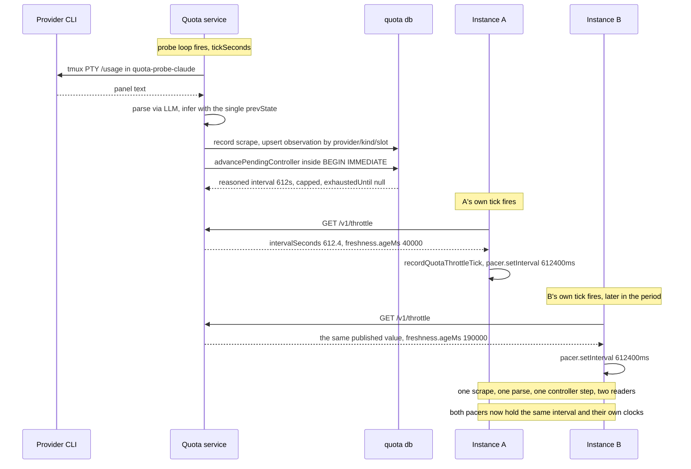
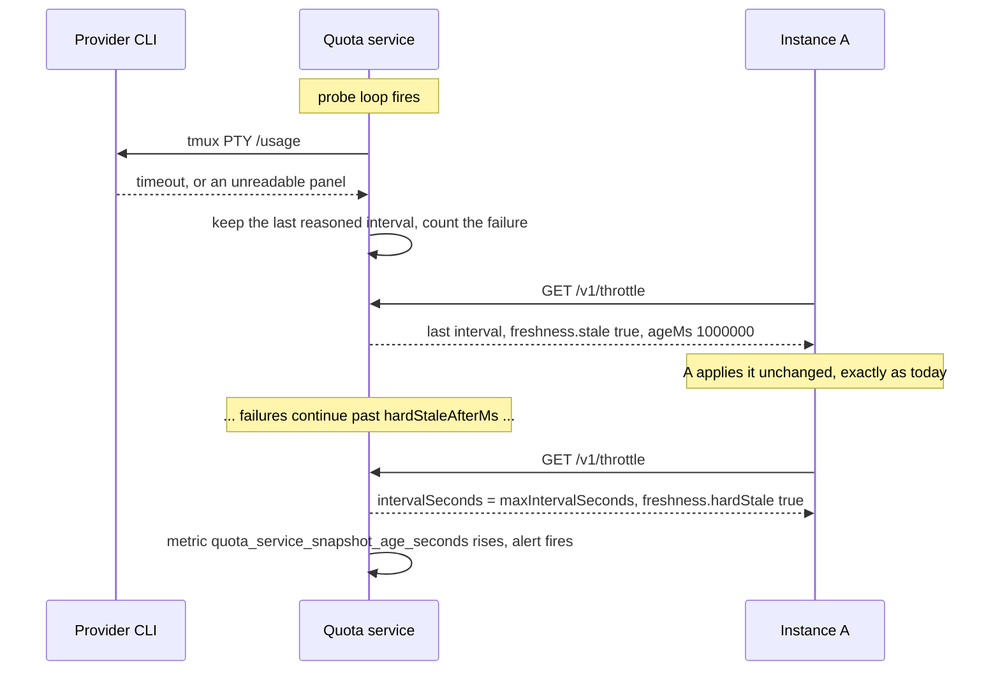
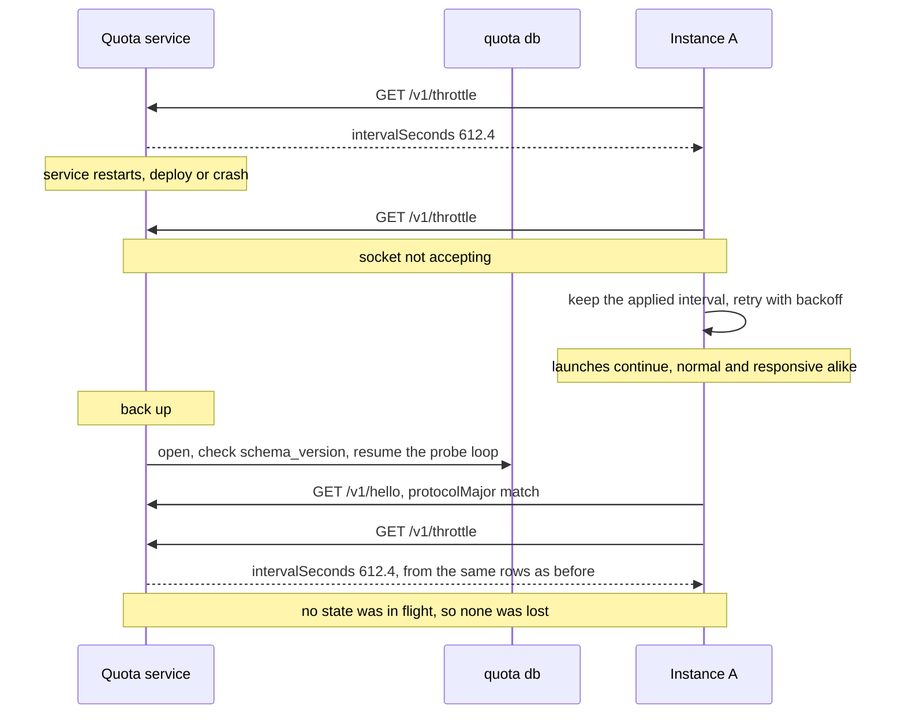
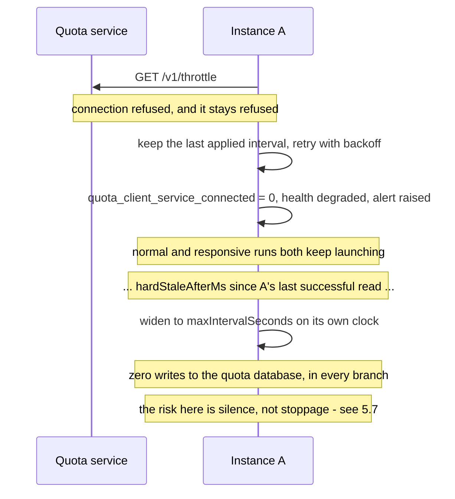

# Shared quota coordinator — design proposal

Design-only proposal for #178. It names a deployment model, states the
service contract, and defines the failure, compatibility and operational
semantics that must hold before any code moves. Nothing here is implemented.
No quota storage, schema, or pacing behaviour changes with this document.

Every source citation below is against `origin/staging` at `5ee178f`. Paths are
repository-relative; line numbers are that commit's.

## What v1 is, in one paragraph

**A self-contained quota module.** One process scrapes the provider panels,
parses and reasons about them, keeps the observation and controller history,
and **publishes the resulting throttle periods** over a small read-only API.
Instances stop scraping, stop parsing, and stop opening the quota database;
they read a published interval and apply it to their own pacer exactly as they
apply the persisted one today. Nothing in v1 gates a launch, reserves anything,
or holds a lease.

**What v1 deliberately does not do.** It does not close the launch-clock gap in
§1.4. Two instances reading one published interval still both start immediately
at boot, so the pool's effective normal-launch rate stays `N × 1/interval`
rather than `1/interval`. That is a scope decision taken in review, not an
oversight, and the machinery that would close it is kept intact in §11 for v2
rather than discarded.

## Revision log

- **Revision 1** proposed the sidecar with a reservation protocol.
- **Revision 2** stamped the launch clock on confirmation rather than on grant,
  removed multi-pool surface, made old-writer exclusion a path relocation rather
  than a cooperative flag (§8.2), and withdrew the claim that centralising
  parsing reduces PTY scrapes (§3.1).
- **Revision 3** settled the topology assumption on the evidence in #237 —
  remote instances are leader-authoritative — and adopted Option 2 outright
  (§4.1), while noting that the processes which *consume* the shared account are
  a strictly larger set than the processes which pace it (A1a).
- **Revisions 4 and 5** answered correctness findings against the reservation
  machinery. Those findings are preserved with their provenance in §11, which is
  where that machinery now lives.
- **Revision 6 is a scope change from review, not a correction.** Two directions
  came back, and both narrow v1. First: the quota module should own its own
  collection rather than depending on the systems it serves for the information
  it publishes — a module that is handed its inputs by its consumers is not the
  well-defined unit this effort is for. Second: cross-instance launch
  coordination should wait, and v1 should do nothing but publish the throttle
  periods clients already consume. Both are adopted here.

  What that changed. A5 reverses (§2): collection moves into the service. The
  scrape-reduction claim withdrawn in revision 2 comes back (§3.1), because A5
  was the only reason it was withdrawn. The v1 wire contract becomes
  **read-only — six GETs and no mutating operation anywhere** (§5), which
  deletes client ingestion, the ingest receipts table, the observation replay
  buffer, and the whole reservation lifecycle from v1's surface. The v1 schema
  addition shrinks to one singleton table (§7). §5.7 collapses, because a
  service that gates nothing cannot fail closed. And §8.4's account of
  separability is rewritten: separable no longer means *collection stays where
  it is*, it means *collection lives behind a contract in its own deployable
  unit*.

## Contents

1. [What exists today](#1-what-exists-today)
2. [Assumptions](#2-assumptions)
3. [The three options](#3-the-three-options)
4. [Recommendation](#4-recommendation)
5. [Service contract](#5-service-contract)
6. [Sequences](#6-sequences)
7. [Storage schema](#7-storage-schema)
8. [Compatibility and rollout](#8-compatibility-and-rollout)
9. [Operations](#9-operations)
10. [Test criteria](#10-test-criteria)
11. [Deferred to v2 — cross-instance launch coordination](#11-deferred-to-v2--cross-instance-launch-coordination)
12. [Implementation issues this would cut](#12-implementation-issues-this-would-cut)
13. [Open questions](#13-open-questions)

---

## 1. What exists today

### 1.1 Storage is already shared; nothing else is

`quota.databasePath` is the sharing boundary, and it is a plain filesystem path
(`packages/rusa/src/config/types.ts:101-111`). `quota.poolId` was removed
outright, so the file *is* the pool identity today
(`packages/rusa/src/config/loader.ts:299-303`). A database path is mandatory
once pacing is enabled (`loader.ts:314-318`).

Each instance opens that file directly and keeps the connection for its whole
life (`packages/rusa/src/quota/shared-store.ts:182-192`): WAL, a 10 s
`busy_timeout` (`packages/rusa/src/db/wal.ts:4`), foreign keys on.

### 1.2 The throttle publication loop already exists, in every instance

This is the loop v1 relocates, so it is worth reading as code rather than as a
description. Every `tickSeconds` (default 300, `packages/rusa/src/commands/start.ts:3509-3517`),
each instance runs three steps per provider (`start.ts:1355-1360`):

1. `quotaService.getQuota(provider)` — probe the provider panel if the TTL has
   lapsed, parse it, infer state, and persist the scrape.
2. `sharedQuotaStore.advancePendingController(...)` — reason every unprocessed
   observation into a controller decision.
3. `applyPersistedQuotaThrottle(provider)` — read the decision back with
   `getProviderThrottle` (`start.ts:1317-1322`, `shared-store.ts:580`) and hand
   it to `recordQuotaThrottleTick`, which calls `pacer.setInterval` and, when the
   window is exhausted, `pacer.deferUntil` (`start.ts:1289-1293`).

Step 3's payload is already a published-shaped value:
`PersistedQuotaProviderStatus` (`shared-store.ts:118-128`) carries the interval,
the uncapped interval, the governing bucket, `capped`, `expired`,
`exhaustedUntil` and the per-bucket detail. Its client-facing sibling
`QuotaThrottleStatus` (`packages/rusa/src/actor/quota-throttle-status.ts:10-20`)
is what the dashboard already renders (`start.ts:3210-3216`).

The same apply path also runs at boot (`start.ts:1346-1348`), and the store can
already drive it on controller update rather than on a timer
(`shared-store.ts:202-204`). **v1 changes who runs steps 1 and 2, and replaces
step 3's local read with a network read. It changes nothing about what is
published.**

### 1.3 Observation ingestion is already idempotent — by slot

Observations are keyed `(provider, kind, observed_slot)` where a slot is five
minutes (`shared-store.ts:11`, `:236`). Two instances scraping the same window
inside one slot collapse to one row, and the winner is decided by a stated
rule — a reading with a valid reset beats one without, then later
`observed_at` wins (`shared-store.ts:705-710`). A row already marked
`processed` is never overwritten (`shared-store.ts:704`).

There is no caller-supplied idempotency key and no record of *which* instance
reported a reading. `recordRaw` mints a fresh `randomUUID` per call
(`shared-store.ts:302-303`), so a retried report is a second raw row.

### 1.4 Controller advancement is already atomic across processes

`advancePendingController` runs inside `BEGIN IMMEDIATE`
(`shared-store.ts:394-409`), and so does the ad-hoc column widening
(`shared-store.ts:257-272`). Every unprocessed observation is reasoned about
exactly once across all connections; the PID decision is written back onto the
observation row (`shared-store.ts:527-543`).

This matters for the comparison below: **cross-process atomicity is not the
missing piece.** SQLite already provides it, and the code already uses it. Under
v1 it becomes belt-and-braces rather than load-bearing, because there is exactly
one writer.

### 1.5 The launch clock is per-process — and v1 leaves it that way

`ProviderPacer` holds `lastStartedAt` and `nextAvailableAt` as instance fields
in memory (`packages/rusa/src/actor/provider-pacer.ts:45-46`), set when a run
actually starts (`:285-292`). One pacer per lane per process, created lazily
(`start.ts:1267-1275`).

What the shared file distributes is the *interval*. What it does not distribute
is the *clock*. Two instances configured against the same `quota.db` both learn
"space normal starts 600 s apart" and then both start a run immediately, because
each one's `nextAvailableAt` is `0` at boot. The effective launch rate is
`N × 1/interval`, not `1/interval`.

That is precisely the "cross-instance throttling is not free" caveat #178 was
filed on, and **v1 does not close it.** Deferring it was a deliberate scope call
in review: the throttle publication is the part that pays off first, and the
reservation protocol is the part that carries all the risk. §11 keeps the design
that closes it, with the review findings that shaped it, so v2 starts from a
settled position rather than from scratch.

Three behaviours a later reservation design has to preserve rather than invent,
recorded here because they are properties of today's code and will not change
under v1:

- **The clock is stamped at the actual start.** `start()` sets `lastStartedAt`
  and `nextAvailableAt` at the moment the run really begins
  (`provider-pacer.ts:285-292`), not when the request was admitted.
- **Responsive runs bypass pacing but still charge the clock.** A responsive
  request skips the queue entirely (`provider-pacer.ts:173-175`) and lands in
  `start()`, which advances the clock like any other start.
- **The lane FIFO is a user-visible surface.** `getQueueSnapshot`
  (`provider-pacer.ts:91-117`) is projected to the dashboard
  (`start.ts:3161-3163`) with an explicit "never fabricate a time" contract
  (`provider-pacer.ts:67-90`).

### 1.6 Probing, parsing and inference are per-instance — and can disagree

This is the gap v1 *does* close, and it is the one the module's ownership of
collection closes structurally rather than by convention.

`QuotaService` owns a TTL cache in a plain in-memory `Map`
(`packages/rusa/src/mcp/quota-mcp.ts:697-701`), 5 min for claude/agy/kimi and
30 min for codex (`:768-786`). One service per process
(`start.ts:1110-1114`), shared between the `get_quota` MCP tool and the
dashboard endpoint (`quota-mcp.ts:1105-1109`). So *N* instances run *N*
independent PTY scrapes of the same provider panel — and those scrapes are
expensive tmux-driven captures
(`packages/rusa/src/providers/agy-usage-scrape.ts:43-100`).

Parsing is an LLM call, not a regex, gated on `geminiApiKey`
(`quota-mcp.ts:493-540`).

The disagreement risk is concrete, not hypothetical, and it has two independent
mechanisms:

1. **Inference is stateful in client memory.** `inferQuotaState` takes
   `prevState` (`quota-mcp.ts:555`), and production passes the calling
   process's own TTL-cache entry (`quota-mcp.ts:725`, consumed at `:733`).
   Rules like `carried_forward_bad_read` and `assumed_window_starts_now`
   (`quota-mcp.ts:543-554`) therefore resolve differently in two instances that
   happen to hold different previous readings. Two instances can write
   *different canonical observations* from the same provider panel.

2. **Controller state is read through whatever schema the local build knows.**
   `SharedQuotaStore` evolves the shared file's schema itself, on every open, by
   every instance, outside the migration runner — the code says so
   (`shared-store.ts:251-256`). An older build opening a widened file does not
   see the new column; `advanceObservation` reads
   `previous?.controllerIntegral ?? 0` (`shared-store.ts:492`), so a row written
   without an integral reads as a zeroed integral rather than as "unknown". A
   mixed-version pair silently disagrees about pacing.

These are exactly the two concerns raised in #173: backwards-incompatible schema
changes reaching production, and behavioural changes making the systems disagree
about pacing. One process that scrapes, holds one `prevState`, and is the only
writer of the file closes both — not by a rule anyone has to follow, but because
there is no second implementation to disagree with.

### 1.7 There is more than one scraper already, and one of them is not an instance

The A/B harness builds its **own** `QuotaService` with `ttlMs: 0`, deliberately,
so that the exit reading is a real probe rather than the launch reading served
back out of a cache (`packages/rusa/src/commands/ab-context.ts:350-355`). The
reasoning is documented at length, including the failure it prevents
(`packages/rusa/src/harness/quota-capture.ts:32-42`), and a second defence
refuses a diff whose two `scrapedAt` stamps are identical.

That is a real second scraper against the shared account, it is not an instance,
and "the module owns collection" has to say something about it. This design does
not decide it; Q10 asks.

### 1.8 Topology as configured

Instances are user-level systemd units. The two environments are `production`
and `staging`, resolving to `~/.rusa` and `~/.rusa-staging` under one user home
(`packages/rusa/src/commands/service-instance.ts:43-49`). Loopback-only binding
is the established posture: the MCP HTTP server defaults to `127.0.0.1`
(`packages/rusa/src/mcp/http-server.ts:225`) and so does the dashboard
(`start.ts:2949`).

Quota lanes exist for four providers — `claude`, `codex`, `agy`, `kimi`
(`start.ts:275`) — keyed by `providerThrottleKey`
(`packages/rusa/src/providers/registry.ts:64-68`), which fans config aliases of
one CLI onto one lane.

The one piece of roadmap that changes this picture is #237, and it changes it
less than it first appears. Its remote instances are leader-authoritative — the
leader keeps records, durable inboxes, prompt assembly, admission, tool
execution, scheduling and accounting, while the follower contributes provider
execution and filesystem work. So a follower adds a host that *runs provider
CLIs* without adding a host that *decides when they start*. That distinction is
what A1 and A1a are built on, and §8.4 is where it stops being free.

---

## 2. Assumptions

Stated so they can be corrected. Each one is load-bearing for the
recommendation, and §4.3 says what changes if it is wrong.

- **A1 — The quota service and every client run on one host, under one user
  session.** That is the topology today (§1.8), and it is what makes a Unix
  socket's filesystem permissions a sufficient authentication model.
  *Confidence: high for today; high for the roadmap as of #237.*

  Under revision 6 this assumption carries a **second** load it did not carry
  before, and the new one is heavier. The service now runs the provider CLIs
  itself, so it must run somewhere those CLIs are authenticated — the same host
  and the same user account whose credentials the probes already use
  (`quota-mcp.ts:898-901`). Moving the service off-host is therefore no longer
  only a transport question. See A5a and §4.3.
- **A1a — Provider *consumption* is not confined to that host, and this design
  does not change that.** A follower's provider CLI on another machine bills the
  same account (#237), and so does interactive human use on any other machine.
  Neither is visible to the service's scrape. The pacing boundary, the
  observation boundary and the consumption boundary are three different sizes.
  §8.4 is written to that.
- **A2 — Launch rate is low, and so is publication rate.** Normal starts are
  spaced by a controller interval capped at `maxIntervalSeconds`, default 3600
  (`config/types.ts:96`), and the sensor ticks every `tickSeconds`, default 300
  (`config/types.ts:98`, `start.ts:3509-3517`). A client read is therefore a
  low-rate operation on a slow-moving value, which is why v1 can poll rather than
  push. *Confidence: high — read directly from configuration defaults.*
- **A4 — Credential sharing, not provider identity, defines a pool.** Two
  instances contend only when the provider would bill the same account. This is
  what `quota.databasePath` already encodes.
- **A5 — Collection belongs to the quota service.** *This assumption is the
  reverse of the one earlier revisions made, and the reversal is the substance of
  revision 6.* The module scrapes the provider panels itself, parses them,
  reasons about them, and publishes the result; it does not accept quota
  information from the systems it serves.

  **This is a relocation, not a redesign, and the code says so.** `executeProbe`
  already runs each probe in a directory of its own that belongs to no actor and
  no run — `join(workersDir, "quota-probe-<provider>")`, created on demand
  (`quota-mcp.ts:876-881`) — under its own bwrap sandbox scoped to that directory
  (`:898-901`). The probe's only dependencies on its host process are
  `workersDir` and `config`, both already injected through `QuotaMcpDeps`
  (`quota-mcp.ts:110-141`). Nothing about a probe is entangled with the instance
  that happens to run it.

  **Consequence: N scrapes become 1, and N parses become 1.** See §3.1.
- **A5a — The service's host holds the provider CLI authentication context.**
  A probe drives the real provider CLI under bwrap and reads its interactive
  panel; it works only where that CLI is already logged in. This is an
  assumption about *deployment*, and it is what makes A1 stronger under revision
  6 than it was before. It also bears directly on Q6: a dedicated service user
  would need its own copy of that context, which is a much larger change than a
  `chown`.
- **A6 — One short, scheduled write-quiesce is acceptable once.** Flipping
  collection and storage ownership needs a moment with no instance writing.
  Seconds, once, planned.

Two assumptions that earlier revisions carried have moved rather than gone. **A3**
(a reservation must survive a client crash) and **A7** (a client can bound the
delay between deciding to spawn and the provider process actually starting) are
assumptions about reservation machinery, which v1 does not have. Both are stated
where that machinery now lives, in §11, so that v2 inherits them with their
reasoning intact.

---

## 3. The three options

The scope change in revision 6 does not change what the three options are. It
changes what they are being asked to do — publish a throttle from a single
owner of collection, rather than arbitrate launches — and under that question
the gap between them widens rather than narrows.

### Option 1 — Keep the shared SQLite library and path

Keep `SharedQuotaStore` linked into every instance and keep every instance
scraping, as today.

For v1's purpose this fails at the first requirement, and it fails
*structurally*: **a library linked into N processes is N scrapers.** There is no
process for the single scrape loop to run in and no single `prevState` for
inference to read, so §1.6's divergence stays live by construction.

The obvious repair is worse than the disease. Instances could elect a collector
by taking a lease row in the shared file — but then the scrape lives inside
whichever instance won the election, which forfeits the two properties that
motivated moving collection in the first place: the module is no longer
independently deployable, so a bad scrape change cannot be rolled back without
rolling back the instance that carries it; and the leader-election problem
arrives anyway, just without a service to own it.

The rest of #178's contract is unreachable for the same reasons it always was:

| #178 requirement | Why Option 1 cannot meet it |
| --- | --- |
| "Quota parsing, inference, controller state, and pacing policy should have one owner. Clients should not retain a second implementation that can disagree." | Every client links the implementation. The two disagreement mechanisms in §1.6 remain live. |
| "versioned request/response compatibility" | There are no requests. The only contract is a schema shared by N writers, widened ad hoc on open (`shared-store.ts:251-272`). |
| "server-owned clock semantics" | Each writer stamps with its own `Date.now()`. On one host this is *de facto* satisfied by the shared OS clock; it is not a property of the design. |
| "health/readiness signals" | Nothing is running to be healthy. |

It also cannot express "the quota service is unavailable" — the file is either
openable or it is not — so the degraded semantics #178 asks for have no place to
live.

### Option 2 — Same-host sidecar over a Unix domain socket

One additional in-repo process (`rusa quota-coordinator`, a fourth
`systemd --user` unit) **is** the quota module. It owns the quota database, runs
the scrape loop, holds the single parse/inference path, advances the controller,
and serves a small versioned **read-only** JSON API over a Unix domain socket in
the user's runtime directory. Instances become readers: they neither scrape nor
open the database.

Filesystem permissions on the socket are the authentication boundary — the same
trust model the repo already uses for loopback MCP and the dashboard (§1.8),
with a strictly smaller attack surface than a TCP port, since a Unix socket is
not reachable off-host at all. Because the v1 surface has no mutating operation
at all, the authentication question shrinks further: the worst a compromised
client can do through this API is read.

Costs: a third unit to install, supervise, upgrade and back up; a new failure
mode ("service down") that must have defined behaviour; an IPC hop on a path
that is currently a function call; one more process holding `geminiApiKey`
(§5.3); and a unit that now needs the provider CLI environment rather than just
a database path (A5a, §9.1).

### Option 3 — Networked coordinator

Option 2's contract over TCP, plus: a bind address that is not loopback, TLS or
a tunnel, a shared secret or mTLS, firewall/tailnet policy, clock-skew handling
between hosts, and an availability story for the network path itself.

Revision 6 adds a cost to Option 3 that revision 5 did not have. Under the old
scope the coordinator received raw text and could run anywhere; under A5 it runs
the provider CLIs, so it has to live where those CLIs are authenticated (A5a).
Option 3 therefore no longer buys "run the service anywhere" — it buys "let
clients reach the service from anywhere", which is a narrower thing.

Everything Option 3 adds is machinery for a hop that does not exist yet (A1).
The request/response contract in §5 is transport-agnostic and carries over
unchanged; what has to be built is the authentication and transport layer, not
a new protocol.

### 3.1 What centralising collection buys — restored, with its provenance

**Revision 2 withdrew this claim; revision 6 restores it.** The claim is that
centralising reduces scrape and parse volume, and revision 2 was right to
withdraw it *at the time*: A5 then kept collection in every instance, so nothing
elected a single collector and N instances kept probing on their own TTLs. The
claim was false because of A5, and A5 has now reversed. It is restored on that
basis and no other.

With collection in the service:

- **PTY scrapes drop from N per cadence to 1.** One process runs one probe loop
  per provider. The tmux-driven capture (`agy-usage-scrape.ts:43-100`) happens
  once per cadence for the pool rather than once per instance.
- **LLM parses drop from N to 1**, since there is one scrape to parse
  (`quota-mcp.ts:493-540`).
- **The slot winner rule stops being a reconciliation and becomes a safety
  net.** `(provider, kind, observed_slot)` dedupe with its valid-reset-wins tie
  break (`shared-store.ts:705-710`) exists because two instances could write the
  same slot. With one writer there is normally nothing to reconcile. The rule is
  retained unchanged — it still governs replayed history and anything Q10
  decides about the A/B rig — but it is no longer load-bearing, and the trade
  revision 2 described (dedupe parses, but lose the two-reading comparison the
  winner rule needs) simply evaporates.
- **The divergent-`prevState` mechanism in §1.6(1) becomes impossible**, because
  there is one cache and one process.
- **The mixed-version mechanism in §1.6(2) becomes impossible**, because there is
  one writer and one schema.

What it does *not* buy is anything about launch spacing. §1.5 is untouched by
v1.

### 3.2 Comparison

Assessed against v1's job: one owner of collection, publishing throttle periods
to read-only clients.

| Dimension | 1 — Shared SQLite | 2 — Same-host sidecar (UDS) | 3 — Networked |
| --- | --- | --- | --- |
| **One owner of collection** | Impossible without electing a collector inside an instance, which forfeits independent deployability | Yes, by construction | Yes |
| **Deployment** | Nothing new | +1 `systemd --user` unit, same host/user, with the provider CLI environment | +1 unit, +transport config, +certs/secret, still pinned to a credentialed host (A5a) |
| **Operations** | No new supervision | One process to supervise; ordering with instances | Above, plus network policy and cross-host rollout |
| **Compatibility** | N writers all carrying the schema; ad-hoc widening on open | One writer; versioned wire contract; clients carry no schema | Same as 2 |
| **Latency** | In-process SQLite call (µs) | UDS round trip (sub-ms), at one read per provider per tick (A2) | Network RTT plus TLS; still negligible at A2 rates |
| **Availability** | No new dependency; a corrupt or locked file stops everyone anyway | New dependency, but a soft one: v1 gates nothing, so an outage freezes the published interval rather than stopping launches (§5.7) | Same, plus network partitions |
| **Security** | Filesystem ACL on one file; every instance runs PTY probes | Filesystem ACL on one socket; unreachable off-host; **read-only client surface**; one more holder of `geminiApiKey`; probes run in one place | Authn/authz, transport encryption, exposed port |
| **Scrape / parse cost** | N scrapes, N parses | **1 scrape, 1 parse** (§3.1) | Same as 2 |
| **Blast radius of a scrape change** | Ships with the instance; a bad parse change rolls back the whole orchestrator | Ships with one unit; can be deployed and rolled back alone | Same as 2 |
| **Backup** | One SQLite file, but no single process owns quiescing it | One SQLite file with exactly one writer that can quiesce and `VACUUM INTO` | Same as 2 |
| **Observability** | Per-instance logs; no aggregate view | One place that sees every provider and every publication | Same as 2 |
| **Rollback** | Config revert; but mixed-version writers are the hazard being rolled back *from* | Read path is per-instance and reversible; ownership flip is one scheduled step (§8.3) | Same as 2, over more moving parts |
| **Meets #178's v1 contract** | No | Yes | Yes, with unused capability |

---

## 4. Recommendation

### 4.1 Option 2 — the same-host sidecar, owning collection, publishing read-only

**Adopt Option 2, scoped to v1 as described below.** It is the smallest option
that meets what #178 asks for, and the topology assumption it rests on has been
settled rather than assumed: A1 is high-confidence for the roadmap as well as
for today, on the evidence in #237 — remote instances are leader-authoritative,
so followers execute provider CLIs but never decide when they start. Production
and staging, on one host under one user, are the complete client set. A Unix
domain socket fits that set exactly.

§4.3 keeps the trigger that would move this to Option 3, and it is narrower than
"more than one host". Nothing on the roadmap proposes it today.

Within Option 2, v1 is deliberately narrow:

- The service is **one in-repo Node process**, not a service platform. It reuses
  `SharedQuotaStore` and the existing `QuotaService` probe/parse/infer path
  rather than reimplementing them.
- It speaks **HTTP/JSON**, so the framing is the one the repo already knows
  (`packages/rusa/src/mcp/http-server.ts`) with the TCP listener swapped for a
  socket path. No new protocol, no new dependency.
- **It scrapes.** Collection, parsing, inference, controller advancement and
  retention all live inside it. It does not accept quota information from its
  clients — there is no ingestion endpoint in v1 at all (§5.5), which is what
  makes "clients cannot supply the information they consume" a property of the
  wire contract rather than a convention.
- **Its client surface is read-only.** Six GETs, no POST, no PUT, no DELETE
  (§5.5). Everything that mutates quota state is internal to the process.
- **It arbitrates nothing.** No leases, no reservations, no gating. Clients read
  a published interval and pace themselves with it, exactly as they pace
  themselves with the persisted interval today (`start.ts:1289-1293`).

### 4.2 What the read-only surface is worth, stated separately

It is worth stating on its own, because it is the property that makes the rest of
the rollout cheap rather than merely tidy.

- **Auth collapses to "can you open the socket".** With no mutating operation
  there is no privilege to model beyond read access, and a compromised or buggy
  client cannot corrupt quota state, publish a wrong interval, or poison the
  controller's memory.
- **The canary becomes free.** An instance can read `GET /v1/throttle` and
  *compare* it against what it would have applied, logging the difference and
  applying nothing, for as long as anyone wants. There is no such thing as a
  half-committed reservation to unwind. §8.3 stage 2 is built on this.
- **The scrape becomes independently deployable.** A regression in scraping or
  parsing is contained to one unit, and rolling it back does not roll back the
  orchestrator. The cost, stated honestly, is that two units now have to be
  upgraded in an order (§8.3).
- **The implementation of collection becomes private.** tmux, PTY, bwrap and the
  LLM parse are all behind the contract. If a provider ever exposes quota through
  an API, that swap changes one process and no client.

### 4.3 What would change this recommendation

- **A second leader shares these provider credentials from another host** →
  Option 3, and §5.3 must grow a real per-instance credential and transport
  before anything ships. This is the precise trigger, and it is narrower than
  "the mesh spans hosts": #237 already spans hosts without producing a second
  pacing client, because followers do not pace.
- **A5a is false or becomes inconvenient** (the service cannot be run where the
  provider CLIs are authenticated): the whole of A5 is in question, because a
  module that owns collection has to be deployable where collection is possible.
  The fallback is not Option 3 — it is a split where the service still owns
  parsing, inference and publication while a thin same-host collector feeds it,
  which is exactly the ingestion endpoint v1 deleted. That is a real design, and
  it is the one to reach for if and only if A5a fails.
- **A1a stops being tolerable** (unpaced, unobserved consumption from followers
  or interactive use grows large enough that the controller cannot absorb it):
  that is not an argument for Option 3, which would not help. It is an argument
  for extending *observation* to those paths, which is Q9.
- **A6 is unacceptable** (no write-quiesce is ever schedulable): §8.3's
  ownership flip needs redesign — probably a service that begins read-only and
  takes the write lock only when it observes no other writer for a full tick.
  That is more machinery; it is not proposed here.
- **A2 is false** (tick rate rises far enough that polling is wasteful): the
  publication becomes a push — a long-poll or an event stream driven by the
  controller-update hook the store already has (`shared-store.ts:202-204`). That
  is a protocol-minor addition, not a redesign, and it is the reason §5.5 fixes
  the *payload* rather than the delivery.

---

## 5. Service contract

Everything below is versioned as **protocol v1**.

### 5.1 One service, one database, one pool

**v1 has no pool identity on the wire.** One service process binds one socket
and owns exactly one quota database, which *is* the pool — the same thing
`quota.databasePath` means today (§1.1), and the reason `quota.poolId` was
removed in the first place (`loader.ts:299-303`).

An earlier revision threaded a `poolId` through every RPC and every new table so
that one process could later serve several credential sets. That was
anticipatory surface, and it was also incoherent: `quota_coordinator_meta` is a
singleton, and the preserved `quota_observations` primary key
(`shared-store.ts:236`) has no pool dimension.

Two credential sets therefore mean two services, two sockets and two
databases — which is what two `quota.databasePath` values mean today. Under A5a
this is now also the natural shape for a second *authentication* context, since
a probe can only read the panel of the account its host is logged into.

A **provider key** is `providerThrottleKey(provider, config)`, reusing
`registry.ts:64-68` unchanged so config aliases of one CLI keep collapsing onto
one published throttle, as they do now.

### 5.2 Transport, framing, versioning

- **Transport:** Unix domain socket at `quota.coordinator.socketPath`, default
  `$XDG_RUNTIME_DIR/rusa-quota/coordinator.sock`, mode `0600`, owned by the
  service user. Under Option 3 this is a TCP listener instead; nothing else in
  this section changes.
- **Framing:** HTTP/1.1 + JSON. Paths are prefixed `/v1/`. **Every v1 path is a
  `GET`.** Any other method on any v1 path is `405`, unconditionally, and that
  is a contract statement rather than an implementation detail (criterion 7).
- **Handshake:** `GET /v1/hello` → `{ protocolMajor, protocolMinor,
  serverVersion, schemaVersion, databasePath, providers, serverTime }`. Every
  client calls it at startup and after every reconnect.
- **Compatibility rule:** `protocolMajor` must match exactly; a mismatch is a
  hard refusal on both sides with a message naming both versions.
  `protocolMinor` is additive-only — a client ignores response fields it does
  not know, and the server treats absent optional query parameters as their
  documented defaults. No field is ever repurposed; removal requires a major
  bump.
- **Schema guard:** the service refuses to open a database whose recorded
  `schema_version` is *newer* than the version it knows, and exits non-zero with
  that message. Note what this does and does not do: it stops a **rolled-back
  service** from writing to a file a newer one has widened. It cannot stop a
  pre-service build, which reads no version at all (§8.2).

### 5.3 Authentication and scope

v1 authenticates by **filesystem permission on the socket**: `0600`, service
user only. There is no token, because on a Unix socket a token would be a second
copy of the same fact.

The read-only surface is what keeps this sufficient. There is no operation a
client can call that changes quota state, so the authorization question is
"which processes may read the pool's quota history", and on a single-user host
the answer is already "processes running as that user".

**Key and credential exposure, stated plainly, because revision 6 moves it in
both directions.**

- The service must hold `geminiApiKey` in order to parse
  (`quota-mcp.ts:493-540`). Instances cannot drop it in exchange, because they
  use the same key for unrelated features — dashboard avatar generation
  (`packages/rusa/src/dashboard/api.ts:760-765`), ledger compaction
  (`config/loader.ts:588`) and voice (`config/types.ts:385`). So the number of
  processes holding the key still goes from N to N+1.
- **Raw provider panel text stops being spread across N processes.** Today every
  instance captures and holds it; under v1 exactly one process ever sees it, and
  it never crosses the socket, because no endpoint returns it.
- **The provider CLI authentication context is now exercised by the service**
  (A5a). It was already exercised by every instance, so this is not a new trust
  boundary; it is a constraint on where the service may run, and it is the reason
  Q6 is harder than it looks.

Under Option 3 this section is what grows: a per-instance shared secret in
config, presented as a bearer credential, over TLS or an existing private
tunnel — never an unauthenticated bind.

### 5.4 Clock

**The service's clock is the only clock.** Every timestamp that participates in a
decision — observation instants, controller stamps, staleness — is stamped by
the service. Under v1 that is easier than it was under revision 5, because the
service is also the only thing scraping: `scrapedAt` is now stamped by the
process that ran the scrape rather than reported by a client
(`quota-mcp.ts:714-717`).

Clients never compare their own `Date.now()` to a service timestamp for a
decision. Freshness is expressed by the service as an **age in milliseconds**,
never as an absolute instant to be differenced locally, so client clock skew
cannot make a client believe stale data is fresh. Absolute instants appear only
in read-only display fields, alongside `serverTime`, so the dashboard can render
them honestly.

### 5.5 Operations

Six paths, all `GET`, none of them mutating.

#### `GET /v1/throttle?provider=`

**This is the publication contract — the one endpoint v1 exists for.** It
returns what `getProviderThrottle` returns today (`shared-store.ts:580`,
`PersistedQuotaProviderStatus` at `shared-store.ts:118-128`), plus freshness and
the server clock:

```jsonc
{
  "provider": "claude",
  "intervalSeconds": 612.4,
  "uncappedIntervalSeconds": 900.1,
  "governingBucketKey": "claude:weekly",
  "capped": true,
  "expired": false,
  "exhaustedUntil": null,
  "updatedAt": "2026-09-07T16:00:00.000Z",
  "buckets": [ /* unchanged shape */ ],
  "freshness": { "ageMs": 240000, "stale": false, "hardStale": false },
  "serverTime": "2026-09-07T16:04:00.000Z"
}
```

Notes on the shape, because the shape is the point:

- **No field here is new.** Everything except `freshness` and `serverTime` is a
  field `applyPersistedQuotaThrottle` already reads and hands to
  `recordQuotaThrottleTick` (`start.ts:1317-1322`). The client mapping is the
  one that exists.
- `exhaustedUntil` is included and is not optional. It is what drives
  `pacer.deferUntil` when the window is expired (`start.ts:1289-1293`), and a
  publication that omitted it would silently drop the exhaustion gate.
- The dashboard's `QuotaThrottleStatus` view
  (`actor/quota-throttle-status.ts:10-20`) is a projection of this, unchanged,
  so `quotaApi.getThrottle` (`dashboard/quota-api.ts:158`) keeps its type.
- Omitting `provider` returns every configured provider, so a client's tick is
  one round trip rather than four.

**Delivery is polling, on the client's existing timer.** The client's
`tickSeconds` interval (`start.ts:3509-3517`) stays exactly where it is; its body
loses steps 1 and 2 of §1.2 and keeps step 3, with the local
`getProviderThrottle` read replaced by this GET. A published value can therefore
be up to one tick stale at a client — which is precisely as stale as today's
locally-computed value already is, since today's client also only applies on its
own tick. A push channel is a protocol-minor addition if A2 ever fails (§4.3),
not a v1 requirement.

#### `GET /v1/quota?provider=`

The evidence view: today's `ProviderQuotaSnapshot` (`quota-mcp.ts:79-108`) for
the provider, served from the service's own cache. This is what the `get_quota`
MCP tool and the dashboard's `/api/quota` endpoint consume today
(`start.ts:3210-3216`).

**It never triggers a probe in the request path.** That is today's rule for the
dashboard, stated in the code and motivated there
(`start.ts:3203-3209`, `quota-mcp.ts:844`), and v1 makes it universal rather than
per-caller: the probe loop is the only thing that probes, so no reader can cause
one. A cold service answers with `"status": "unknown"` and a `freshness` block
saying so, rather than blocking.

Whether the agent-facing `get_quota` MCP tool should read through this endpoint
or keep a local implementation is Q11.

#### `GET /v1/history?provider=&since=`

The reasoned-observation history the dashboard already joins for its quota view,
returning what `listHistorySince` returns (`shared-store.ts:380`).

This endpoint exists for a compatibility reason rather than a design one, and it
is worth naming: §8.2 takes `quota.databasePath` away from instances, and the
dashboard's history join reads that database directly today
(`start.ts:3214-3216`). Without this endpoint, the ownership flip would silently
remove a working dashboard panel.

#### `GET /v1/healthz` and `GET /v1/readyz`

- `healthz`: process alive, database open and writable. 200/503.
- `readyz`: schema version matches, meta row readable, and either at least one
  observation newer than `hardStaleAfterMs` **or** an explicit `"cold": true`.
  A cold service is ready-but-cold, not ready-and-lying.

`readyz` should also report the last scrape outcome per provider, because under
A5 a service that is healthy and reachable but whose probes are all failing is
the failure mode that matters most — and it is one no client can detect on its
own, since a frozen interval looks exactly like a stable one (§5.7).

#### `GET /v1/hello`

The handshake in §5.2. Listed here for completeness; it is the sixth path.

### 5.6 Errors

One error envelope: `{ "error": { "code": "...", "message": "...", "retryable": bool } }`.

| Code | Meaning | Client action |
| --- | --- | --- |
| `protocol_mismatch` | `protocolMajor` differs | Keep the last applied interval and widen on the stale schedule (§5.7); log loudly; surface in health |
| `provider_unknown` | Provider not configured on this service | Refuse; this is a configuration error, not a runtime one |
| `stale_snapshot` | Read while hard-stale and the caller demanded fresh | Apply `maxIntervalSeconds` |
| `not_ready` | Service is up but cold — no observation yet | Keep the last applied interval; retry next tick |
| `busy` | Read contention beyond `busy_timeout` | Retry with jittered backoff |

Every v1 call is safe to retry, trivially, because every v1 call is a `GET` and
nothing on the wire mutates. This is the entire idempotency section — under
revision 5 it was a page, and the caller-minted keys it needed
(`idempotencyKey`, `requestId`, `leaseId`) are all gone with the operations that
needed them.

### 5.7 When the service is unavailable or stale

The scope change makes this section short, and the reason is worth stating
before the rules: **v1 gates nothing.** A client that cannot reach the service
is a client that does not learn a new interval; it is not a client that cannot
launch. Nothing fails closed, because there is no closed to fail to.

**Stale** — the service has data but it is old:

- `stale` at `now - observedAt > staleAfterMs` (default `3 × tickSeconds` = 900 s):
  keep publishing the last reasoned interval. This matches today's stated
  behaviour on a failed scrape — "keep the last persisted reasoned interval"
  (`start.ts:1362`) — and `freshness.stale` says so, so the dashboard can show it.
- `hardStale` at `now - observedAt > hardStaleAfterMs` (default 3600 s): the
  published interval widens to `maxIntervalSeconds`. **The degradation is always
  toward slower, never faster.**

**Unavailable** — the socket is gone, the connection fails, or the handshake is
refused:

1. **The client keeps the interval it last applied.** Its `ProviderPacer` retains
   whatever `setInterval` last set (`provider-pacer.ts:136-142`); nothing needs
   to be re-derived and nothing is lost. This is exactly today's behaviour when a
   scrape fails (`start.ts:1362`).
2. **Past `hardStaleAfterMs` since its last successful read, the client widens to
   `maxIntervalSeconds` on its own.** The client can compute this without the
   service, because it knows when it last read successfully. Degradation stays
   monotone toward slower, and it is the client's own clock measuring its own
   read, not a comparison against a server instant (§5.4).
3. **Normal and responsive launches both continue throughout.** There is no
   grace window, no fail-closed transition, and no `unavailableGraceSeconds`,
   because v1 never had permission to withhold.
4. **The client never writes to the quota database.** Not while disconnected, not
   ever, once ownership has flipped (§8.2). This is the rule that makes "avoid
   concurrent old and new writers" enforceable rather than aspirational, and
   under v1 it is trivially satisfiable, since the client has no writing code
   path left to take.
5. **No observation buffering, because there is nothing to buffer.** Clients do
   not scrape, so a disconnected client holds no evidence the service is missing.
   The service's own probe loop is unaffected by client connectivity; a service
   whose clients are all gone keeps scraping and keeps a complete history.
6. **The outage is visible on both sides.** The client emits
   `quota_client_service_connected = 0` and surfaces it in health (§9.3); the
   service's own `healthz` is the other half. A coordinator cannot count clients
   it cannot see, so the client-side gauge is the one that matters.

The honest cost of this design is not availability — it is **silence**. A frozen
interval is indistinguishable from a stable one at a glance, so a service that
dies quietly degrades into "the pool paces on a snapshot from an hour ago" with
no launch failing to announce it. That is why rule 2 exists, why
`quota_client_service_connected` is alerted on in §9.3, and why `readyz` reports
per-provider scrape outcomes in §5.5. Under v2 this changes character
completely, and §11 says so.

---

## 6. Sequences

Four sequences, matching v1's four interesting states: the steady loop, a failed
scrape, a service restart, and a lost socket. There is no reservation sequence,
because there are no reservations.

### 6.1 One scrape, two readers



**What this proves and what it does not.** It proves that the pool scrapes once
and reasons once, which is §3.1's claim and §1.6's fix. It does **not** prove
anything about spacing: A and B still hold independent `nextAvailableAt` values,
so two starts can still land together. That is §1.5, deferred to §11, and drawing
it here rather than hiding it is deliberate.

### 6.2 A scrape fails



Degradation is monotone toward slower. A stale publication never speeds anything
up. Note where the alert lives: on the **service**, because under A5 the service
is the only thing that can tell a failed scrape from a stable quota window. A
client sees an unchanging interval either way.

### 6.3 Service restart



**Invariant:** a restart costs freshness and nothing else. Every value the
service publishes is derived from rows in the database, so there is no in-memory
state whose loss changes an answer — which is a property v1 has and v2 will not,
since a lease is exactly such state (§11).

### 6.4 The socket stays down



---

## 7. Storage schema

**v1 adds one table.** `quota_scrapes` and `quota_observations` are
**untouched** — the existing observation and controller columns keep their
current meaning (`shared-store.ts:206-247`). There is no `pool_id` column
anywhere, per §5.1.

```sql
-- Single source of truth for what version this file is at and who owns it.
CREATE TABLE IF NOT EXISTS quota_coordinator_meta (
  singleton          INTEGER PRIMARY KEY CHECK (singleton = 1),
  schema_version     INTEGER NOT NULL,
  protocol_major     INTEGER NOT NULL,
  owner_boot_id      TEXT,                 -- service instance identity
  owner_started_at   TEXT
);
```

That is the whole of it. Three tables an earlier revision proposed are gone with
the operations that needed them, and the reason each one is gone is worth
recording so v2 does not have to rediscover it:

- **`quota_lanes` and `quota_leases`** held reservation state. v1 reserves
  nothing. Their design, including the partial unique index that made "at most
  one hold per lane" a database invariant rather than handler logic, is kept in
  §11.
- **`quota_ingest_receipts`** made a replayed client observation cost no LLM
  parse. v1 has no client observations to replay, because clients do not scrape
  and the service accepts nothing from them. The table's entire purpose was
  ingestion idempotency, and ingestion is gone.

Notes on what remains:

- **The existing retention and prune-on-write behaviour is unchanged**
  (`shared-store.ts:273-300`), including the rule that the newest reasoned
  observation per `(provider, kind)` is never pruned (`shared-store.ts:279-299`)
  — the controller's memory must not be deleted out from under it.
- **The quota database stays separate from `mesh.db`.** `mesh.db` is opened and
  migrated per instance home (`packages/rusa/src/db/index.ts:41-57`); the quota
  database is shared. Folding them would make the shared file instance-owned,
  which is the opposite of this design. #178 forbids it while this decision is
  open, and this design does not need it.
- **`BEGIN IMMEDIATE` stays where it is** (`shared-store.ts:394-409`). With one
  writer it is no longer load-bearing, but removing it would be a change with no
  benefit and a real cost the day a second writer appears by accident.

---

## 8. Compatibility and rollout

### 8.1 Existing observations and controller state are preserved

There is **no import and no export**. The service opens the same database the
instances open today and inherits every `quota_scrapes` and `quota_observations`
row, including `controller_error`, `controller_derivative`,
`controller_integral`, `uncapped_interval_seconds` and `interval_seconds`. The
PID controller keeps its memory across the cutover because the rows are never
rewritten.

The flip does **rename** the file (§8.2). A rename within a directory is atomic
and byte-preserving; it is not a migration, and it is what buys the old-writer
guarantee below.

One asymmetry to record for the rollback path: while the service owns the file it
creates `quota_coordinator_meta`, which a pre-service build never reads. Rolling
back therefore leaves one unread table behind. That is harmless —
`ensureSchema` is `CREATE TABLE IF NOT EXISTS` throughout
(`shared-store.ts:206-247`) and no old code path selects from it — but it means a
rollback is not quite byte-identical, and saying so is better than discovering it.

### 8.2 No concurrent old and new writers

An earlier revision claimed this was "enforced, not promised" via an
`authoritative` flag in `quota_coordinator_meta`. **That claim was wrong, and it
is withdrawn.** Only a build that already contains the check would consult that
row; a genuinely old binary started by hand runs today's `ensureSchema()` and
writes, having read no version and no flag at all — the current store reads no
`user_version`, no `application_id` and no schema version of any kind
(`shared-store.ts:182-192`, `:206-272`). A flag in the file cannot fence a
writer that never looks at it. For the same reason, a "poison pill"
`schema_version` bump does not work either: it fences rolled-back *services*
(§5.2), not pre-service instances.

Filesystem permissions cannot fence it either, as the instances and the service
run as the same user against the same path.

**The mechanism is the path, not a flag.** The flip relocates the authoritative
database:

1. `quota.db` is renamed to `quota-coordinator.db` in the same directory —
   atomic, byte-preserving, all history intact.
2. The service is configured with the new path. Instances lose
   `quota.databasePath` entirely and gain `quota.coordinator.socketPath`.
3. A **directory** is created at the old `quota.db` path. `new Database(path)`
   against a directory fails with `SQLITE_CANTOPEN`, so an old build started by
   hand dies at open instead of silently pacing from a freshly created empty
   database. That failure mode — an old instance quietly pacing off an empty
   file — is the one worth engineering against, because it is silent.

That is mechanical: it requires no cooperation from the old binary, because the
old binary cannot reach the file and cannot open what is in its place.

Under revision 6 the same relocation carries a second, unrelated benefit worth
naming. An old build that cannot open the database also never reaches its own
`tickQuotaThrottle`, whose first step is a scrape (`start.ts:1349-1351` returns
immediately when `sharedQuotaStore` is null). So the path fence excludes the
stray **scraper** as well as the stray writer, which matters more under A5 than
it did before: two scrapers against one account produce quota consumption nobody
scheduled, and unlike a stray write it leaves no row to notice afterwards.

The `authoritative` flag is kept, demoted to what it honestly is: a clear, fast
error for a **new** build misconfigured back into direct mode against the
service's file. It is a usability guard, not a fence.

If the operator wants ownership-level enforcement as well, the heavier
alternative is to run the service as its own service user and `chown` the
database `0600` to it, so any instance process gets `EACCES`. Revision 6 makes
this materially harder rather than merely inconvenient: under A5a that user would
also need its own provider CLI authentication context, which is a credential
migration rather than a `chown`. It is Q6 in §13.

### 8.3 Canary and rollback

The read-only surface is what makes this rollout unusually cheap, and stage 2 is
where that shows.

| Stage | Action | Verifies | Rollback |
| --- | --- | --- | --- |
| 0 | Install the unit; service runs against a **copy**, probe loop **off**. Instances unchanged. | Unit starts, socket appears with the right mode, `hello`/`healthz`/`readyz`, `GET /v1/throttle` matches what the file says, backups run, metrics appear | Stop and remove the unit. Nothing touched. |
| 1 | Enable the probe loop, still against the copy. Instances still scraping. | **The probe works outside an instance process** — bwrap, tmux, provider CLI auth, LLM parse (A5, A5a). Compare the copy's observations against the live file's for the same slots. | Disable the probe loop, or stop the unit. |
| 2 | Point one instance at the socket in **compare-only** mode: it reads `GET /v1/throttle`, logs the difference against its own `getProviderThrottle`, and applies nothing. | The wire shape and the client mapping, under real traffic, at zero behavioural risk | Config flag off. No state to unwind. |
| 3 | The flip (A6). Back up. Stop all instances. Rename the database, create the blocking directory at the old path, point the service at the real file with the probe loop on, start it, start instances with `socketPath` and **no** `databasePath`. | Exactly one scrape per cadence pool-wide; the service's controller advances; each instance's applied interval tracks the publication; no instance opens the file | Stop instances, stop the service, remove the directory, rename back, restore `databasePath`, restart. The observation data never changed; see §8.1 on the leftover meta table. |

Two things about stage 1 that should be decided rather than discovered:

- **It doubles the scrape rate for its duration.** The service and the instances
  both probe, against the same real account. Provider `/usage` panels are cheap,
  but "cheap" is not "free", and the stage should be short and scheduled rather
  than left running. The alternative — flipping straight from stage 0 to stage 3
  — trades that cost for finding out whether the probe works at all during the
  quiesce window, which is the wrong moment.
- **The comparison it supports is narrower than it looks.** Compare
  *observations* — percent left, reset instants, inferred state — not controller
  integrals. The two files' controller histories diverge the instant they fork,
  so an integral mismatch after stage 1 means nothing.

Stage 2 is the stage that would be impossible under revision 5. A reservation
canary had to actually reserve, so a canaried instance's behaviour changed the
moment it was enabled; a publication canary can read and compare indefinitely
while changing nothing. That difference is the concrete form of §4.2.

**Upgrade order, always:** service first, instances second. The service must
serve the old and the new `protocolMinor`; a `protocolMajor` bump means stopping
every instance, which is a deliberate cost that should be rare.

### 8.4 Separability, restated: behind a contract, not left in place

Earlier revisions argued that #178's separability requirement was satisfied
because collection *stayed in the instance* — the service had no PTY, no tmux,
no sandbox and no provider CLI, so it could not be entangled with collection.
**Review rejected that reading, and rightly.** A module whose quota information
arrives from the systems it serves is not a well-defined unit; it is a shared
data structure with a network hop in front of it. Separability that is achieved
by not moving anything is separability in name.

Under revision 6 the requirement is met the other way round, and it is met more
strongly:

- **The module is a deployable unit of its own.** Scraping, parsing, inference,
  controller state and publication all ship together in one process. A
  regression in any of them is rolled back or redeployed by touching one unit,
  without redeploying the orchestrator. The cost, stated honestly, is that two
  units now have an upgrade order (§8.3) — coordination bought with reduced
  blast radius.
- **The contract hides the implementation completely.** No client knows that a
  scrape is a tmux-driven PTY capture of an interactive TUI
  (`agy-usage-scrape.ts:43-100`), or that parsing is an LLM call
  (`quota-mcp.ts:493-540`). If a provider ever exposes quota through an API, the
  swap changes one process and no client, because nothing on the wire mentions a
  scrape.
- **Consumers are not the source of what they consume.** This is the property
  that was missing, and it is now enforced by the wire contract rather than by
  convention: there is no ingestion endpoint, so a client *cannot* supply quota
  information even by mistake (§5.5, criterion 7).
- **A read-only client needs one GET.** A dashboard, a report, or any future
  reader calls `GET /v1/throttle` or `GET /v1/quota` and nothing else.

**What this costs, and it is a real cost.** Deleting ingestion deletes the relay
path an earlier revision designed for A1a. The set of processes that consume the
shared account is still larger than the set the service can see: a follower's
provider CLI on another host bills the same account (#237), and so does
interactive human use on any other machine. Under revision 5 a follower's
observations *could* in principle have reached the service through its leader,
because there was an endpoint to relay them to. Under v1 there is not — that
consumption is not merely unimplemented, it is **unexpressible**.

The controller only reacts to what it observes, so unseen consumption shows up
later as an unexplained window exhaustion rather than as a widened interval.
Interactive use on another machine is already this kind of blind spot today, and
#237 implements no quota scraping or reporting on the follower side, so nothing
regresses in practice. What changes is that closing the blind spot now requires
a protocol addition rather than a client. That is Q9, and it is a genuine
narrowing rather than a simplification, which is why it is written here in the
section that would otherwise only carry good news.

---

## 9. Operations

### 9.1 Ownership and units

A fourth `systemd --user` unit alongside the existing per-environment units
(`packages/rusa/src/commands/install-service.ts`). It should carry the same
treatment the existing units get: journal logging, restart policy, and a
failure-alert companion unit (`install-service.ts:345-351`).

**Revision 6 makes this unit heavier than an earlier revision's, and the
difference is the whole of A5a.** A service that only received raw text needed a
database path and an API key. A service that scrapes needs the environment a
probe actually runs in:

- the provider CLIs on `PATH`, with their authentication state readable;
- `bwrap` available, since the probe sandboxes itself
  (`quota-mcp.ts:898-901`);
- `tmux` available, since the agy panel is only reachable through a PTY
  (`agy-usage-scrape.ts:43-100`);
- a `workersDir` it may create `quota-probe-<provider>` under
  (`quota-mcp.ts:876-881`);
- `$XDG_RUNTIME_DIR` set, for both the tmux socket and the service's own
  listener.

None of that is new work in the sense of new code — every instance unit already
provides it — but it is new work in the sense that the unit template cannot be a
stripped-down copy. Getting it wrong produces a service that starts, answers
`healthz`, and never successfully scrapes, which is exactly the silent failure
§5.7 warns about. That is why `readyz` reports per-provider scrape outcomes.

Ordering: instances declare `After=` and `Wants=` the service — not `Requires=`,
because under v1 an instance without the service is degraded rather than
stopped.

Ownership follows the quota code: whoever owns `packages/rusa/src/quota/`.

### 9.2 Backup and restore

The service is the only writer, which is the property that makes backup correct
for the first time. It runs a scheduled backup using SQLite's backup API or
`VACUUM INTO` — **never a file copy**, since the file is WAL-mode
(`shared-store.ts:182-192`) and copying the `.db` without its `-wal` produces a
silently truncated database.

- Cadence: daily, plus one mandatory backup immediately before stage 3 of §8.3.
- Retention: 14 daily copies, alongside the existing disk-usage alerting.
- Restore drill: stop instances, stop the service, replace the file, start the
  service, check `readyz` and the published throttle, start instances. This must
  be exercised once before stage 3, not first attempted during an incident.

### 9.3 Metrics and logs

Emitted through the structured logger landed for #177
(`packages/rusa/src/observability/logger.ts`), so this lands with conventions
rather than ad-hoc `console.log` (today's throttle logging is exactly that —
`start.ts:1309`).

| Metric | Type | Labels |
| --- | --- | --- |
| `quota_service_scrapes_total` | counter | `provider`, `outcome` |
| `quota_service_scrape_seconds` | histogram | `provider` |
| `quota_service_parses_total` | counter | `provider`, `outcome` |
| `quota_service_observations_total` | counter | `provider`, `result` |
| `quota_service_controller_steps_total` | counter | `provider` |
| `quota_service_published_interval_seconds` | gauge | `provider` |
| `quota_service_snapshot_age_seconds` | gauge | `provider` |
| `quota_service_reads_total` | counter | `path`, `status` |
| `quota_client_service_connected` | gauge | `source` |
| `quota_client_applied_interval_seconds` | gauge | `source`, `provider` |

The last two are emitted by the **instance**, not by the service, and the reason
is the same one that governs §5.7: a service cannot count the clients it cannot
see, so a service-side "degraded clients" gauge would read zero in exactly the
partial failure that matters.

`quota_client_applied_interval_seconds` is the one that closes the loop. Compared
against `quota_service_published_interval_seconds` it answers the question no
single side can answer alone — *is every instance actually pacing on the value
the pool published?* — and it is how criterion 12 is checked in production rather
than only in a fixture.

Alert on:

- `quota_service_scrapes_total{outcome="failure"}` rising, per provider. Under A5
  this is the pool's only sensor; when it fails, everything downstream keeps
  serving a frozen value and nothing else complains.
- `quota_service_snapshot_age_seconds` past `hardStaleAfterMs`.
- `quota_client_service_connected = 0` on any instance for more than a few ticks.
  Under v1 this does not stop that instance launching, which is precisely why it
  needs an alert rather than a failure — see §5.7 on silence.
- Divergence between published and applied intervals persisting for more than two
  ticks on any instance.

### 9.4 Retention

Unchanged for existing tables: 30 days for raw scrapes and observations
(`shared-store.ts:12`, `:24`), with the existing rule that the newest reasoned
observation per `(provider, kind)` is never pruned
(`shared-store.ts:279-299`) — the controller's memory must not be deleted out
from under it.

v1 adds no retained table. `quota_coordinator_meta` is a single row.

### 9.5 Rollback drill

Rehearse before stage 3, not during an incident. Bring the service down
mid-flight and confirm each of: (a) every instance keeps launching, normal and
responsive alike, at the interval it last applied; (b) no instance writes to the
quota database; (c) `quota_client_service_connected` drops and the alert fires;
(d) past `hardStaleAfterMs` each instance widens to `maxIntervalSeconds` on its
own; (e) on restart, published values resume from the same rows with no gap in
`quota_observations`.

Then rehearse the failure that v1 makes *quiet* rather than loud, because it is
the one the drill exists for: leave the service **up** and break its probes —
revoke the provider CLI's session, or point `workersDir` somewhere unwritable.
Confirm that `healthz` still passes, that `readyz` reports the per-provider
scrape failure, that `quota_service_scrapes_total{outcome="failure"}` alerts, and
that clients go on applying a frozen interval without complaint. A drill that
only rehearses the service being *down* will not find this.

---

## 10. Test criteria

Every criterion below is a statement about observable state, not about intent.
The multi-process pattern already exists in
`packages/rusa/src/quota/shared-store.test.ts:495` (`startConcurrentOpener`
spawns a real second Node process against the same database file) and is the
right foundation for 1 and 8.

1. **One scrape per cadence, pool-wide.** With two clients connected and a
   provider whose TTL has lapsed, exactly one probe executes per tick across the
   whole pool, and exactly one LLM parse. Assert on the probe count, not on the
   observation count — slot dedupe would hide a second scrape behind an identical
   row, which is precisely the thing §3.1 claims is no longer happening.
2. **Publication equals the store.** For any provider at any instant,
   `GET /v1/throttle` returns exactly what `getProviderThrottle` returns for that
   provider (`shared-store.ts:580`), field for field, plus `freshness` and
   `serverTime`. This is the criterion that keeps the wire shape from drifting
   away from the persisted one.
3. **The client applies what is published.** After a tick, the client's
   `ProviderPacer` interval equals `intervalSeconds * 1000`
   (`provider-pacer.ts:136-142`), and when the published value has
   `expired: true` with a parseable `exhaustedUntil`, `deferUntil` is set from
   it (`start.ts:1289-1293`). Assert both, because dropping `exhaustedUntil` from
   the publication would pass a test that only checked the interval.
4. **A failed scrape keeps the last interval.** With the probe forced to fail,
   the published interval is unchanged, `freshness.stale` becomes true, and the
   scrape-failure counter increments. This is today's stated behaviour
   (`start.ts:1362`) moved to the service, and it must move without changing.
5. **Staleness degrades one way.** With observations aged past
   `hardStaleAfterMs`, the published interval is `maxIntervalSeconds` — never the
   last reasoned interval, never faster.
6. **Unavailability changes nothing dangerous.** Remove the socket. Assert:
   clients keep launching, normal and responsive alike; each client's applied
   interval is unchanged until `hardStaleAfterMs` since its own last successful
   read, and then equals `maxIntervalSeconds`; `quota_scrapes` and
   `quota_observations` row counts attributable to any client are **zero** for
   the whole window; `quota_client_service_connected` reads 0. Note what is
   deliberately *not* asserted: that anything stops. v1 gates nothing.
7. **The surface is read-only.** For every v1 path, `POST`, `PUT`, `PATCH` and
   `DELETE` all return 405, and no v1 path accepts a request body. Assert this by
   enumerating the served routes rather than by listing paths in the test, so a
   later mutating endpoint fails the criterion instead of quietly passing it.
   This is the machine-checkable form of §8.4's "consumers are not the source of
   what they consume".
8. **Old-writer exclusion is mechanical.** With the database renamed and a
   directory at the old path, a build containing **no** service awareness fails
   at open with `SQLITE_CANTOPEN`, writes nothing, and — because its throttle
   tick returns early without a store (`start.ts:1349-1351`) — probes nothing.
   Assert on the real failure and on the absent probe, not on a flag being read.
9. **Protocol and schema guards.** A client whose `protocolMajor` differs is
   refused at `hello` and keeps its last applied interval rather than adopting
   anything; a service whose known `schema_version` is lower than the file's
   refuses to open it and exits non-zero.
10. **Continuity across the flip.** Take a database with populated controller
    state, run the flip, and assert the first post-flip controller step reads the
    pre-flip `controller_integral` and `controller_derivative` rather than zero
    (`shared-store.ts:492`), and that no `quota_observations` row was rewritten.
11. **One `prevState`, one canonical observation.** Feed a good reading followed
    by a bad one, from two connected clients' worth of traffic. Assert exactly one
    observation exists for the slot and that its inference explanation reflects a
    single `carried_forward_bad_read` chain — the divergence in §1.6(1) has no
    second cache to resolve differently. Contrast with the pre-flip behaviour,
    where two processes holding different `prevState` values could each write a
    defensible but different row.
12. **Two real instances agree.** Two full instances with separate homes, pointed
    at one service. Assert that after each has ticked, both hold the **same**
    applied interval, and that the pool performed one scrape rather than two.
    Assert explicitly that this is *not* a spacing test: the union of their start
    timestamps is **not** asserted to respect the interval, because §1.5 says it
    will not and §11 is where that is fixed. A criterion that asserted spacing
    here would be asserting a property v1 does not claim.
    Note that no two-instance fixture exists yet: `E2EInstanceManager` provisions
    a *single* sandboxed instance on a fixed port
    (`packages/rusa/src/actor/e2e-instance-manager.ts:28-29`), so building the
    second one is part of this criterion's cost, not a given.

---

## 11. Deferred to v2 — cross-instance launch coordination

**Nothing in this section is part of v1.** It is here because three rounds of
review found real defects in this machinery and fixed them, and throwing that
away would mean rediscovering the same defects later. What follows is the settled
shape, compressed, with each finding attached to the thing it changed. It is a
starting position for a v2 proposal, not a proposal.

### 11.1 The gap, and what deferring it costs

`ProviderPacer` holds the launch clock in memory, per process
(`provider-pacer.ts:45-46`, `:285-292`). Publishing an interval distributes the
*rate* but not the *clock*, so N instances each start immediately at boot and the
pool's effective normal-launch rate is `N × 1/interval` (§1.5). v1 does not
change this. Closing it is what "cross-instance throttling is not free" meant in
#178, and until v2 lands, the pool's spacing promise is a per-process promise.

### 11.2 Assumptions this machinery needs, which v1 does not

- **A3 — A reservation must survive a client crash.** An instance can die between
  reserving and starting, so reservation state has to be durable and
  self-healing, not in-memory. *Confidence: high.*
- **A7 — A client can bound the delay between deciding to spawn and the provider
  process actually starting.** This is what makes a launch deadline enforceable
  rather than decorative, and it is the weakest link in any spacing guarantee:
  it is an obligation on the client, not a property the coordinator can check.
  *Confidence: medium on one host — the gap is an event-loop turn plus process
  creation, but a loaded host or a slow sandbox widens it. Unestablished across a
  #237 leader-to-follower dispatch — the last question in §11.5.*

### 11.3 The settled design, and why each part is the way it is

**A grant is an exclusive hold on a lane, not a clock advance.** At most one
unconfirmed launch exists per lane at a time.

**The lane clock is stamped at confirmation, not at grant.** *Revision 2's
finding.* Advancing at grant does not bound the spacing between *actual* starts:
a client granted at `t=0` may not spawn until its lease is nearly expired, while
the next becomes grantable at `t=interval` and spawns immediately, so two real
starts land far closer than one interval. Stamping on confirmation is both
simpler and correct, and it mirrors the in-process pacer
(`provider-pacer.ts:285-292`). It also deletes the rollback machinery entirely —
a cancel touches no clock because the grant touched none, so there is no
`granted_lane_version` column and no "which value do we restore" problem.

**Every clock advance is monotonic:**
`next_available_at = max(next_available_at, t + interval_ms)`. This is what stops
a confirmation arriving after something else has moved the lane from pulling the
clock backwards.

**Expiry advances from `expires_at`, not from `granted_at`.** Silence is
compatible with "the client spawned and then died", so a reap advances as if the
launch happened at the last possible instant. A cancel is different: it is a
client *telling* the pool it did not start, and it is trusted as such. The cost
of expiry is bounded and worth stating as a tuning knob: a crash between grant
and spawn leaves the lane idle for up to `leaseTtlMs` longer than necessary.
**Prefer idle to double-spent.**

**`requestId` makes reservation idempotent, at the storage layer.** A retry after
a lost response returns the same ticket or the same lease, never a second one.
Three details carry weight: a retry into a live lease returns its **remaining**
TTL, never a fresh one, so a hold cannot be extended by retrying into it; a retry
into a reaped lease returns `expired` rather than resurrecting it, so a lost
response and a silent one resolve identically and conservatively; and a retry
into an invalidated lease returns `invalidated`.

**The launch deadline is a client obligation with a margin, not a fact.**
*Revision 4's finding.* The coordinator hands out a duration and then sees
nothing until the confirm, so it cannot enforce that a launch begins while its
permission is live. The client records a **monotonic** timestamp when it *sends*
each reservation attempt and derives
`deadline = monotonicNow(at send) + leaseTtlMs - spawnMarginMs`. Anchoring at
send is what makes it conservative — the server stamps `expires_at` strictly
after the send — and a monotonic reading survives an NTP step. What it does not
do is make check-and-spawn atomic; A7 names that residual rather than hiding it.

**Late confirms are accepted and repaired forward.** *The other half of revision
4's finding.* A confirm arriving after `expires_at` is recorded, counted as
`late`, and used to move the clock forward from the real start. The excursion is
bounded by the client's overshoot and does not compound. Refusing it would be
strictly worse: the provider is already running.

**The pre-spawn check is `reserveLaunch` re-sent with the same `requestId`.**
*Revision 5's finding.* An earlier revision named a "pre-spawn check" the
protocol did not have — `reserveLaunch` answered only `granted`, `queued` or
`expired`, and `confirmLaunch` is by definition post-spawn — so a holder whose
permission had been taken away had no way to learn it. The repair adds no
endpoint: the idempotent retry *is* a read of the lease's current state, and
`invalidated` becomes its fourth response. It buys the stoppable half of the
responsive exception, which is the only half any mechanism can buy; it explicitly
does *not* narrow the check-to-spawn window, and nothing leans on it doing so.

**The spacing bound is narrower than "all starts are spaced", in three parts.**
*Revision 4's finding.* Guaranteed by the schema: at most one hold per lane, via
a partial unique index rather than handler logic. Guaranteed for *normal* starts
given the client obligation: consecutive normal starts are at least
`interval_ms` apart whether the first settled by confirm, by expiry, or not at
all. **Not** guaranteed for any pair involving a responsive start: a responsive
run is unqueued and unheld by construction
(`provider-pacer.ts:173-175`), so it can land beside an outstanding hold. The
exception is exactly one start per responsive launch — holds are exclusive, so
there is at most one holder to invalidate — and it is not a regression, since
responsive runs have never been spaced.

**Unavailability defers and then fails closed; there is no local degraded
pacer.** *Revision 4's finding, and the sharpest one.* A bounded local formula
(`poolInstances × max(lastKnown, maxInterval)`) is aggregate-safe only under a
*total* outage. Under a partial one — one instance refused at `hello` while the
coordinator serves everyone else — the connected clients keep consuming the full
lane rate and the disconnected one adds to it. The formula was answering a
question the client cannot ask: *is anyone else still getting grants?* Rather
than build a client registry and heartbeats to let it ask, the answer is that a
client with no grant does not start a normal run. An answered refusal fails
closed at once; silence defers and then fails closed after
`unavailableGraceSeconds`. Responsive launches are never blocked.

**The tables.** `quota_lanes` (the durable form of `ProviderPacer`'s fields) and
`quota_leases` (tickets and holds as one row's lifecycle, so ordering and grant
are decided in one transaction), with `UNIQUE (lane, request_id)` for
idempotency, a partial index on `state = 'queued'` keyed by `enqueued_at` for
FIFO, and a partial unique index on `state = 'granted'` making "one hold per
lane" a database invariant.

### 11.4 What v2 inherits from v1, and what it has to add back

v1 is not a detour. The service process, the socket, the versioned handshake, the
schema guard, the meta table, the ownership flip and the operational packaging
are all prerequisites for v2 and all land in v1.

Three things v2 must reintroduce, and it is worth being explicit that they are
reintroductions rather than surprises:

- **A mutating surface.** `reserveLaunch`, `confirmLaunch`, `cancelLaunch`,
  `renewLaunch` and `recordLaunch` are all writes, so §5.3's "the worst a client
  can do is read" ends with v2, and the authorization question comes back.
- **Fail-closed semantics.** v1 cannot fail closed because it grants nothing;
  v2 must, and that turns a service outage from a freshness problem into an
  availability one (§5.7 becomes §11.3's last paragraph).
- **Ordering in the launch path.** Reserving after mesh admission and immediately
  before spawn inverts today's order (pacer first, then mesh queue —
  `provider-pacer.ts:238-269`); it keeps holds short, at the cost of deciding
  cross-instance fairness at arrival order rather than submission order. That
  trade is the second question in §11.5.

### 11.5 Open questions that belong to v2, not to v1

Carried forward so they are not lost, and deliberately **not** asked of the
operator now:

- **Is an unbounded, unspaced responsive path acceptable?** Both consequences are
  policy: responsive launches keep working in every degraded state, and a
  responsive start can land arbitrarily close to a normal one. Both would be
  closed by the same decision — make responsive runs take a hold, and accept that
  an urgent wake can be made to wait.
- **Reserve after mesh admission, or before?** Short holds and coordinator-order
  fairness, against long heartbeated holds and submission-order fairness.
- **How long should an instance wait for an absent coordinator before it fails
  runs?** Too short costs a failed run during routine maintenance; too long
  produces a queue of deferred runs that surface as silence.
- **Who enforces the launch deadline when the process holding the lease is not
  the process that spawns?** Under #237 the leader reserves and the follower
  spawns, across a connection that can itself be delayed. Making the guarantee
  hold there needs a remaining-duration field on that dispatch and a follower
  that refuses a stale one. Neither exists, and inventing a field in another
  component's protocol is exactly the kind of gap worth asking about rather than
  filling.

---

## 12. Implementation issues this would cut

Sequenced, and scoped to v1. None of these should be filed before the design is
approved — that is a human decision, not a mesh one.

1. **Service process and the v1 read API.** `rusa quota-coordinator`, the socket
   listener, the six GET handlers, `hello`/`healthz`/`readyz`, the error
   envelope, the schema guard. Covers criteria 2, 7 and 9.
2. **Move collection into the service.** The per-provider probe loop on
   `tickSeconds`, reusing `QuotaService`'s probe/parse/infer path and its TTL as
   a floor (`quota-mcp.ts:768-786`); the single `prevState`; `geminiApiKey` on
   the service; controller advancement moved out of the instance tick. Covers 1,
   4, 5 and 11.
3. **Client read mode in the instance.** `quota.coordinator.socketPath`; the tick
   body loses its probe and its controller step and keeps its apply
   (`start.ts:1355-1360`); `SharedQuotaStore` construction goes away
   (`start.ts:1101-1106`); the boot-time apply reads through the client
   (`start.ts:1346-1348`). Covers 3.
4. **Dashboard and `get_quota` read through the client.** `GET /v1/quota` and
   `GET /v1/history` replace the direct service and store reads
   (`start.ts:3210-3216`), keeping `quotaApi`'s existing dependency shape
   (`dashboard/quota-api.ts:150-160`). Gated on Q11 for the MCP tool.
5. **Relocation and old-writer exclusion.** The rename, the blocking directory
   placeholder, and the misconfiguration guard. Covers 8 and 10.
6. **Unavailability handling.** Reconnect backoff, retaining the last applied
   interval, widening past `hardStaleAfterMs` on the client's own clock, health
   surfacing. No local pacer formula and no pool-size configuration. Covers 6.
7. **Operational packaging.** The systemd unit *with the probe environment*
   (§9.1) and its alert companion, the backup job, metrics through the #177
   logger, and both rollback drills documented — including the one where the
   service is up and its probes are failing.
8. **End-to-end two-instance check.** Covers 12, and includes building the
   two-instance fixture the current single-instance manager does not provide.

---

## 13. Open questions

Q1 is settled and is kept as a record. The rest need a decision before
implementation issues are cut, and answers change the design rather than just the
wording. None of them is a mesh decision; approval of the design as a whole is
the operator's.

**On the numbering.** Q3, Q4 and Q5 are absent because all three asked about
reservation machinery — the responsive path, where in the launch path to reserve,
and how long to wait for an absent coordinator. They are carried unnumbered at
the end of §11.5 rather than deleted. The surviving numbers are left where they
are rather than closed up, so references to them in earlier review still resolve
to the same questions. Q8 onward are new in revision 6.

**Q1 — Will every instance sharing provider credentials run on one host, under
one user account, for the foreseeable roadmap? — SETTLED.** Yes. The only
multi-host work on the roadmap is #237, and its remote instances are
leader-authoritative: admission, scheduling and accounting stay with the leader,
and followers only execute provider CLIs. Production and staging remain the
complete set of clients, and Option 2 is adopted (§4.1). Revision 6 adds a second
reason the answer has to stay yes: under A5a the service must run where the
provider CLIs are authenticated, so "one host" is now a constraint on the service
as well as on its clients.

**Q2 — Is a fourth `systemd --user` unit acceptable operational weight?** The
alternative is an opt-in "this instance also hosts the quota service" mode, which
removes a unit but introduces a leader-election problem the moment that instance
restarts — and, under A5, decides which instance owns scraping, which is exactly
the coupling §8.4 is trying to remove. This proposal assumes the separate unit is
the cheaper of the two.

**Q6 — Should the service run as its own service user?** §8.2's path relocation
is sufficient to exclude old writers. A dedicated user with `0600` ownership
would add defence in depth — but under A5a that user would also need its own
provider CLI authentication context, which turns a `chown` into a credential
migration. Worth it, or over-engineered for a single-operator host?

**Q7 — Is the one scheduled write-quiesce in stage 3 acceptable?** It is the only
moment in the rollout that requires every instance to be stopped at once, and it
is what makes "no concurrent old and new writers" — and now "no concurrent
scrapers" — a guarantee rather than a hope.

**Q8 — Is stage 1's temporary double scraping acceptable?** Validating that the
probe works in the service's process context before the quiesce window means
running both scrapers against the real account for the length of that stage
(§8.3). The alternative is finding out during the flip. This is a judgement about
the pool's own provider account, which is the operator's rather than the
design's.

**Q9 — Who observes consumption the service cannot see, now that there is no
ingestion endpoint?** A follower's provider CLI on another host bills the shared
account (#237), and so does interactive human use on any other machine. v1
deleted the relay path that could in principle have carried a follower's
observation, so closing this blind spot now requires a protocol addition rather
than a client (§8.4). Nothing regresses today — #237 implements no scraping or
reporting on the follower side — but the question is whether closing it belongs
to #237, to a follow-up here, or nowhere yet.

**Q10 — What happens to the A/B harness, which is a second scraper by design?**
It builds its own `QuotaService` with `ttlMs: 0` precisely so that its exit
reading is a real probe rather than a cached one, and the reasoning is documented
along with the failure it prevents (`commands/ab-context.ts:350-355`,
`harness/quota-capture.ts:32-42`). Under "the module owns collection" there are
three answers and this design does not pick one: leave it as a documented
exception, in which case the pool sees scrapes it did not schedule; give the
service a fresh-read route, which would be the only non-read operation on an
otherwise read-only surface and would let any client force a probe; or have the
rig read published observations and accept a coarser measurement. The first is
cheapest, the second is the one that costs §4.2's main property, and the third
changes what the rig measures.

**Q11 — Should the agent-facing `get_quota` MCP tool read through the service?**
It shares one `QuotaService` with the dashboard today
(`quota-mcp.ts:1105-1109`), so after the flip it either becomes a client of
`GET /v1/quota` or keeps a probe path of its own — and keeping one would
reintroduce a second scraper on the same host, which is the thing v1 exists to
remove. Reading through the service is the consistent answer; it is asked rather
than assumed because it changes an agent-facing tool's failure mode from "the
probe timed out" to "the service is cold".

**Q12 — Does #178 stay open for v2, or is a new issue cut?** This proposal now
covers strictly less than #178 asks for: the contract, compatibility, operations
and test criteria are all addressed, but the atomic cross-instance reservation is
deferred to §11. Whether #178 stays open until v2 lands, or is narrowed to v1 with
a successor filed for the launch coordination, is a tracking decision rather than
a design one — but it should be made deliberately, because it determines what
"done" means for the issue this proposal answers.
