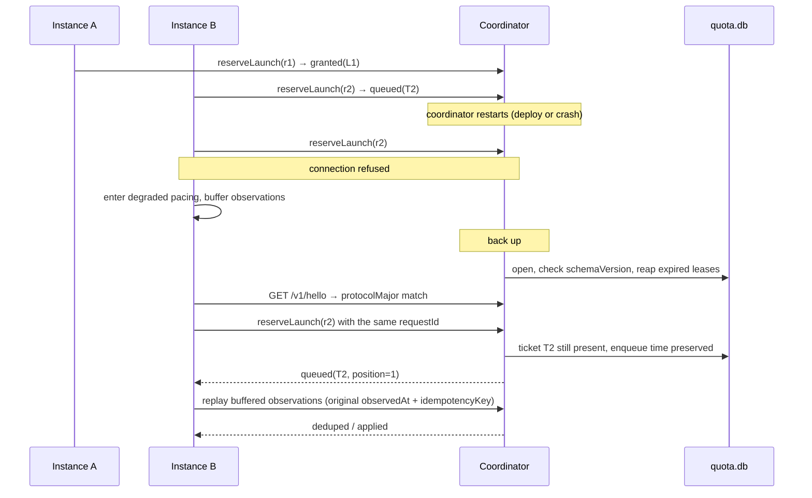

# Shared quota coordinator — design proposal

Design-only proposal for #178. It names a deployment model, states the
service contract, and defines the failure, compatibility and operational
semantics that must hold before any code moves. Nothing here is implemented.
No quota storage, schema, or pacing behaviour changes with this document.

Every source citation below is against `origin/staging` at `13a9ab0`. Paths are
repository-relative; line numbers are that commit's.

## Contents

1. [What exists today](#1-what-exists-today)
2. [Assumptions](#2-assumptions)
3. [The three options](#3-the-three-options)
4. [Recommendation](#4-recommendation)
5. [Service contract](#5-service-contract)
6. [Sequences](#6-sequences)
7. [Storage schema](#7-storage-schema)
8. [Compatibility and rollout](#8-compatibility-and-rollout)
9. [Operations](#9-operations)
10. [Test criteria](#10-test-criteria)
11. [Implementation issues this would cut](#11-implementation-issues-this-would-cut)
12. [Open questions](#12-open-questions)

---

## 1. What exists today

### 1.1 Storage is already shared; nothing else is

`quota.databasePath` is the sharing boundary, and it is a plain filesystem path
(`packages/rusa/src/config/types.ts:101-111`). `quota.poolId` was removed
outright, so the file *is* the pool identity today
(`packages/rusa/src/config/loader.ts:299-303`). A database path is mandatory
once pacing is enabled (`loader.ts:314-318`).

Each instance opens that file directly and keeps the connection for its whole
life (`packages/rusa/src/quota/shared-store.ts:182-192`): WAL, a 10 s
`busy_timeout` (`packages/rusa/src/db/wal.ts:4`), foreign keys on.

### 1.2 Observation ingestion is already idempotent — by slot

Observations are keyed `(provider, kind, observed_slot)` where a slot is five
minutes (`shared-store.ts:11`, `:236`). Two instances scraping the same window
inside one slot collapse to one row, and the winner is decided by a stated
rule — a reading with a valid reset beats one without, then later
`observed_at` wins (`shared-store.ts:705-710`). A row already marked
`processed` is never overwritten (`shared-store.ts:704`).

There is no caller-supplied idempotency key and no record of *which* instance
reported a reading. `recordRaw` mints a fresh `randomUUID` per call
(`shared-store.ts:302-303`), so a retried report is a second raw row.

### 1.3 Controller advancement is already atomic across processes

`advancePendingController` runs inside `BEGIN IMMEDIATE`
(`shared-store.ts:394-409`), and so does the ad-hoc column widening
(`shared-store.ts:257-272`). Every unprocessed observation is reasoned about
exactly once across all connections; the PID decision is written back onto the
observation row (`shared-store.ts:527-543`).

This matters for the comparison below: **cross-process atomicity is not the
missing piece.** SQLite already provides it, and the code already uses it.

### 1.4 The launch clock is per-process, and that is the gap

`ProviderPacer` holds `lastStartedAt` and `nextAvailableAt` as instance fields
in memory (`packages/rusa/src/actor/provider-pacer.ts:45-46`), set when a run
actually starts (`:288-290`). One pacer per lane per process, created lazily
(`packages/rusa/src/commands/start.ts:1192-1199`).

What the shared file distributes is the *interval*
(`shared-store.getProviderThrottle` → `recordQuotaThrottleTick` →
`pacer.setInterval`, `start.ts:1242-1264`). What it does not distribute is the
*clock*. Two instances configured against the same `quota.db` both learn
"space normal starts 600 s apart" and then both start a run immediately, because
each one's `nextAvailableAt` is `0` at boot. The effective launch rate is
`N × 1/interval`, not `1/interval`.

That is precisely the "cross-instance throttling is not free" caveat #178 was
filed on. There is no reservation, lease, or ticket concept anywhere in the
tree today — the only occurrences of "reserved" are SQLite's own lock states.

Two further behaviours the design has to preserve rather than invent:

- **Responsive runs bypass pacing but still charge the clock.** A responsive
  request skips the queue entirely (`provider-pacer.ts:173-175`) and lands in
  `start()`, which advances `lastStartedAt`/`nextAvailableAt` like any other
  start (`:285-292`).
- **The lane FIFO is a user-visible surface.** `getQueueSnapshot`
  (`provider-pacer.ts:91-117`) is projected to the dashboard
  (`start.ts:2941-2951`) with an explicit "never fabricate a time" contract.

### 1.5 Probing, parsing and inference are per-instance — and can disagree

`QuotaService` owns a TTL cache in a plain in-memory `Map`
(`packages/rusa/src/mcp/quota-mcp.ts:700`), 5 min for claude/agy/kimi and
30 min for codex (`:768-786`). One service per process
(`start.ts:1048-1052`), shared between the `get_quota` MCP tool and the
dashboard endpoint. So *N* instances run *N* independent PTY scrapes of the
same provider panel — and those scrapes are expensive tmux-driven captures
(`packages/rusa/src/providers/agy-usage-scrape.ts:43-100`).

Parsing is an LLM call, not a regex, gated on `geminiApiKey`
(`quota-mcp.ts:493-540`) — so *N* instances also pay *N* parse calls.

The disagreement risk is concrete, not hypothetical, and it has two independent
mechanisms:

1. **Inference is stateful in client memory.** `inferQuotaState` takes
   `prevState` (`quota-mcp.ts:555`), and production passes the calling
   process's own TTL-cache entry (`quota-mcp.ts:725`, consumed at `:733`). Rules like
   `carried_forward_bad_read` and `assumed_window_starts_now`
   (`quota-mcp.ts:543-554`) therefore resolve differently in two instances that
   happen to hold different previous readings. Two instances can write
   *different canonical observations* from the same provider panel.

2. **Controller state is read through whatever schema the local build knows.**
   `SharedQuotaStore` evolves the shared file's schema itself, on every open, by
   every instance, outside the migration runner — the code says so
   (`shared-store.ts:251-256`). An older build opening a widened file does not
   see the new column; `advanceObservation` reads
   `previous?.controllerIntegral ?? 0` (`shared-store.ts:492`), so a row written
   without an integral reads as a zeroed integral rather than as "unknown". A
   mixed-version pair silently disagrees about pacing.

These are exactly the two concerns raised in #173: backwards-incompatible schema
changes reaching production, and behavioural changes making the systems disagree
about pacing.

### 1.6 Topology as configured

Instances are user-level systemd units. The two environments are `production`
and `staging`, resolving to `~/.rusa` and `~/.rusa-staging` under one user home
(`packages/rusa/src/commands/service-instance.ts:43-48`,
`packages/rusa/src/commands/install-service.ts:87`). Loopback-only binding is
the established posture: the MCP HTTP server defaults to `127.0.0.1`
(`packages/rusa/src/mcp/http-server.ts:165`) and so does the dashboard
(`start.ts:2726`).

Quota lanes exist for four providers — `claude`, `codex`, `agy`, `kimi`
(`start.ts:256`) — keyed by `providerThrottleKey`
(`packages/rusa/src/providers/registry.ts:64-68`), which fans config aliases of
one CLI onto one lane.

---

## 2. Assumptions

Stated so they can be corrected. Each one is load-bearing for the
recommendation, and §4.3 says what changes if it is wrong.

- **A1 — One host, one user session.** Every instance sharing provider
  credentials runs on the same host under the same user account, as it does
  today (§1.6). *Confidence: high for today, unverified for the roadmap.*
- **A2 — Launch rate is low.** Normal starts are spaced by a controller
  interval capped at `maxIntervalSeconds`, default 3600
  (`config/types.ts:96`), and the sensor ticks every `tickSeconds`, default 300
  (`start.ts:3287`). A reservation RPC is therefore a low-rate operation, not a
  hot path. *Confidence: high — read directly from configuration defaults.*
- **A3 — A reservation must survive a client crash.** An instance can die
  between reserving and starting, so reservation state has to be durable and
  self-healing, not in-memory. *Confidence: high.*
- **A4 — Credential sharing, not provider identity, defines a pool.** Two
  instances contend only when the provider would bill the same account. This is
  what `quota.databasePath` already encodes.
- **A5 — Provider scrape collection stays in the instance.** The PTY/tmux/
  sandbox harness works where it is; moving it is a separate, larger change and
  #178 explicitly wants collection separable from pacing.
- **A6 — One short, scheduled write-quiesce is acceptable once.** Flipping
  ingestion ownership needs a moment with no instance writing. Seconds, once,
  planned.

---

## 3. The three options

### Option 1 — Keep the shared SQLite library and path

Add a reservations table to `quota.db` and have every instance take leases
through `BEGIN IMMEDIATE`, exactly as `advancePendingController` already does
(`shared-store.ts:409`).

This *does* close the launch-clock gap. It is the cheapest possible change and
it needs no new process, port, socket, unit, or credential.

It does not close the rest of #178. Four required contract items are
unreachable by construction:

| #178 requirement | Why Option 1 cannot meet it |
| --- | --- |
| "Quota parsing, inference, controller state, and pacing policy should have one owner. Clients should not retain a second implementation that can disagree." | Every client links the implementation. The two disagreement mechanisms in §1.5 remain live. |
| "versioned request/response compatibility" | There are no requests. The only contract is a schema shared by N writers, widened ad hoc on open (`shared-store.ts:251-272`). |
| "server-owned clock semantics" | Each writer stamps with its own `Date.now()`. On one host this is *de facto* satisfied by the shared OS clock; it is not a property of the design. |
| "health/readiness signals" | Nothing is running to be healthy. |

It also cannot express "the coordinator is unavailable" — the file is either
openable or it is not — so the degraded-mode semantics #178 asks for have no
place to live.

### Option 2 — Same-host sidecar over a Unix domain socket

One additional in-repo process (`rusa quota-coordinator`, a fourth
`systemd --user` unit) owns `quota.db`. It hosts today's `SharedQuotaStore` and
the parse/inference half of today's `QuotaService`, and serves a small versioned
JSON API over a Unix domain socket in the user's runtime directory. Instances
become thin clients: they still collect raw provider scrapes, and they report
that raw text; they never open `quota.db`.

Filesystem permissions on the socket are the authentication boundary — the same
trust model the repo already uses for loopback MCP and the dashboard (§1.6),
with a strictly smaller attack surface than a TCP port, since a Unix socket is
not reachable off-host at all.

Centralising the parse is a side benefit that pays for part of the cost: one
LLM parse per scrape instead of one per instance per scrape
(`quota-mcp.ts:493-540`), and one PTY scrape per provider instead of *N*
(§1.5).

Costs: a third unit to install, supervise, upgrade and back up; a new failure
mode ("coordinator down") that must have defined behaviour; an IPC hop on a
path that is currently a function call.

### Option 3 — Networked coordinator

Option 2's contract over TCP, plus: a bind address that is not loopback, TLS or
a tunnel, a shared secret or mTLS, firewall/tailnet policy, clock-skew handling
between hosts, and a availability story for the network path itself.

Everything Option 3 adds is machinery for a hop that does not exist yet (A1).

### 3.1 Comparison

| Dimension | 1 — Shared SQLite | 2 — Same-host sidecar (UDS) | 3 — Networked |
| --- | --- | --- | --- |
| **Deployment** | Nothing new | +1 `systemd --user` unit, same host/user | +1 unit, +transport config, +certs/secret |
| **Operations** | No new supervision | One process to supervise; ordering with instances | Above, plus network policy and cross-host rollout |
| **Compatibility** | N writers all carrying the schema; ad-hoc widening on open | One writer; versioned wire contract; clients carry no schema | Same as 2 |
| **Latency** | In-process SQLite call (µs) | UDS round trip (sub-ms), at ≤ one reservation per interval (A2) | Network RTT plus TLS; still negligible at A2 rates |
| **Availability** | No new dependency; a corrupt or locked file stops everyone anyway | New SPOF; needs an explicit degraded mode | Same SPOF plus network partitions |
| **Security** | Filesystem ACL on one file | Filesystem ACL on one socket; unreachable off-host | Authn/authz, transport encryption, exposed port |
| **Backup** | One SQLite file, but no single process owns quiescing it | One SQLite file with exactly one writer that can quiesce and `VACUUM INTO` | Same as 2 |
| **Observability** | Per-instance logs; no aggregate view | One place that sees every pool, lane, lease and waiter | Same as 2 |
| **Rollback** | Config revert; but mixed-version writers are the hazard being rolled back *from* | Per-instance for pacing adoption; one flag for ingestion ownership; data never moves | Same as 2, over more moving parts |
| **Meets #178's contract** | No (4 items unreachable) | Yes | Yes, with unused capability |

---

## 4. Recommendation

### 4.1 Adopt Option 2 — a same-host quota coordinator over a Unix domain socket

It is the smallest option that meets the contract #178 actually asks for.
Option 1 is smaller but cannot own parsing, inference or policy, which is the
half of the problem that motivated the issue. Option 3 is a strict superset of
Option 2's wire contract and buys nothing while A1 holds.

The recommendation is deliberately narrow:

- The coordinator is **one in-repo Node process**, not a service platform. It
  reuses `SharedQuotaStore` and the existing parse/infer functions rather than
  reimplementing them.
- It speaks **HTTP/JSON over a Unix domain socket**, so the framing is the one
  the repo already knows (`packages/rusa/src/mcp/http-server.ts`) with the TCP
  listener swapped for a socket path. No new protocol, no new dependency.
- It **does not scrape**. Collection stays in the instance (A5), which satisfies
  #178's separability requirement by construction rather than by promise.

### 4.2 Implementation is staged, and stage 1 is Option 1's table

The reservation tables land in `quota.db` first, behind the coordinator, before
any instance stops writing directly. That means the riskiest new logic — atomic
grant, lease expiry, waiter ordering — is exercised against the real file with
the real `BEGIN IMMEDIATE` machinery before the ownership flip, and can be
tested with the multi-process harness that already exists
(`packages/rusa/src/quota/shared-store.test.ts:495`). Option 1 is a step on the
path, not a competing destination.

### 4.3 What would change this recommendation

State the trigger now so the decision is re-openable on evidence, not vibes.

- **A1 is false today** — any instance sharing provider credentials already runs
  on another host: go directly to **Option 3**. Do not build Option 2 first; the
  wire contract in §5 is transport-agnostic, but the auth model is not.
- **A1 becomes false later** — the migration is: bind the same handlers to a
  TCP listener, add the credential and transport described in §5.3, keep the
  socket for local clients. The contract, schema and semantics below are
  unchanged.
- **A3 is false** (a lost reservation is acceptable): Option 1 plus an in-memory
  advisory lock would do, and this proposal is over-built.
- **A6 is unacceptable** (no write-quiesce is ever schedulable): §8.2's
  ownership flip needs redesign — probably a coordinator that begins as a
  read-through proxy and takes the write lock only when it observes no other
  writer for a full tick. That is more machinery; it is not proposed here.

---

## 5. Service contract

Everything below is versioned as **protocol v1**.

### 5.1 Pool identity

A pool is the set of instances that would bill the same provider account (A4).

`poolId` is a stable operator-chosen string, defaulting to the canonical
absolute path of the coordinator's `quota.db`. That default reproduces today's
semantics exactly — the file is the pool (§1.1) — and the explicit form exists
so one coordinator can serve more than one credential set later without a second
process.

A **lane** is `(poolId, providerThrottleKey)`, reusing
`registry.ts:64-68` unchanged so config aliases of one CLI keep collapsing onto
one lane, as they do now.

Clients send `poolId` on every call. A client whose `poolId` is unknown to the
coordinator is rejected, never silently created: an operator typo must not
quietly open a second, unthrottled pool.

### 5.2 Transport, framing, versioning

- **Transport:** Unix domain socket at `quota.coordinator.socketPath`, default
  `$XDG_RUNTIME_DIR/rusa-quota/<poolId-hash>.sock`, mode `0600`, owned by the
  service user.
- **Framing:** HTTP/1.1 + JSON over that socket. Paths are prefixed `/v1/`.
- **Handshake:** `GET /v1/hello` → `{ protocolMajor, protocolMinor,
  serverVersion, schemaVersion, poolId, serverTime }`. Every client calls it at
  startup and after every reconnect.
- **Compatibility rule:** `protocolMajor` must match exactly; a mismatch is a
  hard refusal on both sides with a message naming both versions. `protocolMinor`
  is additive-only — a client ignores response fields it does not know, and the
  server treats absent optional request fields as their documented defaults. No
  field is ever repurposed; removal requires a major bump.
- **Schema guard:** the coordinator refuses to open a `quota.db` whose recorded
  `schemaVersion` is *newer* than the version it knows, and exits non-zero with
  that message. This is the direct answer to "backwards-incompatible schema
  changes that affect prod": a rolled-back coordinator cannot write to a file a
  newer one has widened.

### 5.3 Authentication and scope

v1 authenticates by **filesystem permission on the socket**: `0600`, service
user only. There is no token, because on a Unix socket a token would be a second
copy of the same fact.

The coordinator additionally records the peer credentials of each connection
(`SO_PEERCRED`) on lease rows, so an operator can see which process holds what.

If Option 3 is ever adopted, this section is what changes: a per-instance shared
secret in config, presented as a bearer credential, scoped to one `poolId`, over
TLS or an existing private tunnel — never an unauthenticated bind.

### 5.4 Clock

**The coordinator's clock is the only clock.** Every timestamp that participates
in a decision — grant time, lease expiry, lane availability, staleness — is
stamped by the coordinator. Clients send `observedAt` for observations (because
only the client knows when its scrape ran) and the coordinator records both that
and its own `receivedAt`.

Clients never compare their own `Date.now()` to a coordinator timestamp. Waits
are expressed by the coordinator as **durations** (`retryAfterMs`,
`leaseTtlMs`), never as absolute instants, so client clock skew cannot make a
client start early. Absolute instants appear only in read-only display fields,
alongside `serverTime`, so the dashboard can render them honestly.

### 5.5 Operations

#### `POST /v1/observations`

Ingests raw provider evidence. The coordinator parses and infers; the client
does neither.

```jsonc
{
  "poolId": "...",
  "source": "rusa-staging",           // stable instance id, recorded on the row
  "provider": "claude",
  "scrapedAt": "2026-09-05T16:00:00.000Z",  // client's real scrape instant
  "rawOutput": "...",                 // the captured panel text
  "idempotencyKey": "..."             // caller-minted, stable across retries
}
```

Response: `{ "result": "applied" | "deduped" | "rejected", "observations": [...],
"reason": "..." }`.

- `idempotencyKey` is stored and unique per `(poolId, provider)`. A replay
  returns the *original* result without re-parsing — this is what makes the
  degraded-mode replay buffer (§5.7) safe, and it costs no LLM call.
- Beneath that, today's slot dedupe is retained unchanged: canonical rows stay
  keyed `(provider, kind, observed_slot)` with the existing winner rule
  (`shared-store.ts:236`, `:705-710`). Two different instances reporting the same
  window in one slot still collapse to one row.
- `source` is new and is recorded. Today nothing knows which instance produced a
  reading; the coordinator will.
- **The coordinator holds the single `prevState`** used by `inferQuotaState`, so
  the divergence in §1.5(1) becomes structurally impossible.

Because parsing happens server-side, the coordinator needs `geminiApiKey`. That
is one more key in one more config file, and one *fewer* parse per instance per
scrape.

#### `GET /v1/snapshot?poolId=&provider=`

Current quota/pacing snapshot. Returns today's `PersistedQuotaProviderStatus`
shape (`shared-store.ts:118`) plus freshness:

```jsonc
{
  "provider": "claude",
  "intervalSeconds": 612.4,
  "uncappedIntervalSeconds": 900.1,
  "governingBucketKey": "claude:weekly",
  "capped": true,
  "expired": false,
  "exhaustedUntil": null,
  "updatedAt": "...",
  "buckets": [ /* unchanged */ ],
  "freshness": { "observedAt": "...", "ageMs": 240000, "stale": false, "hardStale": false },
  "serverTime": "..."
}
```

Read-only and cheap; safe for the dashboard's stale-while-revalidate path, which
already refuses to probe in the request path (`start.ts:2976-2989`).

#### `POST /v1/reserveLaunch`

The atomic operation #178 asks for.

```jsonc
{
  "poolId": "...",
  "source": "rusa-staging",
  "lane": "claude",
  "threadId": "...",         // for observability and the lane FIFO view
  "requestId": "...",        // caller-minted uuid; the idempotency key
  "mode": "normal"           // or "responsive"
}
```

Response is one of:

```jsonc
{ "status": "granted", "leaseId": "...", "leaseTtlMs": 120000, "laneVersion": 41 }
{ "status": "queued",  "ticketId": "...", "position": 1, "retryAfterMs": 30000 }
```

Semantics:

- A grant is one `BEGIN IMMEDIATE` transaction that, together: verifies the
  ticket is the oldest waiter on the lane; verifies
  `now >= max(next_available_at, blocked_until)`; writes a lease row with
  `expires_at = now + leaseTtlMs`; sets `next_available_at = now + interval_ms`
  and `last_started_at = now`; bumps `lane_version`. Either all of it happens or
  none does. This is the same concurrency primitive the controller already
  relies on (`shared-store.ts:409`).
- **`mode: "responsive"` never queues and is always granted immediately**, and
  it advances the lane clock. That is not a concession; it is today's behaviour
  (`provider-pacer.ts:173-175`, `:285-292`) and changing it is out of scope.
- **Ordering is FIFO by coordinator-stamped enqueue time**, ties broken by
  `ticketId`. Deterministic, and it generalises the per-process FIFO
  (`provider-pacer.ts:91-117`) to the pool.
- **`requestId` makes the call idempotent.** A retry after a lost response
  returns the same ticket or the same lease — never a second lease, never a
  second lane advance. This is the difference between an at-least-once transport
  and a double-spent allowance.
- **Where it sits in the launch path:** the client reserves *after* clearing its
  own mesh concurrency limiter and immediately before spawning the provider.
  That inverts today's order (pacer first, then mesh queue —
  `provider-pacer.ts:238-269`), and it is deliberate: it makes the lease
  short-lived, so a crashed client parks the lane for seconds rather than for a
  whole run. The cost is that cross-instance fairness is decided at the
  coordinator rather than at submission time; §12 Q4 asks whether that is
  acceptable.

#### `POST /v1/confirmLaunch`

`{ poolId, leaseId }`. The provider process actually started. The lease closes;
the lane clock is **unchanged**, because the interval is start-to-start and the
grant already advanced it.

#### `POST /v1/cancelLaunch`

`{ poolId, leaseId, laneVersion }`. The client decided not to start (a stale
provider re-gate, `RunStartStaleProviderError` — `provider-pacer.ts:253-258`, or
a cancellation). The lease closes, and `next_available_at` is rolled back to its
pre-grant value **only if `laneVersion` still matches** — i.e. only if no later
grant has since advanced the lane. Otherwise the rollback is skipped and the
response says so. Compare-and-set, never a blind write.

#### `POST /v1/renewLaunch`

`{ poolId, leaseId }` → `{ leaseTtlMs }`. For a client whose spawn is legitimately
slow. Bounded: a lease can be renewed until `maxLeaseMs` (default 600 s) from its
original grant, then it expires regardless.

#### Expiry

A lease past `expires_at` is reaped by the coordinator (lazily on the next call
touching the lane, and by a sweep every `leaseSweepMs`). On expiry:

- the lease closes with `outcome: "expired"`;
- **`next_available_at` is NOT rolled back.**

That asymmetry with `cancelLaunch` is deliberate and worth stating plainly: a
cancel is a client *telling* us it did not start; an expiry is silence. Silence
is compatible with "the client spawned the provider and then died", so rolling
back would risk double-spending real allowance. Leaving the clock costs at most
one interval of idleness. **Prefer idle to double-spent.**

#### `GET /v1/lanes?poolId=`

Read-only lane state and waiter list, for the dashboard's queue view. Mirrors
`getQueueSnapshot`'s contract (`provider-pacer.ts:67-90`) including its "render
`null` as unknown, never fabricate a time" rule.

#### `GET /v1/healthz` and `GET /v1/readyz`

- `healthz`: process alive, `quota.db` open and writable. 200/503.
- `readyz`: schema version matches, meta row readable, and either at least one
  observation newer than `hardStaleAfterMs` **or** an explicit `"cold": true`.
  A cold coordinator is ready-but-cold, not ready-and-lying.

### 5.6 Errors and deterministic conflict handling

One error envelope: `{ "error": { "code": "...", "message": "...", "retryable": bool } }`.

| Code | Meaning | Client action |
| --- | --- | --- |
| `protocol_mismatch` | `protocolMajor` differs | Refuse to run normal launches; log loudly |
| `unknown_pool` | `poolId` not configured | Refuse; this is a config error |
| `lane_unknown` | Lane not configured for this pool | Refuse |
| `lease_not_found` | Confirm/cancel/renew on a reaped or unknown lease | Treat as expired; do not retry |
| `lease_expired` | Renew after `maxLeaseMs` | Re-reserve |
| `lane_version_conflict` | Cancel rollback skipped | Informational; no retry |
| `stale_snapshot` | Read while hard-stale and caller demanded fresh | Use degraded pacing |
| `busy` | Write contention beyond `busy_timeout` | Retry with jittered backoff |

Every mutating call is safe to retry, because every mutating call carries a
caller-minted idempotency key (`idempotencyKey` for observations, `requestId`
for reservations, `leaseId` for the lease lifecycle).

### 5.7 When the coordinator is unavailable or stale

**Stale** — the coordinator has the data but it is old:

- `stale` at `now - observedAt > staleAfterMs` (default `3 × tickSeconds` = 900 s):
  keep serving the last reasoned interval. This matches today's stated behaviour
  on a failed scrape — "keep the last persisted reasoned interval"
  (`start.ts:1286-1292`) — and the snapshot says `stale: true` so the dashboard
  can show it.
- `hardStale` at `now - observedAt > hardStaleAfterMs` (default 3600 s, the same
  as `maxIntervalSeconds`'s default): grants are spaced at `maxIntervalSeconds`
  rather than at the last reasoned interval. **The degradation is always toward
  slower, never faster.**

**Unavailable** — the socket is gone, the connection fails, or the handshake is
refused. The design is **fail-slow**, not fail-open and not fail-closed:

1. Normal launches continue, paced by a *local* pacer at
   `max(lastKnownIntervalSeconds, degradedIntervalSeconds)` where
   `degradedIntervalSeconds` defaults to `maxIntervalSeconds`. Two degraded
   instances therefore launch at worst at 2 × (1/3600 s), which is slower than
   today's uncoordinated behaviour, not faster.
2. **Responsive launches are never blocked** by the coordinator, in any state.
   An operator's urgent wake must not depend on a sidecar.
3. **The client never writes to `quota.db`.** Not while degraded, not ever, once
   ownership has flipped (§8.2). This is the rule that makes "avoid concurrent
   old/new writers" enforceable rather than aspirational.
4. Observations are **buffered in memory** — a bounded ring, default 200 entries
   per provider, oldest dropped — and replayed on reconnect with their original
   `observedAt` and `idempotencyKey`. Slot dedupe plus the idempotency key make
   replay exactly-once in effect.
5. After `degradedGraceSeconds` with no successful handshake (default 1800), the
   instance **stops starting normal runs** and says so in its health output and
   in chat. Responsive runs still work. Losing pacing for half an hour is a
   degradation; losing it indefinitely and silently is the failure mode this
   whole issue exists to prevent.

---

## 6. Sequences

### 6.1 Simultaneous launch requests from two instances

```mermaid
sequenceDiagram
    participant A as Instance A
    participant B as Instance B
    participant C as Coordinator
    participant D as quota.db

    Note over A,B: both cleared their own mesh concurrency limiter
    A->>C: reserveLaunch(lane=claude, requestId=r1)
    B->>C: reserveLaunch(lane=claude, requestId=r2)
    C->>D: BEGIN IMMEDIATE (r1)
    Note over C,D: now >= next_available_at; r1 is oldest waiter
    D-->>C: lease L1; next_available_at = now+600s; lane_version 41→42
    C-->>A: granted(L1, leaseTtlMs=120000)
    C->>D: BEGIN IMMEDIATE (r2)
    Note over C,D: now < next_available_at
    D-->>C: ticket T2 enqueued
    C-->>B: queued(T2, position=1, retryAfterMs=600000)
    A->>A: spawn provider
    A->>C: confirmLaunch(L1)
    Note over C: lane clock unchanged — interval is start-to-start
    B->>C: reserveLaunch(requestId=r2) again (retry, same id)
    C-->>B: queued(T2, position=1, retryAfterMs=~570000)
    Note over B: same ticket, never a second one
    Note over B: ... the interval elapses ...
    B->>C: reserveLaunch(requestId=r2)
    C->>D: BEGIN IMMEDIATE (r2)
    D-->>C: lease L2; next_available_at = now+600s; lane_version 42→43
    C-->>B: granted(L2)
```

**Invariant proved:** two grants on one lane are separated by at least
`interval_ms`, because the grant that issues a lease also advances
`next_available_at` inside the same immediate transaction.

### 6.2 Client crash after reservation

```mermaid
sequenceDiagram
    participant A as Instance A
    participant C as Coordinator
    participant D as quota.db

    A->>C: reserveLaunch(r1)
    C->>D: grant lease L1, expires_at = now+120s, next_available_at = now+600s
    C-->>A: granted(L1)
    Note over A: process dies before confirm or cancel
    Note over C: t = now+120s, sweep
    C->>D: lease L1 → outcome "expired"
    Note over C,D: next_available_at is NOT rolled back
    Note over C: silence is compatible with "it launched and then died"
    Note over C: worst case is one idle interval; the alternative is a double spend
    C->>C: metric quota_coordinator_leases_expired_total{lane} += 1
```

Recovery: once A restarts it simply reserves again with a fresh `requestId`. It
inherits no state and needs none.

### 6.3 Stale observations

```mermaid
sequenceDiagram
    participant A as Instance A
    participant C as Coordinator

    Note over A: scrape fails (PTY timeout / provider panel unreadable)
    A->>C: (no observation reported)
    A->>C: reserveLaunch(r1)
    Note over C: age = now - observedAt = 1000s > staleAfterMs (900s)
    C-->>A: granted, using the last reasoned interval; snapshot.stale = true
    Note over A,C: ... scrapes keep failing ...
    A->>C: reserveLaunch(r2)
    Note over C: age = 4000s > hardStaleAfterMs (3600s)
    C-->>A: granted at maxIntervalSeconds; snapshot.hardStale = true
    C->>C: metric quota_coordinator_snapshot_age_seconds{provider} = 4000
```

Degradation is monotone toward slower. A stale snapshot never speeds anything up.

### 6.4 Coordinator restart



**Invariant:** waiter order survives a restart, because tickets are rows and
their enqueue time is coordinator-stamped, not connection state. Leases survive
too; only their expiry timer is re-derived, from `expires_at`.

### 6.5 Transport failure

```mermaid
sequenceDiagram
    participant A as Instance A
    participant C as Coordinator

    A->>C: reserveLaunch(r1)
    Note over A,C: response lost in flight (socket reset)
    A->>A: unknown outcome — may or may not hold a lease
    A->>C: reserveLaunch(r1) with an identical requestId
    C-->>A: granted(L1) - the original lease, not a second one
    Note over A: idempotency turns an ambiguous failure into a certain one

    Note over A,C: socket stays down past degradedGraceSeconds
    A->>A: normal runs stop; responsive runs still launch
    A->>A: health degraded; alert raised
    Note over A: zero direct writes to quota.db, in every branch
```

---

## 7. Storage schema

Additive. `quota_scrapes` and `quota_observations` are **untouched** — the
existing observation and controller columns keep their current meaning
(`shared-store.ts:206-247`). New tables live in the same `quota.db`.

```sql
-- Single source of truth for who owns this file and what version it is at.
CREATE TABLE IF NOT EXISTS quota_coordinator_meta (
  singleton          INTEGER PRIMARY KEY CHECK (singleton = 1),
  schema_version     INTEGER NOT NULL,
  protocol_major     INTEGER NOT NULL,
  pool_id            TEXT    NOT NULL,
  authoritative      INTEGER NOT NULL DEFAULT 0,  -- 1 = direct writers rejected
  owner_boot_id      TEXT,                        -- coordinator instance identity
  owner_started_at   TEXT,
  authoritative_since TEXT
);

-- One row per (pool, lane). The durable form of ProviderPacer's fields.
CREATE TABLE IF NOT EXISTS quota_lanes (
  pool_id           TEXT    NOT NULL,
  lane              TEXT    NOT NULL,     -- providerThrottleKey
  interval_ms       INTEGER NOT NULL DEFAULT 0,
  next_available_at TEXT,                 -- coordinator clock
  last_started_at   TEXT,
  blocked_until     TEXT,                 -- exhaustion gate; cf. deferUntil
  lane_version      INTEGER NOT NULL DEFAULT 0,
  updated_at        TEXT    NOT NULL,
  PRIMARY KEY (pool_id, lane)
);

-- One row per reservation attempt. Tickets and leases are the same row's
-- lifecycle, so ordering and grant can be decided in one transaction.
CREATE TABLE IF NOT EXISTS quota_leases (
  id             TEXT PRIMARY KEY,
  pool_id        TEXT NOT NULL,
  lane           TEXT NOT NULL,
  request_id     TEXT NOT NULL,           -- caller-minted idempotency key
  source         TEXT NOT NULL,           -- reporting instance id
  thread_id      TEXT,
  mode           TEXT NOT NULL CHECK (mode IN ('normal','responsive')),
  state          TEXT NOT NULL CHECK (state IN ('queued','granted','confirmed','cancelled','expired')),
  enqueued_at    TEXT NOT NULL,           -- FIFO key, coordinator clock
  granted_at     TEXT,
  expires_at     TEXT,
  settled_at     TEXT,
  granted_lane_version INTEGER,           -- for cancel's compare-and-set
  peer_uid       INTEGER,
  peer_pid       INTEGER,
  UNIQUE (pool_id, lane, request_id),
  FOREIGN KEY (pool_id, lane) REFERENCES quota_lanes(pool_id, lane)
);

CREATE INDEX IF NOT EXISTS idx_quota_leases_lane_queue
  ON quota_leases(pool_id, lane, enqueued_at) WHERE state = 'queued';
CREATE INDEX IF NOT EXISTS idx_quota_leases_expiry
  ON quota_leases(expires_at) WHERE state = 'granted';

-- Ingestion idempotency, so a replayed report costs no LLM parse.
CREATE TABLE IF NOT EXISTS quota_ingest_receipts (
  pool_id         TEXT NOT NULL,
  provider        TEXT NOT NULL,
  idempotency_key TEXT NOT NULL,
  source          TEXT NOT NULL,
  received_at     TEXT NOT NULL,
  result          TEXT NOT NULL,   -- applied | deduped | rejected
  scrape_id       TEXT,            -- quota_scrapes.id, when one was written
  PRIMARY KEY (pool_id, provider, idempotency_key)
);
```

Notes:

- `UNIQUE (pool_id, lane, request_id)` is what makes `reserveLaunch` idempotent
  at the storage layer, not merely at the handler.
- The partial index on `state = 'queued'` keyed by `enqueued_at` is what makes
  "is this ticket the oldest waiter" a single indexed read inside the grant
  transaction.
- `quota_ingest_receipts` and `quota_scrapes` are both pruned on the retention
  schedule (§9.4), reusing the existing prune-on-write pattern
  (`shared-store.ts:273-300`).
- **`quota.db` stays a separate file from `mesh.db`.** `mesh.db` is opened and
  migrated per instance home (`packages/rusa/src/db/index.ts:41-57`); `quota.db`
  is shared across instances. Folding them would make the shared file
  instance-owned, which is the opposite of this design. #178 forbids it while
  this decision is open, and this design does not need it.

---

## 8. Compatibility and rollout

### 8.1 Existing observations and controller state are preserved by not moving

There is **no import and no export**. The coordinator opens the same
`quota.databasePath` the instances open today and inherits every
`quota_scrapes` and `quota_observations` row, including `controller_error`,
`controller_derivative`, `controller_integral`, `uncapped_interval_seconds` and
`interval_seconds`. The PID controller keeps its memory across the cutover
because the rows never move.

This is the "put the service in front of the existing `quota.db`" branch of
#178's compatibility constraint, chosen over "versioned import" precisely
because it has no migration to get wrong.

### 8.2 No concurrent old and new writers — enforced, not promised

`quota_coordinator_meta.authoritative` is the switch, and it is checked in code,
not in a runbook:

- `SharedQuotaStore` gains a **direct mode** (an instance opening the file
  itself, today's behaviour) and a **coordinator mode**.
- Opening in direct mode against a file with `authoritative = 1` **throws at
  open**, with a message naming the coordinator's socket path. It writes
  nothing.
- An instance with `quota.coordinator.socketPath` set never constructs a writing
  `SharedQuotaStore` at all (`start.ts:1040-1044` becomes a client
  construction).

So a stale instance cannot write to an owned file even if someone starts it by
hand.

### 8.3 Canary and rollback

The flip has two independent axes, and only one of them needs coordination.
Separating them is what makes a one-instance canary possible.

**Axis 1 — ingestion ownership** (who writes observations and controller state).
This must flip for all instances at once, because it *is* the concurrent-writer
hazard. It is cheap and reversible because no data moves.

**Axis 2 — reservation adoption** (who takes launch pacing from the
coordinator). This is per-instance, because lane reservation state is *new*
state. An instance that has not yet adopted it paces locally exactly as it does
today — it is not a writer of the reservation tables at all.

Rollout:

| Stage | Action | Verifies | Rollback |
| --- | --- | --- | --- |
| 0 | Install the unit; coordinator runs with `authoritative = 0`, read-only. Instances unchanged. | Unit starts, socket appears with the right mode, `healthz`/`readyz`, backups run, metrics appear | Stop and remove the unit. Nothing else touched. |
| 1 | Back up `quota.db`. Stop all instances. Set `authoritative = 1`. Start the coordinator. Start all instances with `quota.coordinator.socketPath` set. | Observations flow through the coordinator; `quota_ingest_receipts` fills; no instance opens the file | Stop instances, set `authoritative = 0`, unset the socket path, restart. Observations are where they always were. |
| 2 | Canary: enable `quota.coordinator.reservations: true` on **one** instance. | Grants, queueing, confirm/cancel, expiry, and the lane view, under real traffic | Set it back to `false` and restart that one instance. Seconds, one process. |
| 3 | Enable reservations on the remaining instances. | Cross-instance spacing: the union of start timestamps respects the lane interval | Per-instance, as stage 2. |

During stage 2 the non-canary instance still paces on its own clock — which is
today's behaviour, so nothing regresses. Cross-instance enforcement simply is
not yet complete, and that is the honest description of a canary.

**Upgrade order, always:** coordinator first, instances second. The coordinator
must serve the old and the new `protocolMinor`; a `protocolMajor` bump means
stopping every instance, which is a deliberate cost that should be rare.

### 8.4 Scrape collection stays separable

The coordinator has no PTY, no tmux, no sandbox and no provider CLI. It receives
raw text over the socket. Consequences, stated as guarantees:

- Today's in-instance collector keeps working unchanged (A5).
- A dedicated collector process can report observations without owning pacing —
  it just calls `POST /v1/observations`.
- A client that only *reads* (a dashboard, a report) needs `GET /v1/snapshot`
  and nothing else.

Parsing and inference move to the coordinator, which is a different seam from
collection. That is the point: collection is provider-specific and messy; policy
is the thing that must have one owner.

---

## 9. Operations

### 9.1 Ownership and units

A fourth `systemd --user` unit alongside the existing per-environment units
(`install-service.ts`). It should carry the same treatment the existing units
get: journal logging, restart policy, and a failure-alert companion unit
(`install-service.ts:351-395`).

Ordering: instances declare `After=` and `Wants=` the coordinator — not
`Requires=`, because §5.7's degraded mode is designed to make a missing
coordinator survivable rather than fatal.

Ownership follows the quota code: whoever owns `packages/rusa/src/quota/`.

### 9.2 Backup and restore

The coordinator is the only writer, which is the property that makes backup
correct for the first time. It runs a scheduled backup using SQLite's backup API
or `VACUUM INTO` — **never a file copy**, since the file is WAL-mode
(`shared-store.ts:187`) and copying the `.db` without its `-wal` produces a
silently truncated database.

- Cadence: daily, plus one mandatory backup immediately before stage 1 of §8.3.
- Retention: 14 daily copies, alongside the existing disk-usage alerting.
- Restore drill: stop instances, stop the coordinator, replace the file, start
  the coordinator, check `readyz` and lane state, start instances. This must be
  exercised once before stage 1, not first attempted during an incident.

### 9.3 Metrics and logs

Emitted through the structured logger being introduced under #177, so this
lands with conventions rather than ad-hoc `console.log` (today's throttle
logging is exactly that — `start.ts:1233-1236`).

| Metric | Type | Labels |
| --- | --- | --- |
| `quota_coordinator_reservations_total` | counter | `lane`, `mode`, `outcome` (granted/queued) |
| `quota_coordinator_leases_confirmed_total` | counter | `lane` |
| `quota_coordinator_leases_cancelled_total` | counter | `lane`, `rolled_back` |
| `quota_coordinator_leases_expired_total` | counter | `lane` |
| `quota_coordinator_reservation_wait_seconds` | histogram | `lane` |
| `quota_coordinator_lane_interval_seconds` | gauge | `lane` |
| `quota_coordinator_lane_waiters` | gauge | `lane` |
| `quota_coordinator_observations_total` | counter | `provider`, `source`, `result` |
| `quota_coordinator_snapshot_age_seconds` | gauge | `provider` |
| `quota_coordinator_degraded_clients` | gauge | — |

Alert on: `leases_expired_total` rising (clients crashing between reserve and
spawn), `snapshot_age_seconds` past `hardStaleAfterMs` (the sensor is blind), and
`degraded_clients > 0` for longer than `degradedGraceSeconds`.

### 9.4 Retention

Unchanged for existing tables: 30 days for raw scrapes and observations
(`shared-store.ts:12`, `:24`), with the existing rule that the newest reasoned
observation per `(provider, kind)` is never pruned
(`shared-store.ts:279-299`) — the controller's memory must not be deleted out
from under it.

New: settled leases pruned after 7 days; `quota_ingest_receipts` pruned after
7 days, which must exceed the largest plausible degraded-buffer replay delay
(§5.7 caps that at `degradedGraceSeconds`, 30 minutes by default — three orders
of magnitude of headroom).

### 9.5 Rollback drill

Rehearse before stage 1, not during an incident: bring the coordinator down
mid-flight and confirm each of (a) normal runs continue at
`degradedIntervalSeconds`, (b) responsive runs are unaffected, (c) no instance
writes to `quota.db`, (d) buffered observations replay on reconnect and dedupe,
(e) `degraded_clients` fires.

---

## 10. Test criteria

Every criterion below is a statement about observable state, not about intent.
Items 1–11 are unit/integration tests in the package; item 12 is an end-to-end
check. The multi-process pattern already exists in
`packages/rusa/src/quota/shared-store.test.ts:495` (`startConcurrentOpener`
spawns a real second Node process against the same database file) and is the
right foundation for 1–6.

1. **Mutual exclusion.** Two client processes call `reserveLaunch` on one lane
   at the same instant. Exactly one is `granted`; the other is `queued`. The
   second grant's `granted_at` is at least `interval_ms` after the first's.
2. **Crash recovery.** Kill a granted client without confirm or cancel. After
   `leaseTtlMs`, the lease reads `expired`, the lane is grantable again, and
   `next_available_at` is unchanged from its post-grant value.
3. **Cancel is a compare-and-set.** `cancelLaunch` with a current `laneVersion`
   restores `next_available_at`; `cancelLaunch` after another grant has advanced
   the lane does not, and returns `lane_version_conflict`.
4. **Reservation idempotency.** Two `reserveLaunch` calls with one `requestId`
   yield one row in `quota_leases` and exactly one advance of
   `next_available_at`.
5. **Ingestion idempotency.** Replaying a buffered batch leaves
   `quota_observations` bit-identical (same `processed`, `interval_seconds`,
   `controller_integral` values) and triggers no second parse.
6. **Restart preserves order.** With three waiters queued, restart the
   coordinator; grants follow the original `enqueued_at` order, and at no point
   do two rows for one lane hold `state = 'granted'`.
7. **Staleness degrades one way.** With observations aged past
   `hardStaleAfterMs`, successive grants are spaced at `maxIntervalSeconds` —
   never at the last reasoned interval, never faster.
8. **Degraded mode.** Remove the socket. Assert: normal launches spaced at or
   above `degradedIntervalSeconds`; responsive launches unaffected;
   `quota_scrapes` and `quota_observations` row counts unchanged for the whole
   window; buffered observations replay and dedupe on reconnect; normal launches
   stop after `degradedGraceSeconds`.
9. **Authoritative guard.** Open `SharedQuotaStore` in direct mode against a
   file with `authoritative = 1`. It throws, the message names the socket path,
   and the database is byte-identical afterwards.
10. **Protocol guard.** A client whose `protocolMajor` differs is refused at
    `hello` and starts no normal runs.
11. **Schema guard.** A coordinator whose known `schema_version` is lower than
    the file's refuses to open it and exits non-zero.
12. **Two real instances.** Two full instances with separate homes, pointed at
    one coordinator. Assert the *union* of provider start timestamps across both
    instances is spaced by at least the lane interval. This is the criterion
    #178 asks for: concurrent clients cannot both consume the same allowance.
    Note that no two-instance fixture exists yet: `E2EInstanceManager` provisions
    a *single* sandboxed instance on a fixed port
    (`packages/rusa/src/actor/e2e-instance-manager.ts:48`, `:136-151`), so
    building the second one is part of this criterion's cost, not a given.

---

## 11. Implementation issues this would cut

Sequenced. None of these should be filed until this proposal is approved.

1. **Reservation storage and grant semantics.** The three new tables (§7) and
   the grant/confirm/cancel/renew/expire transaction, behind
   `SharedQuotaStore`. Testable entirely with the existing multi-process
   harness. No process, no socket. Covers criteria 1–4 and 6.
2. **Coordinator process and v1 API.** `rusa quota-coordinator`, UDS listener,
   handlers, `hello`/`healthz`/`readyz`, error envelope. Covers 10 and 11.
3. **Move parse and inference server-side.** `POST /v1/observations` accepting
   raw text; single `prevState`; `geminiApiKey` on the coordinator. Covers 5.
4. **Client mode in the instance.** `quota.coordinator.socketPath`; the client
   replaces the direct `SharedQuotaStore` (`start.ts:1040-1052`); the
   authoritative guard. Covers 9.
5. **Reservation adoption in the launch path.** `providerGate`
   (`start.ts:1570-1635`) reserves through the coordinator after mesh
   admission; responsive stays a `recordLaunch`; the dashboard lane view reads
   `GET /v1/lanes`.
6. **Degraded mode.** Local fallback pacer, observation ring buffer and replay,
   grace window, health surfacing. Covers 7 and 8.
7. **Operational packaging.** systemd unit and alert companion, backup job,
   metrics through the #177 logger, rollback drill documented.
8. **End-to-end two-instance test.** Covers 12.

---

## 12. Open questions

Each needs a decision before implementation issues are cut. Answers change the
design, not just the wording.

**Q1 — Is A1 true, now and for the foreseeable roadmap?** Does every instance
that shares provider credentials run on one host under one user account? If the
answer is "no" or "not for long", the recommendation changes to Option 3 and
§5.3 has to grow a real credential and transport before anything ships.

**Q2 — Is a fourth `systemd --user` unit acceptable operational weight?** The
alternative is an opt-in "this instance also hosts the coordinator" mode, which
removes a unit but introduces a leader-election problem the moment that instance
restarts. This proposal assumes the separate unit is the cheaper of the two.

**Q3 — Fail-slow, or fail-closed, when the coordinator is unavailable?** §5.7
recommends fail-slow: keep launching at `maxIntervalSeconds` and stop after a
grace window. Fail-closed is safer for quota and worse for availability. This is
a policy call about which risk is preferred.

**Q4 — Reserve after mesh admission, or before?** §5.5 recommends reserving
immediately before spawn, which keeps leases short but moves cross-instance
fairness to arrival order at the coordinator rather than submission order. The
alternative — reserve first, hold a long heartbeated lease — preserves
submission-order fairness at the cost of leases that outlive crashes by much
longer.

**Q5 — Should the collector stay in the instance for v1?** A5 says yes, and
#178 requires only that collection be *separable*. Confirming this keeps the
PTY/sandbox machinery where it already works and keeps the first implementation
small.

**Q6 — Is the one scheduled write-quiesce in stage 1 acceptable?** It is the
only moment in the rollout that requires every instance to be stopped at once,
and it is what makes "no concurrent old and new writers" a guarantee rather than
a hope.
