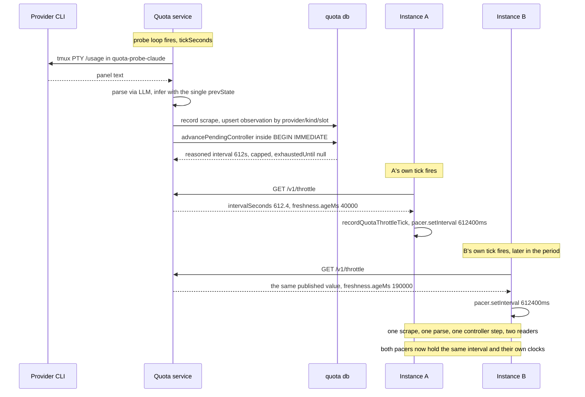
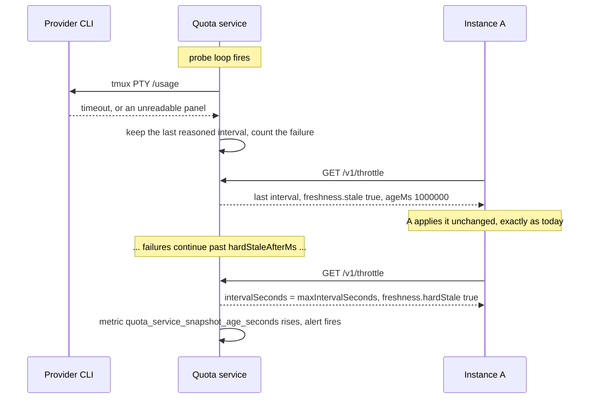
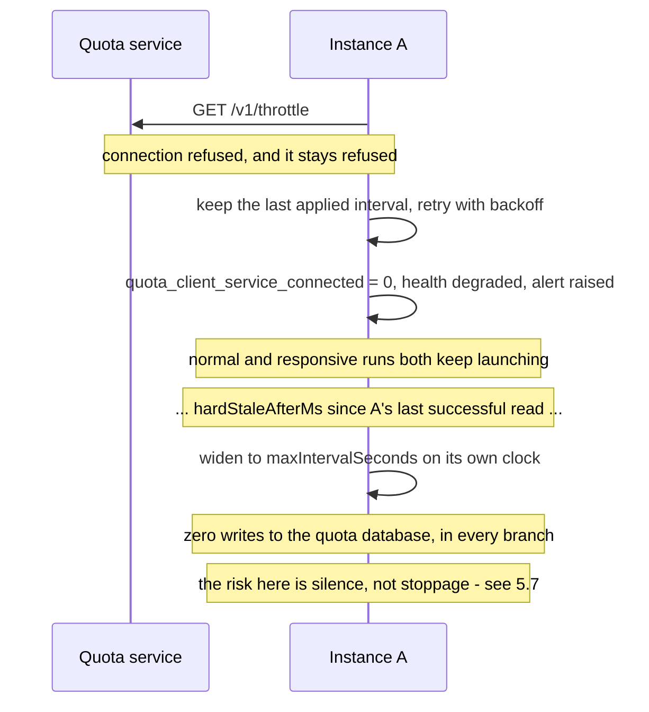

# Shared quota coordinator — design proposal

Design-only proposal for #178. It names a deployment model, states the
service contract, and defines the failure, compatibility and operational
semantics that must hold before any code moves. Nothing here is implemented.
No quota storage, schema, or pacing behaviour changes with this document.

Every source citation below is against `origin/staging` at `aadfdb0`. Paths are
repository-relative; line numbers are that commit's.

## What v1 is, in one paragraph

**A self-contained quota module.** One process scrapes the provider panels,
parses and reasons about them, keeps the observation and controller history,
and **publishes the resulting throttle periods** over a small read-only API.
Instances stop scraping, stop parsing, and stop opening the quota database;
they read a published interval and apply it to their own pacer exactly as they
apply the persisted one today. Nothing in v1 gates a launch, reserves anything,
or holds a lease.

**What v1 deliberately does not do.** It does not close the launch-clock gap in
§1.4. Two instances reading one published interval still both start immediately
at boot, so the pool's effective normal-launch rate stays `N × 1/interval`
rather than `1/interval`. That is a scope decision taken in review, not an
oversight. Whether that gap ever needs closing is now itself a question to be
answered by observation rather than by design: the operator's direction on this
proposal is to ship v1 and wait and see. §11 keeps the invariants that work
would have to respect, and nothing more.

## Revision log

- **Revision 1** proposed the sidecar with a reservation protocol.
- **Revision 2** stamped the launch clock on confirmation rather than on grant,
  removed multi-pool surface, made old-writer exclusion a path relocation rather
  than a cooperative flag (§8.2), and withdrew the claim that centralising
  parsing reduces PTY scrapes (§3.1).
- **Revision 3** settled the topology assumption on the evidence in #237 —
  remote instances are leader-authoritative — and adopted Option 2 outright
  (§4.1), while noting that the processes which *consume* the shared account are
  a strictly larger set than the processes which pace it (A1a).
- **Revisions 4 and 5** answered correctness findings against the reservation
  machinery. Those findings survive as the invariant list in §11.2; the protocol
  they corrected is not carried forward.
- **Revision 6 is a scope change from review, not a correction.** Two directions
  came back **from the change request on this proposal**
  ([`#pullrequestreview-5133794400`](https://github.com/MEK-Org/rusa/pull/256#pullrequestreview-5133794400),
  submitted against head `a4ef697a`), and both narrow v1. Neither is reviewer momentum, and
  both supersede the corresponding wording in #178 — the issue predates them.
  First: the quota module should own its own
  collection rather than depending on the systems it serves for the information
  it publishes — a module that is handed its inputs by its consumers is not the
  well-defined unit this effort is for. Second: cross-instance launch
  coordination should wait, and v1 should do nothing but publish the throttle
  periods clients already consume. Both are adopted here.

  What that changed. A5 reverses (§2): collection moves into the service. The
  scrape-reduction claim withdrawn in revision 2 comes back (§3.1), because A5
  was the only reason it was withdrawn. The v1 wire contract becomes
  **read-only — six GETs and no mutating operation anywhere** (§5), which
  deletes client ingestion, the ingest receipts table, the observation replay
  buffer, and the whole reservation lifecycle from v1's surface. The v1 schema
  addition shrinks to one singleton table, which revision 7 then removes
  altogether. §5.7 collapses, because a
  service that gates nothing cannot fail closed. And §8.4's account of
  separability is rewritten: separable no longer means *collection stays where
  it is*, it means *collection lives behind a contract in its own deployable
  unit*.
- **Revision 7 records the operator's decisions and answers a review round.**
  Four questions this document had left open were settled directly on the
  proposal: stage 1's temporary double scraping is acceptable and is in practice
  a *transfer* rather than an addition (§8.3); the A/B harness stops being a
  scraper and becomes a client (§1.7, Q10); the agent-facing `get_quota` tool
  reads through the service (Q11); and #178 closes when the self-scraping,
  read-only v1 ships, with cross-instance coordination deferred pending evidence
  that it is needed (Q12). The earlier requirement that the collector admit
  off-host observation *sources* is superseded and removed. Review of revision 6
  also found five things wrong or unstated, all fixed here: the freshness rule
  was ambiguous for a provider with several windows (§5.5), a client restarting
  during an outage would have been unpaced (§5.7), the restart invariant ignored
  the service's own in-memory inference state (§6.3), the new schema table was
  mostly anticipatory and is now gone entirely (§7), and §11 carried a
  168-line protocol for work that is not scheduled (§11).
- **Revision 8 answers a two-seat review round, and its net effect is
  subtraction.** Sixteen inline findings across two independent reviews of
  revision 7 converged on one complaint from two directions: v1 was carrying
  surface it could not justify. `GET /v1/hello` is deleted — one seat showed
  that the server-side refusal it promised is unimplementable, because the
  handshake takes no client version and so has nothing to refuse on; the other
  asked what actually breaks if those facts ride in the first real response.
  Both answers point the same way, so versioning now rides in a `service` block
  on *every* v1 response and the refusal is client-side and per-response —
  strictly stronger than a handshake, since it also catches a service restarted
  into a different major between two reads. That leaves **five GETs** (§5.2).
  `governingBucketAgeMs` is deleted as derivable from
  `freshness.buckets[governingBucketKey]` (§5.5), which removes the inconsistent
  worked example the other seat caught. The error envelope drops from five codes
  to two (§5.6): `protocol_mismatch` has no server-side input, `stale_snapshot`
  had no caller, and `busy` cannot occur against a single writer with WAL
  readers. §5.7 names the `publishedThrottle` transformation explicitly so that
  criteria 2 and 5 stop contradicting each other, and criterion 12 splits so the
  two-home end-to-end fixture — the round's most expensive ask — is deferred to
  v2 rather than paid for in v1 (§10). The multi-provider collection form,
  previously only implied, is written out and pinned by criterion 16. Review
  also made two retentions argue for themselves rather than be assumed: the
  throttle history endpoint (§5.5) and the published `stale`/`hardStale` flags.
  A second pass on this revision fixed the transformation it introduced: `capped`
  is now *derived* from the published interval by the store's own strict
  inequality rather than asserted `true`, which removes the one boundary
  (`uncappedIntervalSeconds === maxIntervalSeconds`) where the field had two
  defensible values, and the hard-stale widening takes the wider of the stored
  and configured intervals so that a lowered `maxIntervalSeconds` cannot make a
  stale provider publish faster (§5.7, criterion 2).

## Contents

1. [What exists today](#1-what-exists-today)
2. [Assumptions](#2-assumptions)
3. [The three options](#3-the-three-options)
4. [Recommendation](#4-recommendation)
5. [Service contract](#5-service-contract)
6. [Sequences](#6-sequences)
7. [Storage schema](#7-storage-schema)
8. [Compatibility and rollout](#8-compatibility-and-rollout)
9. [Operations](#9-operations)
10. [Test criteria](#10-test-criteria)
11. [Deferred to v2 — cross-instance launch coordination](#11-deferred-to-v2--cross-instance-launch-coordination)
12. [Implementation issues this would cut](#12-implementation-issues-this-would-cut)
13. [Open questions](#13-open-questions)

---

## 1. What exists today

### 1.1 Storage is already shared; nothing else is

`quota.databasePath` is the sharing boundary, and it is a plain filesystem path
(`packages/rusa/src/config/types.ts:101-111`). `quota.poolId` was removed
outright, so the file *is* the pool identity today
(`packages/rusa/src/config/loader.ts:302-306`). A database path is mandatory
once pacing is enabled (`loader.ts:317-321`).

Each instance opens that file directly and keeps the connection for its whole
life (`packages/rusa/src/quota/shared-store.ts:182-192`): WAL, a 10 s
`busy_timeout` (`packages/rusa/src/db/wal.ts:4`), foreign keys on.

### 1.2 The throttle publication loop already exists, in every instance

This is the loop v1 relocates, so it is worth reading as code rather than as a
description. Every `tickSeconds` (default 300, `packages/rusa/src/commands/start.ts:3509-3517`),
each instance runs three steps per provider (`start.ts:1355-1360`):

1. `quotaService.getQuota(provider)` — probe the provider panel if the TTL has
   lapsed, parse it, infer state, and persist the scrape.
2. `sharedQuotaStore.advancePendingController(...)` — reason every unprocessed
   observation into a controller decision.
3. `applyPersistedQuotaThrottle(provider)` — read the decision back with
   `getProviderThrottle` (`start.ts:1317-1322`, `shared-store.ts:580`) and hand
   it to `recordQuotaThrottleTick`, which calls `pacer.setInterval` and, when the
   window is exhausted, `pacer.deferUntil` (`start.ts:1289-1293`).

Step 3's payload is already a published-shaped value:
`PersistedQuotaProviderStatus` (`shared-store.ts:118-128`) carries the interval,
the uncapped interval, the governing bucket, `capped`, `expired`,
`exhaustedUntil` and the per-bucket detail. Its client-facing sibling
`QuotaThrottleStatus` (`packages/rusa/src/actor/quota-throttle-status.ts:10-20`)
is what the dashboard already renders (`start.ts:3210-3216`).

The same apply path also runs at boot (`start.ts:1346-1348`), and the store can
already drive it on controller update rather than on a timer
(`shared-store.ts:202-204`). **v1 changes who runs steps 1 and 2, and replaces
step 3's local read with a network read. It changes nothing about what is
published.**

### 1.3 Observation ingestion is already idempotent — by slot

Observations are keyed `(provider, kind, observed_slot)` where a slot is five
minutes (`shared-store.ts:11`, `:236`). Two instances scraping the same window
inside one slot collapse to one row, and the winner is decided by a stated
rule — a reading with a valid reset beats one without, then later
`observed_at` wins (`shared-store.ts:705-710`). A row already marked
`processed` is never overwritten (`shared-store.ts:704`).

There is no caller-supplied idempotency key and no record of *which* instance
reported a reading. `recordRaw` mints a fresh `randomUUID` per call
(`shared-store.ts:302-303`), so a retried report is a second raw row.

### 1.4 Controller advancement is already atomic across processes

`advancePendingController` runs inside `BEGIN IMMEDIATE`
(`shared-store.ts:394-409`), and so does the ad-hoc column widening
(`shared-store.ts:257-272`). Every unprocessed observation is reasoned about
exactly once across all connections; the PID decision is written back onto the
observation row (`shared-store.ts:527-543`).

This matters for the comparison below: **cross-process atomicity is not the
missing piece.** SQLite already provides it, and the code already uses it. Under
v1 it becomes belt-and-braces rather than load-bearing, because there is exactly
one writer.

### 1.5 The launch clock is per-process — and v1 leaves it that way

`ProviderPacer` holds `lastStartedAt` and `nextAvailableAt` as instance fields
in memory (`packages/rusa/src/actor/provider-pacer.ts:45-46`), set when a run
actually starts (`:285-292`). One pacer per lane per process, created lazily
(`start.ts:1267-1275`).

What the shared file distributes is the *interval*. What it does not distribute
is the *clock*. Two instances configured against the same `quota.db` both learn
"space normal starts 600 s apart" and then both start a run immediately, because
each one's `nextAvailableAt` is `0` at boot. The effective launch rate is
`N × 1/interval`, not `1/interval`.

That is precisely the "cross-instance throttling is not free" caveat #178 was
filed on, and **v1 does not close it.** Deferring it was a deliberate scope call
in review: the throttle publication is the part that pays off first, and the
reservation protocol is the part that carries all the risk. §11 keeps the design
that closes it, with the review findings that shaped it, so v2 starts from a
settled position rather than from scratch.

Three behaviours a later reservation design has to preserve rather than invent,
recorded here because they are properties of today's code and will not change
under v1:

- **The clock is stamped at the actual start.** `start()` sets `lastStartedAt`
  and `nextAvailableAt` at the moment the run really begins
  (`provider-pacer.ts:285-292`), not when the request was admitted.
- **Responsive runs bypass pacing but still charge the clock.** A responsive
  request skips the queue entirely (`provider-pacer.ts:173-175`) and lands in
  `start()`, which advances the clock like any other start.
- **The lane FIFO is a user-visible surface.** `getQueueSnapshot`
  (`provider-pacer.ts:91-117`) is projected to the dashboard
  (`start.ts:3161-3163`) with an explicit "never fabricate a time" contract
  (`provider-pacer.ts:67-90`).

### 1.6 Probing, parsing and inference are per-instance — and can disagree

This is the gap v1 *does* close, and it is the one the module's ownership of
collection closes structurally rather than by convention.

`QuotaService` owns a TTL cache in a plain in-memory `Map`
(`packages/rusa/src/mcp/quota-mcp.ts:763-766`), 5 min for claude/agy/kimi and
30 min for codex (`:822-842`). One service per process
(`start.ts:1110-1114`), shared between the `get_quota` MCP tool and the
dashboard endpoint (`quota-mcp.ts:1173-1177`). So *N* instances run *N*
independent PTY scrapes of the same provider panel — and those scrapes are
expensive tmux-driven captures
(`packages/rusa/src/providers/agy-usage-scrape.ts:43-100`).

Parsing is an LLM call, not a regex, gated on `geminiApiKey`
(`quota-mcp.ts:555-607`).

The disagreement risk is concrete, not hypothetical, and it has two independent
mechanisms:

1. **Inference is stateful in client memory.** `inferQuotaState` takes
   `prevState` (`quota-mcp.ts:621`), and production passes the calling
   process's own TTL-cache entry (`quota-mcp.ts:791`, consumed at `:799`).
   Rules like `carried_forward_bad_read` and `assumed_window_starts_now`
   (`quota-mcp.ts:609-620`) therefore resolve differently in two instances that
   happen to hold different previous readings. Two instances can write
   *different canonical observations* from the same provider panel.

2. **Controller state is read through whatever schema the local build knows.**
   `SharedQuotaStore` evolves the shared file's schema itself, on every open, by
   every instance, outside the migration runner — the code says so
   (`shared-store.ts:251-256`). An older build opening a widened file does not
   see the new column; `advanceObservation` reads
   `previous?.controllerIntegral ?? 0` (`shared-store.ts:492`), so a row written
   without an integral reads as a zeroed integral rather than as "unknown". A
   mixed-version pair silently disagrees about pacing.

These are exactly the two concerns raised in #173: backwards-incompatible schema
changes reaching production, and behavioural changes making the systems disagree
about pacing. One process that scrapes, holds one `prevState`, and is the only
writer of the file closes both — not by a rule anyone has to follow, but because
there is no second implementation to disagree with.

### 1.7 There is more than one scraper already, and one of them is not an instance

The A/B harness builds its **own** `QuotaService` with `ttlMs: 0`, deliberately,
so that the exit reading is a real probe rather than the launch reading served
back out of a cache (`packages/rusa/src/commands/ab-context.ts:350-355`). The
reasoning is documented at length, including the failure it prevents
(`packages/rusa/src/harness/quota-capture.ts:32-42`), and a second defence
refuses a diff whose two `scrapedAt` stamps are identical.

That is a real second scraper against the shared account, it is not an instance,
and "the module owns collection" has to say something about it. **It is decided:
the harness stops scraping and becomes a client of the service like everything
else.** What that costs the rig is stated where the cost lands (§8.5), because
`ttlMs: 0` exists for a reason and reading published observations does not
reproduce it.

### 1.8 Topology as configured

Instances are user-level systemd units. The two environments are `production`
and `staging`, resolving to `~/.rusa` and `~/.rusa-staging` under one user home
(`packages/rusa/src/commands/service-instance.ts:43-49`). Loopback-only binding
is the established posture: the MCP HTTP server defaults to `127.0.0.1`
(`packages/rusa/src/mcp/http-server.ts:225`) and so does the dashboard
(`start.ts:2949`).

Quota lanes exist for four providers — `claude`, `codex`, `agy`, `kimi`
(`start.ts:275`) — keyed by `providerThrottleKey`
(`packages/rusa/src/providers/registry.ts:64-68`), which fans config aliases of
one CLI onto one lane.

The one piece of roadmap that changes this picture is #237, and it changes it
less than it first appears. Its remote instances are leader-authoritative — the
leader keeps records, durable inboxes, prompt assembly, admission, tool
execution, scheduling and accounting, while the follower contributes provider
execution and filesystem work. So a follower adds a host that *runs provider
CLIs* without adding a host that *decides when they start*. That distinction is
what A1 and A1a are built on, and §8.4 is where it stops being free.

---

## 2. Assumptions

Stated so they can be corrected. Each one is load-bearing for the
recommendation, and §4.3 says what changes if it is wrong.

- **A1 — The quota service and every client run on one host, under one user
  session.** That is the topology today (§1.8), and it is what makes a Unix
  socket's filesystem permissions a sufficient authentication model.
  *Confidence: high for today; high for the roadmap as of #237.*

  Under revision 6 this assumption carries a **second** load it did not carry
  before, and the new one is heavier. The service now runs the provider CLIs
  itself, so it must run somewhere those CLIs are authenticated — the same host
  and the same user account whose credentials the probes already use
  (`quota-mcp.ts:964-967`). Moving the service off-host is therefore no longer
  only a transport question. See A5a and §4.3.
- **A1a — Provider *consumption* is not confined to that host, and this design
  does not change that.** A follower's provider CLI on another machine bills the
  same account (#237), and so does interactive human use on any other machine.

  **What the scrape does and does not see, stated precisely, because an earlier
  revision got this wrong.** The panel a probe reads is the *account's*, not the
  process's: every window the parser is asked for is provider-scope — Claude's
  session and week, Codex's 5h and Weekly, agy's GEMINI MODELS windows
  (`quota-mcp.ts:342-391`). Consumption on another host under the same account
  therefore *does* reach the service, as a lower `percentLeft` on the next
  scrape, and the controller reacts to it exactly as it reacts to local
  consumption. What the service cannot do is **attribute** that consumption, or
  see it any sooner than the next scrape. Nothing today attributes it either.
  The pacing boundary is smaller than the consumption boundary; the *observation*
  boundary is the account, and it always was.
- **A2 — Launch rate is low, and so is publication rate.** Normal starts are
  spaced by a controller interval capped at `maxIntervalSeconds`, default 3600
  (`config/types.ts:96`), and the sensor ticks every `tickSeconds`, default 300
  (`config/types.ts:98`, `start.ts:3509-3517`). A client read is therefore a
  low-rate operation on a slow-moving value, which is why v1 can poll rather than
  push. *Confidence: high — read directly from configuration defaults.*
- **A4 — Credential sharing, not provider identity, defines a pool.** Two
  instances contend only when the provider would bill the same account. This is
  what `quota.databasePath` already encodes.
- **A5 — Collection belongs to the quota service.** *This assumption is the
  reverse of the one earlier revisions made, and the reversal is the substance of
  revision 6.* The module scrapes the provider panels itself, parses them,
  reasons about them, and publishes the result; it does not accept quota
  information from the systems it serves.

  **This is a relocation, not a redesign, and the code says so.** `executeProbe`
  already runs each probe in a directory of its own that belongs to no actor and
  no run — `join(workersDir, "quota-probe-<provider>")`, created on demand
  (`quota-mcp.ts:945-947`) — under its own bwrap sandbox scoped to that directory
  (`:964-967`). The probe's only dependencies on its host process are
  `workersDir` and `config`, both already injected through `QuotaMcpDeps`
  (`quota-mcp.ts:110-142`). Nothing about a probe is entangled with the instance
  that happens to run it.

  **Consequence: N scrapes become 1, and N parses become 1.** See §3.1.
- **A5a — The service's host holds the provider CLI authentication context.**
  A probe drives the real provider CLI under bwrap and reads its interactive
  panel; it works only where that CLI is already logged in. This is an
  assumption about *deployment*, and it is what makes A1 stronger under revision
  6 than it was before. It also bears directly on Q6: a dedicated service user
  would need its own copy of that context, which is a much larger change than a
  `chown`.
- **A6 — One short, scheduled write-quiesce is acceptable once.** Flipping
  collection and storage ownership needs a moment with no instance writing.
  Seconds, once, planned.

Two assumptions that earlier revisions carried have moved rather than gone. **A3**
(a reservation must survive a client crash) and **A7** (a client can bound the
delay between deciding to spawn and the provider process actually starting) are
assumptions about reservation machinery, which v1 does not have. Both are stated
where that machinery now lives, in §11.1, so that v2 inherits them with their
reasoning intact.

---

## 3. The three options

The scope change in revision 6 does not change what the three options are. It
changes what they are being asked to do — publish a throttle from a single
owner of collection, rather than arbitrate launches — and under that question
the gap between them widens rather than narrows.

### Option 1 — Keep the shared SQLite library and path

Keep `SharedQuotaStore` linked into every instance and keep every instance
scraping, as today.

For v1's purpose this fails at the first requirement, and it fails
*structurally*: **a library linked into N processes is N scrapers.** There is no
process for the single scrape loop to run in and no single `prevState` for
inference to read, so §1.6's divergence stays live by construction.

The obvious repair is worse than the disease. Instances could elect a collector
by taking a lease row in the shared file — but then the scrape lives inside
whichever instance won the election, which forfeits the two properties that
motivated moving collection in the first place: the module is no longer
independently deployable, so a bad scrape change cannot be rolled back without
rolling back the instance that carries it; and the leader-election problem
arrives anyway, just without a service to own it.

The rest of #178's contract is unreachable for the same reasons it always was:

| #178 requirement | Why Option 1 cannot meet it |
| --- | --- |
| "Quota parsing, inference, controller state, and pacing policy should have one owner. Clients should not retain a second implementation that can disagree." | Every client links the implementation. The two disagreement mechanisms in §1.6 remain live. |
| "versioned request/response compatibility" | There are no requests. The only contract is a schema shared by N writers, widened ad hoc on open (`shared-store.ts:251-272`). |
| "server-owned clock semantics" | Each writer stamps with its own `Date.now()`. On one host this is *de facto* satisfied by the shared OS clock; it is not a property of the design. |
| "health/readiness signals" | Nothing is running to be healthy. |

It also cannot express "the quota service is unavailable" — the file is either
openable or it is not — so the degraded semantics #178 asks for have no place to
live.

### Option 2 — Same-host sidecar over a Unix domain socket

One additional in-repo process (`rusa quota-coordinator`, a fourth
`systemd --user` unit) **is** the quota module. It owns the quota database, runs
the scrape loop, holds the single parse/inference path, advances the controller,
and serves a small versioned **read-only** JSON API over a Unix domain socket in
the user's runtime directory. Instances become readers: they neither scrape nor
open the database.

Filesystem permissions on the socket are the authentication boundary — the same
trust model the repo already uses for loopback MCP and the dashboard (§1.8),
with a strictly smaller attack surface than a TCP port, since a Unix socket is
not reachable off-host at all. Because the v1 surface has no mutating operation
at all, the authentication question shrinks further: the worst a compromised
client can do through this API is read.

Costs: a third unit to install, supervise, upgrade and back up; a new failure
mode ("service down") that must have defined behaviour; an IPC hop on a path
that is currently a function call; one more process holding `geminiApiKey`
(§5.3); and a unit that now needs the provider CLI environment rather than just
a database path (A5a, §9.1).

### Option 3 — Networked coordinator

Option 2's contract over TCP, plus: a bind address that is not loopback, TLS or
a tunnel, a shared secret or mTLS, firewall/tailnet policy, clock-skew handling
between hosts, and an availability story for the network path itself.

Revision 6 adds a cost to Option 3 that revision 5 did not have. Under the old
scope the coordinator received raw text and could run anywhere; under A5 it runs
the provider CLIs, so it has to live where those CLIs are authenticated (A5a).
Option 3 therefore no longer buys "run the service anywhere" — it buys "let
clients reach the service from anywhere", which is a narrower thing.

Everything Option 3 adds is machinery for a hop that does not exist yet (A1).
The request/response contract in §5 is transport-agnostic and carries over
unchanged; what has to be built is the authentication and transport layer, not
a new protocol.

### 3.1 What centralising collection buys — restored, with its provenance

**Revision 2 withdrew this claim; revision 6 restores it.** The claim is that
centralising reduces scrape and parse volume, and revision 2 was right to
withdraw it *at the time*: A5 then kept collection in every instance, so nothing
elected a single collector and N instances kept probing on their own TTLs. The
claim was false because of A5, and A5 has now reversed. It is restored on that
basis and no other.

With collection in the service:

- **PTY scrapes drop from N per cadence to 1.** One process runs one probe loop
  per provider. The tmux-driven capture (`agy-usage-scrape.ts:43-100`) happens
  once per cadence for the pool rather than once per instance.
- **LLM parses drop from N to 1**, since there is one scrape to parse
  (`quota-mcp.ts:555-607`).
- **The slot winner rule stops being a reconciliation and becomes a safety
  net.** `(provider, kind, observed_slot)` dedupe with its valid-reset-wins tie
  break (`shared-store.ts:705-710`) exists because two instances could write the
  same slot. With one writer there is normally nothing to reconcile. The rule is
  retained unchanged — it still governs replayed history — but it is no longer
  load-bearing, and the trade
  revision 2 described (dedupe parses, but lose the two-reading comparison the
  winner rule needs) simply evaporates.
- **The divergent-`prevState` mechanism in §1.6(1) becomes impossible**, because
  there is one cache and one process.
- **The mixed-version mechanism in §1.6(2) becomes impossible**, because there is
  one writer and one schema.

What it does *not* buy is anything about launch spacing. §1.5 is untouched by
v1.

### 3.2 Comparison

Assessed against v1's job: one owner of collection, publishing throttle periods
to read-only clients.

| Dimension | 1 — Shared SQLite | 2 — Same-host sidecar (UDS) | 3 — Networked |
| --- | --- | --- | --- |
| **One owner of collection** | Impossible without electing a collector inside an instance, which forfeits independent deployability | Yes, by construction | Yes |
| **Deployment** | Nothing new | +1 `systemd --user` unit, same host/user, with the provider CLI environment | +1 unit, +transport config, +certs/secret, still pinned to a credentialed host (A5a) |
| **Operations** | No new supervision | One process to supervise; ordering with instances | Above, plus network policy and cross-host rollout |
| **Compatibility** | N writers all carrying the schema; ad-hoc widening on open | One writer; versioned wire contract; clients carry no schema | Same as 2 |
| **Latency** | In-process SQLite call (µs) | UDS round trip (sub-ms), at one read per provider per tick (A2) | Network RTT plus TLS; still negligible at A2 rates |
| **Availability** | No new dependency; a corrupt or locked file stops everyone anyway | New dependency, but a soft one: v1 gates nothing, so an outage freezes the published interval rather than stopping launches (§5.7) | Same, plus network partitions |
| **Security** | Filesystem ACL on one file; every instance runs PTY probes | Filesystem ACL on one socket; unreachable off-host; **read-only client surface**; one more holder of `geminiApiKey`; probes run in one place | Authn/authz, transport encryption, exposed port |
| **Scrape / parse cost** | N scrapes, N parses | **1 scrape, 1 parse** (§3.1) | Same as 2 |
| **Blast radius of a scrape change** | Ships with the instance; a bad parse change rolls back the whole orchestrator | Ships with one unit; can be deployed and rolled back alone | Same as 2 |
| **Backup** | One SQLite file, but no single process owns quiescing it | One SQLite file with exactly one writer that can quiesce and `VACUUM INTO` | Same as 2 |
| **Observability** | Per-instance logs; no aggregate view | One place that sees every provider and every publication | Same as 2 |
| **Rollback** | Config revert; but mixed-version writers are the hazard being rolled back *from* | Read path is per-instance and reversible; ownership flip is one scheduled step (§8.3) | Same as 2, over more moving parts |
| **Meets #178's v1 contract** | No | Yes | Yes, with unused capability |

---

## 4. Recommendation

### 4.1 Option 2 — the same-host sidecar, owning collection, publishing read-only

**Adopt Option 2, scoped to v1 as described below.** It is the smallest option
that meets what #178 asks for, and the topology assumption it rests on has been
settled rather than assumed: A1 is high-confidence for the roadmap as well as
for today, on the evidence in #237 — remote instances are leader-authoritative,
so followers execute provider CLIs but never decide when they start. Production
and staging, on one host under one user, are the complete client set. A Unix
domain socket fits that set exactly.

§4.3 keeps the trigger that would move this to Option 3, and it is narrower than
"more than one host". Nothing on the roadmap proposes it today.

Within Option 2, v1 is deliberately narrow:

- The service is **one in-repo Node process**, not a service platform. It reuses
  `SharedQuotaStore` and the existing `QuotaService` probe/parse/infer path
  rather than reimplementing them.
- It speaks **HTTP/JSON**, so the framing is the one the repo already knows
  (`packages/rusa/src/mcp/http-server.ts`) with the TCP listener swapped for a
  socket path. No new protocol, no new dependency.
- **It scrapes.** Collection, parsing, inference, controller advancement and
  retention all live inside it. It does not accept quota information from its
  clients — there is no ingestion endpoint in v1 at all (§5.5), which is what
  makes "clients cannot supply the information they consume" a property of the
  wire contract rather than a convention.
- **Its client surface is read-only.** Five GETs, no POST, no PUT, no DELETE
  (§5.5). Everything that mutates quota state is internal to the process.
- **It arbitrates nothing.** No leases, no reservations, no gating. Clients read
  a published interval and pace themselves with it, exactly as they pace
  themselves with the persisted interval today (`start.ts:1289-1293`).

### 4.2 What the read-only surface is worth, stated separately

It is worth stating on its own, because it is the property that makes the rest of
the rollout cheap rather than merely tidy.

- **Auth collapses to "can you open the socket".** With no mutating operation
  there is no privilege to model beyond read access, and a conforming or buggy
  client cannot corrupt quota state, publish a wrong interval, or poison the
  controller's memory.

  **This is a correctness boundary, not a security boundary, and the difference
  matters.** Under A1 the service and its clients run as the same Unix user
  against the same filesystem, so a *compromised* client process can open the
  relocated database directly no matter what verbs the API offers. What the
  read-only surface buys is that no client can do damage **through the
  contract** — by accident, by a bug, or by a future endpoint added without
  thinking. Making it a security boundary requires real process isolation, which
  is Q6, and v1 does not claim it. `databasePath` is published nowhere
  accordingly (§5.2): no client needs the path, and publishing it only assists a
  process that should not be opening the file.
- **The canary becomes free.** An instance can read `GET /v1/throttle` and
  *compare* it against what it would have applied, logging the difference and
  applying nothing, for as long as anyone wants. There is no such thing as a
  half-committed reservation to unwind. §8.3 stage 2 is built on this.
- **The scrape becomes independently deployable.** A regression in scraping or
  parsing is contained to one unit, and rolling it back does not roll back the
  orchestrator. The cost, stated honestly, is that two units now have to be
  upgraded in an order (§8.3).
- **The implementation of collection becomes private.** tmux, PTY, bwrap and the
  LLM parse are all behind the contract. If a provider ever exposes quota through
  an API, that swap changes one process and no client.

### 4.3 What would change this recommendation

- **A second leader shares these provider credentials from another host** →
  Option 3, and §5.3 must grow a real per-instance credential and transport
  before anything ships. This is the precise trigger, and it is narrower than
  "the mesh spans hosts": #237 already spans hosts without producing a second
  pacing client, because followers do not pace.
- **A5a is false or becomes inconvenient** (the service cannot be run where the
  provider CLIs are authenticated): the whole of A5 is in question, because a
  module that owns collection has to be deployable where collection is possible.
  The fallback is not Option 3 — it is a split where the service still owns
  parsing, inference and publication while a thin same-host collector feeds it,
  which is exactly the ingestion endpoint v1 deleted. That is a real design, and
  it is the one to reach for if and only if A5a fails.
- **A1a stops being tolerable** (unpaced consumption from followers or
  interactive use grows large enough that the controller's reaction to it is too
  slow): that is not an argument for Option 3, which would not help. The account
  panel already carries that consumption (A1a), so the lever is cadence and
  attribution, not topology — scrape more often, or teach the other paths to
  report what they spent. Neither is a v1 requirement.
- **A6 is unacceptable** (no write-quiesce is ever schedulable): §8.3's
  ownership flip needs redesign — probably a service that begins read-only and
  takes the write lock only when it observes no other writer for a full tick.
  That is more machinery; it is not proposed here.
- **A2 is false** (tick rate rises far enough that polling is wasteful): the
  publication becomes a push — a long-poll or an event stream driven by the
  controller-update hook the store already has (`shared-store.ts:202-204`). That
  is a protocol-minor addition, not a redesign, and it is the reason §5.5 fixes
  the *payload* rather than the delivery.

---

## 5. Service contract

Everything below is versioned as **protocol v1**.

### 5.1 One service, one database, one pool

**v1 has no pool identity on the wire.** One service process binds one socket
and owns exactly one quota database, which *is* the pool — the same thing
`quota.databasePath` means today (§1.1), and the reason `quota.poolId` was
removed in the first place (`loader.ts:302-306`).

An earlier revision threaded a `poolId` through every RPC and every new table so
that one process could later serve several credential sets. That was
anticipatory surface, and it was also incoherent: one file has one
`user_version` (§7), and the preserved `quota_observations` primary key
(`shared-store.ts:236`) has no pool dimension.

Two credential sets therefore mean two services, two sockets and two
databases — which is what two `quota.databasePath` values mean today. Under A5a
this is now also the natural shape for a second *authentication* context, since
a probe can only read the panel of the account its host is logged into.

A **provider key** is `providerThrottleKey(provider, config)`, reusing
`registry.ts:64-68` unchanged so config aliases of one CLI keep collapsing onto
one published throttle, as they do now.

### 5.2 Transport, framing, versioning

- **Transport:** Unix domain socket at `quota.coordinator.socketPath`, default
  `$XDG_RUNTIME_DIR/rusa-quota/coordinator.sock`, mode `0600`, owned by the
  service user. Under Option 3 this is a TCP listener instead; nothing else in
  this section changes.
- **Framing:** HTTP/1.1 + JSON. Paths are prefixed `/v1/`. **Every v1 path is a
  `GET`.** Any other method on any v1 path is `405`, unconditionally, and that
  is a contract statement rather than an implementation detail (criterion 7).
- **Versioning rides on every response, and there is no handshake path.**
  Every v1 response carries `"service": { "protocolMajor", "protocolMinor",
  "serverVersion", "serverTime" }`. Revision 8 removes the separate
  `GET /v1/hello` that revisions 6 and 7 had, for two reasons review made plain.
  First,
  a handshake that takes no client version cannot refuse anything: `hello` had
  no client-version header, query or body, so the "hard refusal on both sides"
  it promised was not implementable and the server-side `protocol_mismatch`
  envelope had no input to fire on. Second, a client that finds `protocolMajor`
  *in* the body it is about to parse can refuse just as early and just as
  loudly, without a round trip on every reconnect.
- **Compatibility rule:** `protocolMajor` must match exactly. **The refusal is
  client-side**, and it is checked on every response rather than once per
  connection — which is strictly stronger, because a service restarted into a
  different major between two reads is caught rather than missed. A client that
  sees a mismatch discards the body without applying it, keeps its last applied
  interval and widens on the stale schedule (§5.7), logs both versions, and
  surfaces the condition in health. `protocolMinor` is additive-only — a client
  ignores response fields it does not know, and the server treats absent
  optional query parameters as their documented defaults. No field is ever
  repurposed; removal requires a major bump.
- **`databasePath` is published nowhere.** The deleted `hello` carried it;
  nothing needs it — `GET /v1/history` exists precisely so that a client never
  opens the file (§5.5) — and publishing it hands a location to the one kind of
  process that should not have it (§4.2).
- **`schemaVersion` is not on the wire either.** It is a property of the file the
  *service* opens, checked by the service at open and reported by `readyz`
  (§5.5); no client acts on it.
- **Schema guard:** the service refuses to open a database whose
  `PRAGMA user_version` is *newer* than the version it knows, and exits non-zero
  with that message. `user_version` is a SQLite header field rather than a table,
  it is free to claim — nothing in the tree reads or writes `user_version` or
  `application_id` on any database today — and it is the whole of v1's schema
  addition (§7). Note what the guard does and does not do: it stops a
  **rolled-back service** from writing to a file a newer one has widened. It
  cannot stop a pre-service build, which reads no version at all (§8.2).

### 5.3 Authentication and scope

v1 authenticates by **filesystem permission on the socket**: `0600`, service
user only. There is no token, because on a Unix socket a token would be a second
copy of the same fact.

The read-only surface is what keeps this sufficient. There is no operation a
client can call that changes quota state, so the authorization question is
"which processes may read the pool's quota history", and on a single-user host
the answer is already "processes running as that user".

**Key and credential exposure, stated plainly, because revision 6 moves it in
both directions.**

- The service must hold `geminiApiKey` in order to parse
  (`quota-mcp.ts:555-607`). Instances cannot drop it in exchange, because they
  use the same key for unrelated features — dashboard avatar generation
  (`packages/rusa/src/dashboard/api.ts:760-765`), ledger compaction
  (`config/loader.ts:591`) and voice (`config/types.ts:385`). So the number of
  processes holding the key still goes from N to N+1.
- **Raw provider panel text stops being spread across N processes.** Today every
  instance captures and holds it; under v1 exactly one process ever sees it, and
  it never crosses the socket, because no endpoint returns it.
- **The provider CLI authentication context is now exercised by the service**
  (A5a). It was already exercised by every instance, so this is not a new trust
  boundary; it is a constraint on where the service may run, and it is the reason
  Q6 is harder than it looks.

Under Option 3 this section is what grows: a per-instance shared secret in
config, presented as a bearer credential, over TLS or an existing private
tunnel — never an unauthenticated bind.

### 5.4 Clock

**The service's clock is the only clock.** Every timestamp that participates in a
decision — observation instants, controller stamps, staleness — is stamped by
the service. Under v1 that is easier than it was under revision 5, because the
service is also the only thing scraping: `scrapedAt` is now stamped by the
process that ran the scrape rather than reported by a client
(`quota-mcp.ts:780-783`).

Clients never compare their own `Date.now()` to a service timestamp for a
decision. Freshness is expressed by the service as an **age in milliseconds**,
never as an absolute instant to be differenced locally, so client clock skew
cannot make a client believe stale data is fresh. Absolute instants appear only
in read-only display fields, alongside `serverTime`, so the dashboard can render
them honestly.

### 5.5 Operations

Five paths, all `GET`, none of them mutating.

#### `GET /v1/throttle?provider=`

**This is the publication contract — the one endpoint v1 exists for.** It
returns what `getProviderThrottle` returns today (`shared-store.ts:580`,
`PersistedQuotaProviderStatus` at `shared-store.ts:118-128`), plus freshness and
the server clock:

```jsonc
{
  "service": { "protocolMajor": 1, "protocolMinor": 0, "serverVersion": "…",
               "serverTime": "2026-09-07T16:15:00.000Z" },
  "provider": "claude",
  "intervalSeconds": 612.4,
  "uncappedIntervalSeconds": 900.1,
  "governingBucketKey": "claude:weekly",
  "capped": true,
  "expired": false,
  "exhaustedUntil": null,
  "updatedAt": "2026-09-07T16:11:00.000Z",
  "buckets": [ /* unchanged shape */ ],
  "freshness": {
    "ageMs": 900000,
    "buckets": { "claude:session": 240000, "claude:weekly": 900000 },
    "stale": false,
    "hardStale": false
  }
}
```

`ageMs` is 900000 because the *oldest* bucket is `claude:weekly` at 900000, and
that is also `governingBucketKey`, so the governing bucket's age is
`freshness.buckets[governingBucketKey]`. The two need not coincide — a provider
whose session window is the older one publishes `ageMs` from the session bucket
while `governingBucketKey` still names the weekly one — which is why both the
key and the per-bucket map are on the wire and no separate governing-age field
is.

**Omitting `provider` returns the published statuses from configured providers**,
and that is the call a client's tick actually makes, so the collection form is
part of the contract rather than a convenience:

```jsonc
{
  "service": { /* as above */ },
  "providers": {
    "claude": { /* every field above except "service" */ },
    "codex":  { /* … */ }
  }
}
```

A map keyed by provider, not an array: `freshness`, `governingBucketKey` and
`exhaustedUntil` are all per-provider and cannot hoist, and a map makes the
per-provider object byte-identical to the single-provider response minus its
`service` block. Criterion 16 pins that identity, because otherwise the shape
every client uses would be the one shape no criterion covers.

**Omitting means the `provider` key is absent.** `GET /v1/throttle` selects this
collection form; a present-but-empty `GET /v1/throttle?provider=` is not the
same request and returns `provider_unknown`. Provider input is trimmed,
case-folded, and resolved to its canonical throttle lane before that lookup, so
the documented aliases select the same published lane in either form.

**The collection includes only configured lanes with a published throttle.** A
configured lane that is cold is absent rather than represented by an invented
throttle object, preserving the byte-identity rule above. A client already knows
its configured lanes: for an absent configured lane it has no successful read
and therefore applies §5.7 rule 0; an individual lookup distinguishes
`not_ready` from an unconfigured provider's `provider_unknown` response. An
unconfigured lane is never a collection key.

Notes on the shape, because the shape is the point:

- **No field here is new.** Everything except `freshness` and `serverTime` is a
  field `applyPersistedQuotaThrottle` already reads and hands to
  `recordQuotaThrottleTick` (`start.ts:1317-1322`). The client mapping is the
  one that exists.
- `exhaustedUntil` is included and is not optional. It is what drives
  `pacer.deferUntil` when the window is expired (`start.ts:1289-1293`), and a
  publication that omitted it would silently drop the exhaustion gate.
- **`freshness.ageMs` is the age of the *oldest* current bucket, not of the
  newest observation.** A provider has several independently stored windows —
  session and weekly for Claude, 5h and Weekly for Codex — each its own
  `(provider, kind)` row, and a parse that omits one window leaves that kind's
  previous row in place. `updatedAt` cannot carry this weight: it is computed as
  the **newest** `observed_at` across kinds (`shared-store.ts:625-631`), so a
  provider whose session window refreshes every tick would report itself fresh
  indefinitely while its weekly window — possibly the governing one, since the
  governing bucket is the widest required interval (`shared-store.ts:622-623`) —
  went hours without an update. Defining provider freshness from the oldest
  bucket makes staleness degrade toward slower (§5.7) in exactly the case that
  should. The per-bucket map is published alongside so a reader can see *which*
  window is old rather than only that one is; `updatedAt` keeps its current
  meaning and is display-only. Criterion 5a is the failure test.
- **`stale` and `hardStale` are published rather than left to the client, and
  that is deliberate.** A client could compute both from `ageMs` — but only
  against `staleAfterMs` and `hardStaleAfterMs`, which are *service*
  configuration. Publishing the booleans keeps the threshold where the value it
  judges is produced, for the same reason §5.4 publishes an age rather than an
  absolute instant: a decision the service owns should not be re-derived N times
  against N possibly-different copies of a config. Criterion 2 pins this block
  field for field, so this is a commitment and not a convenience.
- The dashboard's `QuotaThrottleStatus` view
  (`actor/quota-throttle-status.ts:10-20`) is a projection of this, unchanged,
  so `quotaApi.getThrottle` (`dashboard/quota-api.ts:158`) keeps its type.
**Delivery is polling, on the client's existing timer.** The client's
`tickSeconds` interval (`start.ts:3509-3517`) stays exactly where it is; its body
loses steps 1 and 2 of §1.2 and keeps step 3, with the local
`getProviderThrottle` read replaced by this GET. A published value can therefore
be up to one tick stale at a client — which is precisely as stale as today's
locally-computed value already is, since today's client also only applies on its
own tick. A push channel is a protocol-minor addition if A2 ever fails (§4.3),
not a v1 requirement.

#### `GET /v1/quota?provider=`

The evidence view: today's `ProviderQuotaSnapshot` (`quota-mcp.ts:79-108`) for
the provider, served from the service's own cache. This is what the `get_quota`
MCP tool and the dashboard's `/api/quota` endpoint consume today
(`start.ts:3210-3216`).

**It never triggers a probe in the request path.** That is today's rule for the
dashboard, stated in the code and motivated there
(`start.ts:3203-3209`, `quota-mcp.ts:910`), and v1 makes it universal rather than
per-caller: the probe loop is the only thing that probes, so no reader can cause
one. A cold service answers with `"status": "unknown"` and a `freshness` block
saying so, rather than blocking.

**The agent-facing `get_quota` MCP tool reads through this endpoint.** It shares
one `QuotaService` with the dashboard today (`quota-mcp.ts:1173-1177`), and
keeping a local probe path would reintroduce on this host exactly the second
scraper v1 exists to remove. The cost is a changed failure mode for an
agent-facing tool — "the service is cold" instead of "the probe timed out" — and
it is why the cold answer above is a shape rather than an error.

#### `GET /v1/history?provider=&since=`

The reasoned-observation history the dashboard already joins for its quota view,
returning what `listHistorySince` returns (`shared-store.ts:380`).

This endpoint exists for a compatibility reason rather than a design one, and it
is worth naming: §8.2 takes `quota.databasePath` away from instances, and the
dashboard's history join reads that database directly today
(`start.ts:3214-3216`). Without this endpoint, the ownership flip would silently
remove a working dashboard panel.

**The alternative was weighed rather than skipped.** Its deadline is precisely
the stage-3 flip, so the choice is between one more GET in the first cut and a
dark history panel from the flip until a follow-up lands. Two things decide it
against deferral. The panel is the operator's only view of the pool's pacing
during exactly the rollout that needs watching, and §9.5's drill asks the
operator to confirm continuity across the flip — which is a claim about history,
not about the current interval. And the endpoint is a pass-through to an
existing store method (`shared-store.ts:380`) with an existing consumer shape
(`dashboard/quota-api.ts:150-160`), so it is the cheapest of the five to build.
The endpoint stays; if the panel is ever retired, this is the path to retire with
it.

#### `GET /v1/healthz` and `GET /v1/readyz`

- `healthz`: process alive, database open and writable. 200/503.
- `readyz`: two conditions, not three. The file's `PRAGMA user_version` is a
  version this build supports (§7) — that *is* the schema check now, and there is
  no meta row to read, since §7 removes the table revision 6 proposed. And either
  at least one observation newer than `hardStaleAfterMs` **or** an explicit
  `"cold": true`. A cold service is ready-but-cold, not ready-and-lying.

`readyz` should also report the last scrape outcome per provider, because under
A5 a service that is healthy and reachable but whose probes are all failing is
the failure mode that matters most — and it is one no client can detect on its
own, since a frozen interval looks exactly like a stable one (§5.7).

### 5.6 Errors

One error envelope: `{ "error": { "code": "...", "message": "...", "retryable": bool } }`.

| Code | Meaning | Client action |
| --- | --- | --- |
| `not_ready` | Service is up but cold — no observation for this provider yet | Keep the last applied interval, or `maxIntervalSeconds` if there has never been one (§5.7 rule 0); retry next tick |
| `provider_unknown` | Provider argument is blank or not configured on this service | Refuse; this is a configuration error, not a runtime one |

**Two application-state codes, and revision 8 deleted three.** Each deletion is
a claim that the code could not fire, so each is worth its sentence:

- **`protocol_mismatch` is not a server error at all.** With no handshake taking
  a client version (§5.2), the server has nothing to compare and cannot raise it.
  The condition is real and its client action is unchanged — keep the last
  applied interval, widen on the stale schedule, log both versions, surface in
  health — but it is a *client-side* refusal on a well-formed response, so it
  belongs in §5.2 rather than in an envelope the server can never emit.
- **`stale_snapshot` had no caller.** It fired when "the caller demanded fresh",
  and v1's surface defines exactly two query parameters across all five paths —
  `?provider=` and `?since=`. There is no way to demand anything. It also
  duplicated a decision §5.7 already makes: past `hardStaleAfterMs` the service
  *publishes* `maxIntervalSeconds` rather than refusing, and the row's prescribed
  client action was to apply `maxIntervalSeconds` — the same value by a harder
  path, with an error branch in every client to reach it. §5.7 is now the single
  place staleness is handled.
- **`busy` was anticipation.** Under v1 there is one writer; readers are N
  instances on a `tickSeconds` timer plus the dashboard; the store already sets
  `busy_timeout` (`db/wal.ts:4`); and WAL readers do not block on a writer. There
  is no contention path left that reaches a caller. If one ever appears, a plain
  500 carries the day it happens, and `protocolMinor` being additive-only (§5.2)
  makes *adding* a code cheap while removing one is a major bump — so an
  unearned code is the expensive direction to guess in.

`provider_unknown` stays, and it is reachable rather than caught at config load:
the `get_quota` tool's provider argument is an enum of all four supported
providers regardless of which are configured on this host, and today
`getQuotaCached` answers an unconfigured one with a `status: "unsupported"`
snapshot rather than an error (`quota-mcp.ts:910`). `GET /v1/quota` keeps that
behaviour exactly — the snapshot shape can say "unsupported", so it does. `GET
/v1/throttle` cannot: there is no throttle shape meaning "this provider is not
mine", so it is the one path that answers with the code.

An unrouted URL is a typed, versioned HTTP `404`, not a provider-state error:
its error carries a message and `retryable: false`, but deliberately no
application-state code. A path mismatch is neither a cold service nor an unknown
provider, and borrowing either code would give a client the wrong prescribed
action. HTTP status is sufficient for this transport failure; adding an honestly
named code remains a future protocol-minor decision if a client ever needs to
branch on it.

Every v1 call is safe to retry, trivially, because every v1 call is a `GET` and
nothing on the wire mutates. This is the entire idempotency section — under
revision 5 it was a page, and the caller-minted keys it needed
(`idempotencyKey`, `requestId`, `leaseId`) are all gone with the operations that
needed them.

### 5.7 When the service is unavailable or stale

The scope change makes this section short, and the reason is worth stating
before the rules: **v1 gates nothing.** A client that cannot reach the service
is a client that does not learn a new interval; it is not a client that cannot
launch. Nothing fails closed, because there is no closed to fail to.

**Stale** — the service has data but it is old:

- `stale` at `now - observedAt > staleAfterMs` (default `3 × tickSeconds` = 900 s):
  keep publishing the last reasoned interval. This matches today's stated
  behaviour on a failed scrape — "keep the last persisted reasoned interval"
  (`start.ts:1362`) — and `freshness.stale` says so, so the dashboard can show it.
- `hardStale` at `now - observedAt > hardStaleAfterMs` (default 3600 s): the
  published interval widens to `maxIntervalSeconds`. **The degradation is always
  toward slower, never faster.**

**The hard-stale widening is a named transformation, not a client courtesy**,
because two criteria depend on knowing exactly where it happens. Define:

```
publishedThrottle(p).intervalSeconds
    = stored(p).intervalSeconds                            when not hardStale
    = max(stored(p).intervalSeconds, maxIntervalSeconds)   when hardStale

publishedThrottle(p).capped
    = stored(p).uncappedIntervalSeconds > publishedThrottle(p).intervalSeconds

every other field is stored(p)'s, unchanged
```

`stored(p)` is `getProviderThrottle(p)` unchanged (`shared-store.ts:580`). Three
things this pins, and the first two are corrections review earned:

- **`capped` is derived from the published interval, not asserted.** The store's
  meaning is a strict inequality — `uncappedIntervalSeconds > intervalSeconds`
  (`shared-store.ts:636-637`) — so setting `capped: true` unconditionally broke
  it at exactly one boundary: a hard-stale provider whose
  `uncappedIntervalSeconds` already equals `maxIntervalSeconds` would publish
  `intervalSeconds === uncappedIntervalSeconds` and `capped: true` in the same
  object, and criterion 2 would have had two defensible expected values there.
  Applying the store's own formula to the value actually on the wire gives the
  field one meaning in both branches, with no second rule to remember and no
  boundary to special-case.
- **The widening takes the wider of the two, rather than assigning.** Every
  bucket's `interval_seconds` is already clamped at record time by
  `Math.min(maxIntervalSeconds, uncappedInterval)` (`shared-store.ts:525`), so in
  the steady case `stored(p).intervalSeconds ≤ maxIntervalSeconds` and the `max`
  is simply `maxIntervalSeconds`. It earns its keep only after a config edit
  lowers `maxIntervalSeconds` beneath a value already recorded — a real
  possibility, since that setting is operator-editable and rows outlive edits
  (`commitment-ledger.ts:60-68` notes the same hazard from the other side). A
  plain assignment would then make a hard-stale provider publish *faster* than
  its own stored interval, which is precisely what "the degradation is always
  toward slower, never faster" forbids.
- **`uncappedIntervalSeconds` is never rewritten.** It keeps its store meaning —
  what the controller derived for the governing bucket before any cap — so the
  pair stays readable as "this is what reasoning produced, this is what is being
  applied".

`freshness.hardStale` in the same object is what says a widening happened, and it
is now the *only* thing that says so. That is a narrowing of `capped`, not a loss:
`capped` answers "is the ceiling binding below what reasoning wanted?", and under
an ordinary hard-stale widening the honest answer is no — reasoning wanted
something *narrower*. No `cappedReason` field is needed to tell the two apart,
because the two are no longer competing for the same field. Criterion 2
compares the endpoint against `publishedThrottle`, not against the raw store
read; criterion 5 exercises the second branch. Without naming this, the two
criteria contradict each other for a hard-stale provider — the store still
returns 612 s while the endpoint must publish 3600 s.

**Unavailable** — the socket is gone, the connection fails, or the response is
refused locally on `protocolMajor` (§5.2):

0. **A client that has never had a successful read starts at
   `maxIntervalSeconds`.** This rule exists because rules 1 and 2 have nothing to
   retain or to age when the outage covers the client's own startup, and the
   default is not safe: `pacerFor` constructs `new ProviderPacer(0)`
   (`start.ts:1267-1275`), and an interval of zero is *unpaced*, not
   *conservative*. Today that never bites, because the boot-time apply reads the
   shared database directly (`start.ts:1346-1348`) and a local file is always
   there — and that read is exactly what §8.2 takes away. So the client sets
   `maxIntervalSeconds` before its first successful read and narrows only when a
   publication arrives. Cold-start-under-outage is part of criterion 6, because
   a test that only removes the socket from an already-running client would pass
   while this case failed.
1. **The client keeps the interval it last applied.** Its `ProviderPacer` retains
   whatever `setInterval` last set (`provider-pacer.ts:136-142`); nothing needs
   to be re-derived and nothing is lost. This is exactly today's behaviour when a
   scrape fails (`start.ts:1362`).
2. **Past `hardStaleAfterMs` since its last successful read, the client widens to
   `maxIntervalSeconds` on its own.** The client can compute this without the
   service, because it knows when it last read successfully. Degradation stays
   monotone toward slower, and it is the client's own clock measuring its own
   read, not a comparison against a server instant (§5.4).
3. **Normal and responsive launches both continue throughout.** There is no
   grace window, no fail-closed transition, and no `unavailableGraceSeconds`,
   because v1 never had permission to withhold.
4. **The client never writes to the quota database.** Not while disconnected, not
   ever, once ownership has flipped (§8.2). This is the rule that makes "avoid
   concurrent old and new writers" enforceable rather than aspirational, and
   under v1 it is trivially satisfiable, since the client has no writing code
   path left to take.
5. **No observation buffering, because there is nothing to buffer.** Clients do
   not scrape, so a disconnected client holds no evidence the service is missing.
   The service's own probe loop is unaffected by client connectivity; a service
   whose clients are all gone keeps scraping and keeps a complete history.
6. **The outage is visible on both sides.** The client emits
   `quota_client_service_connected = 0` and surfaces it in health (§9.3); the
   service's own `healthz` is the other half. A coordinator cannot count clients
   it cannot see, so the client-side gauge is the one that matters.

The honest cost of this design is not availability — it is **silence**. A frozen
interval is indistinguishable from a stable one at a glance, so a service that
dies quietly degrades into "the pool paces on a snapshot from an hour ago" with
no launch failing to announce it. That is why rule 2 exists, why
`quota_client_service_connected` is alerted on in §9.3, and why `readyz` reports
per-provider scrape outcomes in §5.5. Under v2 this changes character
completely, and §11 says so.

---

## 6. Sequences

Four sequences, matching v1's four interesting states: the steady loop, a failed
scrape, a service restart, and a lost socket. There is no reservation sequence,
because there are no reservations.

### 6.1 One scrape, two readers



**What this proves and what it does not.** It proves that the pool scrapes once
and reasons once, which is §3.1's claim and §1.6's fix. It does **not** prove
anything about spacing: A and B still hold independent `nextAvailableAt` values,
so two starts can still land together. That is §1.5, deferred to §11, and drawing
it here rather than hiding it is deliberate.

### 6.2 A scrape fails



Degradation is monotone toward slower. A stale publication never speeds anything
up. Note where the alert lives: on the **service**, because under A5 the service
is the only thing that can tell a failed scrape from a stable quota window. A
client sees an unchanging interval either way.

### 6.3 Service restart

```mermaid
sequenceDiagram
    participant S as Quota service
    participant D as quota db
    participant A as Instance A

    A->>S: GET /v1/throttle
    S-->>A: intervalSeconds 612.4
    Note over S: service restarts, deploy or crash
    A->>S: GET /v1/throttle
    Note over A,S: socket not accepting
    A->>A: keep the applied interval, retry with backoff
    Note over A: launches continue, normal and responsive alike
    Note over S: back up
    S->>D: open, check user_version, hydrate prevState, resume the probe loop
    A->>S: GET /v1/throttle
    S-->>A: service.protocolMajor matches; intervalSeconds 612.4, same rows
    Note over A,S: no state was in flight, so none was lost
```

**Invariant:** a restart costs freshness and nothing else — **provided the
service hydrates its inference state on boot.** Every value the service
*publishes* is derived from rows in the database, so nothing a client can read is
lost. But the service also *reasons*, and that part is not free: `inferQuotaState`
takes `prevState` from an in-process cache (`quota-mcp.ts:791`, consumed at
`:799`) which is constructed empty (`quota-mcp.ts:766`), so a service that
restarts and then takes a bad or partial reading cannot continue the
`carried_forward_bad_read` chain the surviving rows would have supported. Under
revision 6 that loss was unstated; it is not acceptable to leave it unstated when
one process is the only reasoner in the pool.

**The repair is small, because the state is already persisted.**
`recordParsed` writes the *inferred* snapshot as JSON into
`quota_scrapes.parsed_state` (`shared-store.ts:318-333`), so hydration is: for
each provider, read the newest scrape row with a non-null `parsed_state`, parse
it, and seed the cache with it before the probe loop starts. That is an exact
restoration of the value the cache would have held, not an approximation.
Criterion 13 rehearses it. What remains genuinely lost on restart is the TTL
timer, which only means the first post-restart probe may run early — harmless,
and visible as one extra scrape.

### 6.4 The socket stays down



---

## 7. Storage schema

**v1 adds no table.** `quota_scrapes` and `quota_observations` are **untouched**
— the existing observation and controller columns keep their current meaning
(`shared-store.ts:206-247`). There is no `pool_id` column anywhere, per §5.1.

```sql
-- The entire v1 schema change.
PRAGMA user_version = 1;
```

Revision 6 proposed a `quota_coordinator_meta` singleton, and review was right
that it did not earn itself. Taking its four columns in turn:

- **`schema_version`** is the only one with a job, and SQLite already has a field
  for exactly this. Nothing in the tree reads or writes `user_version` or
  `application_id` on any database, so the header field is unclaimed and a table
  is a heavier way to store one integer.
- **`protocol_major`** described the *binary*, not the file. Two services built
  from different commits can open the same database; the wire version travels on
  every response and is judged by the client (§5.2), where both ends are present.
  Storing it in the file could only ever record which service wrote last.
- **`owner_boot_id` and `owner_started_at`** had no defined read, no write
  ordering, no fencing rule and no recovery path — they looked like a lease
  without being one, which is worse than either having a lease or not. If a
  second service ever has to be excluded, that is a real acquisition protocol
  with crash recovery, and it belongs in the proposal that needs it. v1 has one
  service by construction (§9.1) and excludes the old writer with the path, not
  with a row (§8.2).

Dropping the table also removes an inconsistency review caught: §8.2 described an
`authoritative` flag that the schema did not contain. There is now no flag, and
§8.2 says what actually guards misconfiguration.

Three tables an earlier revision proposed are gone with the operations that
needed them, and the reason each one is gone is worth recording:

- **`quota_lanes` and `quota_leases`** held reservation state. v1 reserves
  nothing. Their design, including the partial unique index that made "at most
  one hold per lane" a database invariant rather than handler logic, survives as
  an invariant in §11.2.
- **`quota_ingest_receipts`** made a replayed client observation cost no LLM
  parse. v1 has no client observations to replay, because clients do not scrape
  and the service accepts nothing from them. The table's entire purpose was
  ingestion idempotency, and ingestion is gone.

Notes on what remains:

- **The existing retention and prune-on-write behaviour is unchanged**
  (`shared-store.ts:273-300`), including the rule that the newest reasoned
  observation per `(provider, kind)` is never pruned (`shared-store.ts:279-299`)
  — the controller's memory must not be deleted out from under it.
- **The quota database stays separate from `mesh.db`.** `mesh.db` is opened and
  migrated per instance home (`packages/rusa/src/db/index.ts:41-57`); the quota
  database is shared. Folding them would make the shared file instance-owned,
  which is the opposite of this design. #178 forbids it while this decision is
  open, and this design does not need it.
- **`BEGIN IMMEDIATE` stays where it is** (`shared-store.ts:394-409`). With one
  writer it is no longer load-bearing, but removing it would be a change with no
  benefit and a real cost the day a second writer appears by accident.

---

## 8. Compatibility and rollout

### 8.1 Existing observations and controller state are preserved

There is **no import and no export**. The service opens the same database the
instances open today and inherits every `quota_scrapes` and `quota_observations`
row, including `controller_error`, `controller_derivative`,
`controller_integral`, `uncapped_interval_seconds` and `interval_seconds`. The
PID controller keeps its memory across the cutover because the rows are never
rewritten.

The flip does **rename** the file (§8.2). A rename within a directory is atomic
and byte-preserving; it is not a migration, and it is what buys the old-writer
guarantee below.

One asymmetry to record for the rollback path: while the service owns the file it
sets `PRAGMA user_version`, which a pre-service build never reads. Rolling back
therefore leaves a non-zero `user_version` behind in a four-byte header field
that no old code path consults. That is harmless, and it is smaller than the
leftover table revision 6 would have left, but it means a rollback is not quite
byte-identical and saying so is better than discovering it.

### 8.2 No concurrent old and new writers

An earlier revision claimed this was "enforced, not promised" via an
`authoritative` flag in the file. **That claim was wrong, and it is withdrawn.**
Only a build that already contains the check would consult it; a genuinely old
binary started by hand runs today's `ensureSchema()` and writes, having read no
version and no flag at all — the current store reads no `user_version`, no
`application_id` and no schema version of any kind (`shared-store.ts:182-192`,
`:206-272`). A marker in the file cannot fence a writer that never looks at it.
For the same reason a "poison pill" version bump does not work either: it fences
rolled-back *services* (§5.2), not pre-service instances.

Filesystem permissions cannot fence it either, as the instances and the service
run as the same user against the same path.

**The mechanism is the path, not a flag.** The flip relocates the authoritative
database:

1. `quota.db` is renamed to `quota-coordinator.db` in the same directory —
   atomic, byte-preserving, all history intact.
2. The service is configured with the new path. Instances lose
   `quota.databasePath` entirely and gain `quota.coordinator.socketPath`.
3. A **directory** is created at the old `quota.db` path. `new Database(path)`
   against a directory fails with `SQLITE_CANTOPEN`, so an old build started by
   hand dies at open instead of silently pacing from a freshly created empty
   database. That failure mode — an old instance quietly pacing off an empty
   file — is the one worth engineering against, because it is silent.

That is mechanical: it requires no cooperation from the old binary, because the
old binary cannot reach the file and cannot open what is in its place.

Under revision 6 the same relocation carries a second, unrelated benefit worth
naming. An old build that cannot open the database also never reaches its own
`tickQuotaThrottle`, whose first step is a scrape (`start.ts:1349-1351` returns
immediately when `sharedQuotaStore` is null). So the path fence excludes the
stray **scraper** as well as the stray writer, which matters more under A5 than
it did before: two scrapers against one account produce quota consumption nobody
scheduled, and unlike a stray write it leaves no row to notice afterwards.

What remains is a usability guard rather than a fence, and it needs no new
storage: a **new** build misconfigured back into direct mode opens the file,
reads a non-zero `user_version` (§7), and refuses with a message naming the
socket it should have used. That helps the operator who mis-edits a config. It
does nothing about an old binary, and it does not pretend to.

If the operator wants ownership-level enforcement as well, the heavier
alternative is to run the service as its own service user and `chown` the
database `0600` to it, so any instance process gets `EACCES`. Revision 6 makes
this materially harder rather than merely inconvenient: under A5a that user would
also need its own provider CLI authentication context, which is a credential
migration rather than a `chown`. That is Q6 in §13, and v1's stated default is
not to do it.

### 8.3 Canary and rollback

The read-only surface is what makes this rollout unusually cheap, and stage 2 is
where that shows.

| Stage | Action | Verifies | Rollback |
| --- | --- | --- | --- |
| 0 | Install the unit; service runs against a **copy**, probe loop **off**. Instances unchanged. | Unit starts, socket appears with the right mode, `healthz`/`readyz`, `GET /v1/throttle` matches what the file says and carries the expected `service.protocolMajor`, backups run, metrics appear | Stop and remove the unit. Nothing touched. |
| 1 | Enable the probe loop, still against the copy. Instances still scraping. | **The probe works outside an instance process** — bwrap, tmux, provider CLI auth, LLM parse (A5, A5a). Compare the copy's observations against the live file's for the same slots. | Disable the probe loop, or stop the unit. |
| 2 | Point one instance at the socket in **compare-only** mode: it reads `GET /v1/throttle`, logs the difference against its own `getProviderThrottle`, and applies nothing. | The wire shape and the client mapping, under real traffic, at zero behavioural risk | Config flag off. No state to unwind. |
| 3 | The flip (A6). Back up. Stop all instances. Rename the database, create the blocking directory at the old path, point the service at the real file with the probe loop on, start it, start instances with `socketPath` and **no** `databasePath`. | Exactly one scrape per cadence pool-wide; the service's controller advances; each instance's applied interval tracks the publication; no instance opens the file | Stop instances, stop the service, remove the directory, rename back, restore `databasePath`, restart. The observation data never changed; see §8.1 on the leftover `user_version`. |

Two things about stage 1, the first of which is settled:

- **It runs two scrapers against the real account for its duration, and that is
  accepted.** The operator's guidance on this proposal is that this is close to
  the status quo: production and staging already scrape the same account
  independently (§1.8), so the stage adds a third scraper only briefly, and the
  intended end state is that the service's deployment lands together with
  staging's switch to consuming it — which *moves* one of the two existing
  scrape consumers into the service rather than adding to them. The stage should
  still be short and scheduled rather than left running, but it needs no
  further approval. The alternative — flipping straight from stage 0 to stage 3
  — would trade that cost for finding out whether the probe works at all during
  the quiesce window, which is the wrong moment.
- **The comparison it supports is narrower than it looks.** Compare
  *observations* — percent left, reset instants, inferred state — not controller
  integrals. The two files' controller histories diverge the instant they fork,
  so an integral mismatch after stage 1 means nothing.

Stage 2 is the stage that would be impossible under revision 5. A reservation
canary had to actually reserve, so a canaried instance's behaviour changed the
moment it was enabled; a publication canary can read and compare indefinitely
while changing nothing. That difference is the concrete form of §4.2.

**Upgrade order, always:** service first, instances second. The service must
serve the old and the new `protocolMinor`; a `protocolMajor` bump means stopping
every instance, which is a deliberate cost that should be rare.

### 8.4 Separability, restated: behind a contract, not left in place

Earlier revisions argued that #178's separability requirement was satisfied
because collection *stayed in the instance* — the service had no PTY, no tmux,
no sandbox and no provider CLI, so it could not be entangled with collection.
**Review rejected that reading, and rightly.** A module whose quota information
arrives from the systems it serves is not a well-defined unit; it is a shared
data structure with a network hop in front of it. Separability that is achieved
by not moving anything is separability in name.

Under revision 6 the requirement is met the other way round, and it is met more
strongly:

- **The module is a deployable unit of its own.** Scraping, parsing, inference,
  controller state and publication all ship together in one process. A
  regression in any of them is rolled back or redeployed by touching one unit,
  without redeploying the orchestrator. The cost, stated honestly, is that two
  units now have an upgrade order (§8.3) — coordination bought with reduced
  blast radius.
- **The contract hides the implementation completely.** No client knows that a
  scrape is a tmux-driven PTY capture of an interactive TUI
  (`agy-usage-scrape.ts:43-100`), or that parsing is an LLM call
  (`quota-mcp.ts:555-607`). If a provider ever exposes quota through an API, the
  swap changes one process and no client, because nothing on the wire mentions a
  scrape.
- **Consumers are not the source of what they consume.** This is the property
  that was missing, and it is now enforced by the wire contract rather than by
  convention: there is no ingestion endpoint, so a client *cannot* supply quota
  information even by mistake (§5.5, criterion 7).
- **A read-only client needs one GET.** A dashboard, a report, or any future
  reader calls `GET /v1/throttle` or `GET /v1/quota` and nothing else.

**What this costs, stated accurately.** An earlier revision claimed that deleting
ingestion left the service blind to consumption it used to be able to receive by
relay, and treated that as a narrowing. **That claim was wrong on the facts and
is withdrawn.** The scrape is not host-scoped: the parse prompt asks for the
provider's account-level windows explicitly (`quota-mcp.ts:342-391`), so
consumption from another host under the same account, or from interactive human
use anywhere, already arrives at the next scrape as a lower `percentLeft` on the
same panel, and the controller reacts to it. That was true before this proposal
and it stays true after it; the observation boundary is the account, and the
relay path that revision 5 designed would have duplicated information the panel
already carries.

What is genuinely missing is narrower, and it is unchanged by v1: the service
cannot **attribute** consumption to a source, and it cannot see a spend
*between* scrapes — a burst inside one tick is only visible at the next. Neither
of those is a v1 requirement, neither is made worse by deleting ingestion, and
the levers for both are cadence and attribution rather than topology (§4.3).
The earlier off-host observation-source requirement is superseded and is not
carried forward.

### 8.5 What the A/B harness gives up by becoming a client

§1.7 settles that the harness stops running its own `QuotaService`. The cost
lands here rather than there, because it is a real one and it should not be
buried in the section that decides it.

The rig's `ttlMs: 0` (`ab-context.ts:350-355`) exists so that the reading taken
at the end of a run is a *fresh probe*, not the launch reading served back out of
the cache — the failure it prevents is documented alongside it
(`harness/quota-capture.ts:32-42`), and a second defence rejects a diff whose two
`scrapedAt` stamps are equal. A client of the service cannot force a probe,
because there is no endpoint that makes one happen (§5.5): every read is served
from the service's own last observation.

So the harness loses **resolution, not correctness**. Its measured delta is
bounded below by the service's tick — a run shorter than one tick can land
entirely between two scrapes and report a zero delta that is an artefact of
sampling rather than a fact about the run. Three things keep that from being a
regression in practice:

- The existing equal-`scrapedAt` defence keeps working unchanged, and it is
  exactly the right check: with the service as the source, an unchanged
  `scrapedAt` across a run means "no new observation", which the rig must treat
  as *no measurement* rather than as *no consumption*.
- `GET /v1/quota` is the endpoint the rig reads, and it is the one that carries
  `scrapedAt`, because it returns `ProviderQuotaSnapshot` unchanged
  (`quota-mcp.ts:79-108`) — which is the same field the rig's existing comparison
  already keys on. `/v1/throttle` deliberately does not carry a canonical
  `scrapedAt`: it publishes a controller decision, whose per-bucket `observedAt`
  values and freshness ages are the honest description of when it was informed.
  Naming `/v1/quota` alone here keeps the rig on the evidence view and avoids
  inventing a field on the publication contract that nothing else needs.
- The service's tick is configuration, not a constant (`start.ts:3509-3517`), so
  a rig run that needs finer resolution is a scheduling problem — run the
  service's cadence tighter for the duration — rather than a reason to keep a
  second scraper against the shared account.

Criterion 14 covers this: the harness reads through the service, takes no
`databasePath`, and treats an unchanged `scrapedAt` as a missing measurement.

---

## 9. Operations

### 9.1 Ownership and units

A fourth `systemd --user` unit alongside the existing per-environment units
(`packages/rusa/src/commands/install-service.ts`). It should carry the same
treatment the existing units get: journal logging, restart policy, and a
failure-alert companion unit (`install-service.ts:345-351`).

**Revision 6 makes this unit heavier than an earlier revision's, and the
difference is the whole of A5a.** A service that only received raw text needed a
database path and an API key. A service that scrapes needs the environment a
probe actually runs in:

- the provider CLIs on `PATH`, with their authentication state readable;
- `bwrap` available, since the probe sandboxes itself
  (`quota-mcp.ts:964-967`);
- `tmux` available, since the agy panel is only reachable through a PTY
  (`agy-usage-scrape.ts:43-100`);
- a `workersDir` it may create `quota-probe-<provider>` under
  (`quota-mcp.ts:945-947`);
- `$XDG_RUNTIME_DIR` set, for both the tmux socket and the service's own
  listener.

None of that is new work in the sense of new code — every instance unit already
provides it — but it is new work in the sense that the unit template cannot be a
stripped-down copy. Getting it wrong produces a service that starts, answers
`healthz`, and never successfully scrapes, which is exactly the silent failure
§5.7 warns about. That is why `readyz` reports per-provider scrape outcomes.

Ordering: instances declare `After=` and `Wants=` the service — not `Requires=`,
because under v1 an instance without the service is degraded rather than
stopped.

Ownership follows the quota code: whoever owns `packages/rusa/src/quota/`.

### 9.2 Backup and restore

The service is the only writer, which is the property that makes backup correct
for the first time. It runs a scheduled backup using SQLite's backup API or
`VACUUM INTO` — **never a file copy**, since the file is WAL-mode
(`shared-store.ts:182-192`) and copying the `.db` without its `-wal` produces a
silently truncated database.

- Cadence: daily, plus one mandatory backup immediately before stage 3 of §8.3.
- Retention: 14 daily copies, alongside the existing disk-usage alerting.
- Restore drill: stop instances, stop the service, replace the file, start the
  service, check `readyz` and the published throttle, start instances. This must
  be exercised once before stage 3, not first attempted during an incident.

### 9.3 Metrics and logs

Emitted through the structured logger landed for #177
(`packages/rusa/src/observability/logger.ts`), so this lands with conventions
rather than ad-hoc `console.log` (today's throttle logging is exactly that —
`start.ts:1309`).

| Metric | Type | Labels |
| --- | --- | --- |
| `quota_service_scrapes_total` | counter | `provider`, `outcome` |
| `quota_service_scrape_seconds` | histogram | `provider` |
| `quota_service_parses_total` | counter | `provider`, `outcome` |
| `quota_service_observations_total` | counter | `provider`, `result` |
| `quota_service_controller_steps_total` | counter | `provider` |
| `quota_service_published_interval_seconds` | gauge | `provider` |
| `quota_service_snapshot_age_seconds` | gauge | `provider` |
| `quota_service_reads_total` | counter | `path`, `status` |
| `quota_client_service_connected` | gauge | `source` |
| `quota_client_applied_interval_seconds` | gauge | `source`, `provider` |

The last two are emitted by the **instance**, not by the service, and the reason
is the same one that governs §5.7: a service cannot count the clients it cannot
see, so a service-side "degraded clients" gauge would read zero in exactly the
partial failure that matters.

`quota_client_applied_interval_seconds` is the one that closes the loop. Compared
against `quota_service_published_interval_seconds` it answers the question no
single side can answer alone — *is every instance actually pacing on the value
the pool published?* — and it is how criterion 12b is checked in production
rather than only in a fixture, across more instances than any fixture will
provision.

Alert on:

- `quota_service_scrapes_total{outcome="failure"}` rising, per provider. Under A5
  this is the pool's only sensor; when it fails, everything downstream keeps
  serving a frozen value and nothing else complains.
- `quota_service_snapshot_age_seconds` past `hardStaleAfterMs`.
- `quota_client_service_connected = 0` on any instance for more than a few ticks.
  Under v1 this does not stop that instance launching, which is precisely why it
  needs an alert rather than a failure — see §5.7 on silence.
- Divergence between published and applied intervals persisting for more than two
  ticks on any instance.

### 9.4 Retention

Unchanged for existing tables: 30 days for raw scrapes and observations
(`shared-store.ts:12`, `:24`), with the existing rule that the newest reasoned
observation per `(provider, kind)` is never pruned
(`shared-store.ts:279-299`) — the controller's memory must not be deleted out
from under it.

v1 adds no table and therefore nothing new to retain (§7).

### 9.5 Rollback drill

Rehearse before stage 3, not during an incident. Bring the service down
mid-flight and confirm each of: (a) every instance keeps launching, normal and
responsive alike, at the interval it last applied; (b) no instance writes to the
quota database; (c) `quota_client_service_connected` drops and the alert fires;
(d) past `hardStaleAfterMs` each instance widens to `maxIntervalSeconds` on its
own; (e) on restart, published values resume from the same rows with no gap in
`quota_observations`.

Then rehearse the failure that v1 makes *quiet* rather than loud, because it is
the one the drill exists for: leave the service **up** and break its probes —
revoke the provider CLI's session, or point `workersDir` somewhere unwritable.
Confirm that `healthz` still passes, that `readyz` reports the per-provider
scrape failure, that `quota_service_scrapes_total{outcome="failure"}` alerts, and
that clients go on applying a frozen interval without complaint. A drill that
only rehearses the service being *down* will not find this.

---

## 10. Test criteria

Every criterion below is a statement about observable state, not about intent.
The multi-process pattern already exists in
`packages/rusa/src/quota/shared-store.test.ts:495` (`startConcurrentOpener`
spawns a real second Node process against the same database file) and is the
right foundation for 1 and 8.

1. **One scrape per cadence, pool-wide.** With two clients connected and a
   provider whose TTL has lapsed, exactly one probe executes per tick across the
   whole pool, and exactly one LLM parse. Assert on the probe count, not on the
   observation count — slot dedupe would hide a second scrape behind an identical
   row, which is precisely the thing §3.1 claims is no longer happening.
2. **Publication equals the store, after the named transformation.** For any
   provider at any instant, `GET /v1/throttle` returns exactly
   `publishedThrottle(provider)` as defined in §5.7 — which is
   `getProviderThrottle` (`shared-store.ts:580`) field for field when not
   hard-stale, and that read with `intervalSeconds` widened to
   `max(intervalSeconds, maxIntervalSeconds)` and `capped` recomputed against the
   widened value when it is — plus the `freshness` and `service` blocks. State
   it against `publishedThrottle` rather than against the raw store read, or this
   criterion and criterion 5 cannot both pass for the same provider at the same
   instant. Assert the `freshness` block field for field too, including `stale`
   and `hardStale`: they are published deliberately (§5.5), so they are part of
   the contract a future change is committed to keeping.
   **Pin the boundary, because it is where two readings of `capped` disagree.**
   Assert `capped === (uncappedIntervalSeconds > intervalSeconds)` on every
   response, and assert it specifically for a hard-stale provider whose
   `uncappedIntervalSeconds` equals `maxIntervalSeconds`, where the one expected
   response is `intervalSeconds === uncappedIntervalSeconds` **and
   `capped === false`**. Assert the neighbouring case in the same test — a
   hard-stale provider with `uncappedIntervalSeconds > maxIntervalSeconds`
   publishes `capped === true` — so the test pins the inequality rather than a
   single point on it. This is the assertion that fails against an unconditional
   `capped: true`, and it is the reason the transformation derives the field
   instead of stating it.
3. **The client applies what is published.** After a tick, the client's
   `ProviderPacer` interval equals `intervalSeconds * 1000`
   (`provider-pacer.ts:136-142`), and when the published value has
   `expired: true` with a parseable `exhaustedUntil`, `deferUntil` is set from
   it (`start.ts:1289-1293`). Assert both, because dropping `exhaustedUntil` from
   the publication would pass a test that only checked the interval.
4. **A failed scrape keeps the last interval.** With the probe forced to fail,
   the published interval is unchanged, `freshness.stale` becomes true, and the
   scrape-failure counter increments. This is today's stated behaviour
   (`start.ts:1362`) moved to the service, and it must move without changing.
5. **Staleness degrades one way.** With observations aged past
   `hardStaleAfterMs`, the published interval is `maxIntervalSeconds` — never the
   last reasoned interval, never faster.
   **5a. Freshness follows the oldest bucket, not the newest stamp.** Persist two
   kinds for one provider, then re-observe only the narrow one repeatedly while
   the wide one ages past `hardStaleAfterMs`. Assert that `freshness.ageMs` and
   `freshness.buckets[governingBucketKey]` both reflect the **aged** bucket, that
   `hardStale` is true, and that the published interval is `maxIntervalSeconds`.
   This is the criterion that would fail today's shape:
   `getProviderThrottle.updatedAt` is the newest `observed_at` across kinds
   (`shared-store.ts:625-631`) while the governing interval comes from the widest
   window (`:622-623`), so a provider whose narrow bucket keeps refreshing would
   report fresh indefinitely with a stale governing bucket underneath. Assert on
   `freshness`, and separately assert that `updatedAt` still carries its current
   newest-stamp meaning, so the display field and the safety field cannot be
   confused for each other.
6. **Unavailability changes nothing dangerous.** Remove the socket. Assert:
   clients keep launching, normal and responsive alike; each client's applied
   interval is unchanged until `hardStaleAfterMs` since its own last successful
   read, and then equals `maxIntervalSeconds`; `quota_scrapes` and
   `quota_observations` row counts attributable to any client are **zero** for
   the whole window; `quota_client_service_connected` reads 0. Note what is
   deliberately *not* asserted: that anything stops. v1 gates nothing.
   **Then restart a client while the socket is still absent**, which is the case
   §5.7 rule 0 exists for: assert the fresh process launches at
   `maxIntervalSeconds` and not unpaced. Today's lazy construction is
   `new ProviderPacer(0)` (`start.ts:1267-1275`) and the in-process last-applied
   interval does not survive the restart, so a client that has never had a
   successful read has nothing to retain — this criterion fails without rule 0.
   Run the same assertion for a service that is up but answers with a mismatched
   `service.protocolMajor`, which reaches the same state by a different route.
7. **The surface is read-only.** For every v1 path, `POST`, `PUT`, `PATCH` and
   `DELETE` all return 405, and no v1 path accepts a request body. Assert this by
   enumerating the served routes rather than by listing paths in the test, so a
   later mutating endpoint fails the criterion instead of quietly passing it.
   This is the machine-checkable form of §8.4's "consumers are not the source of
   what they consume".
8. **Old-writer exclusion is mechanical.** With the database renamed and a
   directory at the old path, a build containing **no** service awareness fails
   at open with `SQLITE_CANTOPEN`, writes nothing, and — because its throttle
   tick returns early without a store (`start.ts:1349-1351`) — probes nothing.
   Assert on the real failure and on the absent probe, not on a flag being read.
9. **Protocol and schema guards.** Serve a well-formed `/v1/throttle` body whose
   `service.protocolMajor` differs, and assert the client discards it without
   applying, keeps its last applied interval, and reports the mismatch — the
   refusal is client-side and happens on every response, not once at connect
   (§5.2). A service whose supported schema version is lower than the file's
   `PRAGMA user_version` (§7) refuses to open it and exits non-zero. Assert also
   that no v1 response carries `databasePath` anywhere, so a client cannot learn
   the file's location from the wire — enumerate the served routes for this, the
   same way criterion 7 does, rather than checking one path.
10. **Continuity across the flip.** Take a database with populated controller
    state, run the flip, and assert the first post-flip controller step reads the
    pre-flip `controller_integral` and `controller_derivative` rather than zero
    (`shared-store.ts:492`), and that no `quota_observations` row was rewritten.
11. **One `prevState`, one canonical observation.** Feed a good reading followed
    by a bad one, from two connected clients' worth of traffic. Assert exactly one
    observation exists for the slot and that its inference explanation reflects a
    single `carried_forward_bad_read` chain — the divergence in §1.6(1) has no
    second cache to resolve differently. Contrast with the pre-flip behaviour,
    where two processes holding different `prevState` values could each write a
    defensible but different row.
12. **One real instance applies what the pool publishes; agreement is asserted
    with clients.** Split in two, because review was right that the original form
    was buying an expensive fixture to check that two numbers match.
    **12a, with one real instance:** a full instance configured with
    `quota.coordinator.socketPath` and no `databasePath` boots, ticks, and ends
    with its `ProviderPacer` holding the published interval. This is the part a
    client stub cannot stand in for — it exercises the config path, the unit
    environment, the boot-time apply (`start.ts:1346-1348`) and the real tick
    body against a real pacer, which is exactly where §8.2's changes land.
    **12b, with two clients against one service:** after both have read, both
    hold the same applied interval and the pool performed one scrape, on the
    existing multi-process pattern (`shared-store.test.ts:495`).
    Assert explicitly that neither part is a spacing test: the union of start
    timestamps is **not** asserted to respect the interval, because §1.5 says it
    will not and §11 is where that is fixed.
    **The two-home E2E fixture is therefore not a v1 cost.** `E2EInstanceManager`
    provisions a *single* sandboxed instance on a fixed port
    (`packages/rusa/src/actor/e2e-instance-manager.ts:28-29`), and the property
    that genuinely needs two real homes is pool-wide spacing — which v1 does not
    claim. Build the second home when v2 needs it to assert spacing, which is the
    point at which it stops being optional. §12 item 8 shrinks accordingly.
13. **A restart costs freshness and nothing else.** Drive a good reading, then a
    bad one, so the provider is mid-`carried_forward_bad_read`. Restart the
    service. Feed a second bad reading and assert the new observation continues
    the same chain rather than starting a fresh one — which requires the service
    to hydrate `prevState` from the latest persisted `quota_scrapes.parsed_state`
    (`shared-store.ts:318-333`) at boot instead of leaving the cache empty
    (`quota-mcp.ts:766`, read at `:779`). Assert alongside it that no
    `quota_observations` row was rewritten by the restart and that the first
    post-restart publication equals the last pre-restart one. Without hydration
    this criterion fails while every row on disk is intact, which is exactly why
    it is a criterion and not a note.
14. **The A/B harness is a client.** The rig builds no `QuotaService` and is
    given no `databasePath`; assert that a rig run performs zero probes of its
    own and that its start and exit readings both come from the service. Assert
    that a run whose two readings carry the same `scrapedAt` is reported as *no
    measurement* rather than as a zero delta (§8.5), which is the existing
    equal-stamp defence (`harness/quota-capture.ts:32-42`) kept intact against
    the new source.
15. **`get_quota` reads through the service.** With the socket present, the
    agent-facing MCP tool answers from `GET /v1/quota` and triggers no probe; with
    the service cold, it returns the `unknown` shape with a `freshness` block
    rather than an error or a blocking probe (§5.5). Assert the probe count is
    zero in both cases — this is the criterion that keeps a second scraper from
    reappearing on the service's own host. Assert also that a provider the tool's
    enum admits but this service is not configured for comes back as
    `status: "unsupported"` and not as an error, matching today's behaviour
    (`quota-mcp.ts:910`).
16. **The collection form is the single form, repeated.** Call
    `GET /v1/throttle` with no `provider`, and assert the response is a map keyed
    by provider whose every value is byte-identical to that provider's
    single-provider response with the `service` block removed. This is the shape
    every client's tick actually uses (§5.5), and without this criterion it is
    the one part of the publication contract no criterion pins.

---

## 11. Deferred to v2 — cross-instance launch coordination

**Nothing in this section is part of v1, and v2 is not scheduled.** The operator's
direction on this proposal is to wait and see whether cross-instance coordination
turns out to be necessary at all, once the read-only coordinator is running and
there is evidence rather than argument to decide on.

Earlier revisions carried the full settled protocol here — tables, endpoints,
lease lifecycle, roughly a hundred and seventy lines of a design explicitly out of
scope. Review asked what v1 lost by cutting it to the lessons plus a successor
issue, and the answer is: nothing that a v2 author would not re-derive from the
list below in an afternoon. What follows is therefore the **gap**, the
**invariants three rounds of review paid for**, and the **questions**. The
protocol itself is deleted; a successor issue is filed when #178 closes (§12).

**The current shape of this section is the intended *interim* state, not the
intended end state.** Review put the question precisely: §11.2's invariants and
§11.3's questions read like the body of that successor issue rather than like
part of a v1 proposal, and they do. They sit here only because the issue does
not exist yet, and three rounds of review are too expensive to leave unheld in
the gap between this document merging and that issue being filed. §12 item 9
therefore makes the move part of filing rather than a later tidy-up: the
invariants and the questions are lifted into the issue body, and §11 here
shrinks to §11.1's gap plus one sentence naming the issue.

### 11.1 The gap, and what deferring it costs

`ProviderPacer` holds the launch clock in memory, per process
(`provider-pacer.ts:45-46`, `:285-292`). Publishing an interval distributes the
*rate* but not the *clock*, so N instances each start immediately at boot and the
pool's effective normal-launch rate is `N × 1/interval` (§1.5). v1 does not
change this. Closing it is what "cross-instance throttling is not free" meant in
#178, and until it is closed, the pool's spacing promise is a per-process
promise.

Two assumptions any v2 needs and v1 does not: **A3**, that a reservation survives
a client crash, so its state is durable and self-healing rather than in-memory
(*confidence: high*); and **A7**, that a client can bound the delay between
deciding to spawn and the provider process actually starting (*confidence: medium
on one host, unestablished across a leader-to-follower dispatch under #237*). A7
is the weakest link in any spacing guarantee, because it is an obligation on the
client rather than a property the coordinator can check.

### 11.2 Invariants review has already paid for

Each of these cost a review round to find. They are stated as constraints on a
future design, not as a design:

1. **Stamp the lane clock at confirmation, not at grant.** Advancing at grant
   does not bound spacing between *actual* starts — a client granted early may
   spawn late while the next spawns immediately. Confirmation-stamping also
   deletes rollback machinery entirely, because a cancel touches no clock.
2. **Every clock advance is monotonic** (`max(current, now + interval)`), so a
   late arrival cannot pull a lane backwards.
3. **Expiry advances the clock from the lease's expiry, not from its grant**, on
   the assumption that silence may mean "spawned, then died"; an explicit cancel
   is trusted and does not advance. Prefer an idle lane to a double spend.
4. **Idempotency belongs at the storage layer, keyed by a client-supplied request
   id.** A retry into a live hold returns its *remaining* TTL (a hold cannot be
   extended by retrying), a retry into a reaped one reports expiry rather than
   resurrecting it, and a retry into a revoked one says so.
5. **A launch deadline is a client obligation with a margin, not a coordinator
   guarantee.** Anchor it to a *monotonic* reading taken when the request is
   sent, so it survives a clock step and stays conservative. This does not make
   check-and-spawn atomic; A7 is that residual, named rather than hidden.
6. **Accept late confirmations and repair forward.** The provider is already
   running; refusing the report only loses the information. The excursion is
   bounded by the client's overshoot and does not compound.
7. **The pre-spawn check must be an existing operation, not a new one.** An
   idempotent re-send of the reservation *is* a read of the hold's current state.
   It buys the stoppable half of the responsive exception and does not narrow the
   check-to-spawn window.
8. **State the spacing bound in three parts, not one.** At most one hold per lane
   (a schema invariant, not handler logic); consecutive *normal* starts spaced
   given the client obligation; **no** guarantee for any pair involving a
   responsive start, which is unqueued and unheld by construction
   (`provider-pacer.ts:173-175`) and never has been spaced.
9. **There is no safe local degraded pacer.** A bounded local formula is
   aggregate-safe only under a *total* outage; under a partial one the connected
   clients keep consuming the full rate while the disconnected one adds to it. A
   client with no grant does not start a normal run — refusal fails closed at
   once, silence defers and then fails closed. Responsive launches are never
   blocked.
10. **v2 reintroduces three things v1 removed**, and they should be planned as
    reintroductions rather than met as surprises: a mutating surface (so §5.3's
    "the worst a client can do is read" ends, and authorization returns);
    fail-closed semantics (turning a service outage from a freshness problem into
    an availability one); and reservation in the launch path, which inverts
    today's pacer-then-mesh-queue order (`provider-pacer.ts:238-269`).

What v1 leaves in place for that work: the service process, the socket, the
per-response version block and the client-side refusal it enables (§5.2), the
schema guard, the ownership flip and the operational packaging are all
prerequisites, and all land in v1.

### 11.3 Questions that belong to v2, and are deliberately not asked now

- **Is an unbounded, unspaced responsive path acceptable?** Both consequences are
  policy: responsive launches keep working in every degraded state, and a
  responsive start can land arbitrarily close to a normal one. One decision
  closes both — make responsive runs take a hold, and accept that an urgent wake
  can be made to wait.
- **Reserve after mesh admission, or before?** Short holds and arrival-order
  fairness, against long heartbeated holds and submission-order fairness.
- **How long should an instance wait for an absent coordinator before it fails
  runs?** Too short costs a failed run during routine maintenance; too long
  produces a queue of deferred runs that surface as silence.
- **Who enforces the launch deadline when the process holding the reservation is
  not the process that spawns?** Under #237 the leader decides and the follower
  spawns, across a connection that can itself be delayed. Making the guarantee
  hold there needs a remaining-duration field on that dispatch and a follower
  that refuses a stale one. Neither exists, and inventing a field in another
  component's protocol is the kind of gap worth asking about rather than filling.

---

## 12. Implementation issues this would cut

Sequenced, and scoped to v1. None of these should be filed before the design is
approved — that is a human decision, not a mesh one.

1. **Service process and the v1 read API.** `rusa quota-coordinator`, the socket
   listener, the five GET handlers including the collection form of
   `/v1/throttle`, the `service` block on every response, `healthz`/`readyz`,
   the two-code error envelope, the schema guard, and the client-side
   `protocolMajor` refusal. Covers criteria 2, 7, 9 and 16.
2. **Move collection into the service.** The per-provider probe loop on
   `tickSeconds`, reusing `QuotaService`'s probe/parse/infer path and its TTL as
   a floor (`quota-mcp.ts:834-855`); the single `prevState`, **hydrated at boot
   from the latest persisted `parsed_state`** (`shared-store.ts:318-333`);
   `geminiApiKey` on the service; controller advancement moved out of the
   instance tick; freshness computed from the oldest current bucket rather than
   the newest stamp. Covers 1, 4, 5, 5a, 11 and 13.
3. **Client read mode in the instance.** `quota.coordinator.socketPath`; the tick
   body loses its probe and its controller step and keeps its apply
   (`start.ts:1355-1360`); `SharedQuotaStore` construction goes away
   (`start.ts:1101-1106`); the boot-time apply reads through the client
   (`start.ts:1346-1348`); **the cold-start default becomes
   `maxIntervalSeconds`** rather than the current `new ProviderPacer(0)`
   (`start.ts:1267-1275`). Covers 3, and criterion 6's restart case.
4. **Dashboard and `get_quota` read through the client.** `GET /v1/quota` and
   `GET /v1/history` replace the direct service and store reads
   (`start.ts:3210-3216`), keeping `quotaApi`'s existing dependency shape
   (`dashboard/quota-api.ts:150-160`). The MCP tool is included — that is
   settled, not gated (§13). Covers 15.
4b. **The A/B harness becomes a client.** Delete its own `QuotaService`
   construction (`ab-context.ts:350-355`), read start and exit values from the
   service, and keep the equal-`scrapedAt` defence as a *no measurement* signal
   (§8.5). Covers 14.
5. **Relocation and old-writer exclusion.** The rename, the blocking directory
   placeholder, and the misconfiguration guard. Covers 8 and 10.
6. **Unavailability handling.** Reconnect backoff, retaining the last applied
   interval, widening past `hardStaleAfterMs` on the client's own clock, health
   surfacing. No local pacer formula and no pool-size configuration. Covers 6.
7. **Operational packaging.** The systemd unit *with the probe environment*
   (§9.1) and its alert companion, the backup job, metrics through the #177
   logger, and both rollback drills documented — including the one where the
   service is up and its probes are failing.
8. **One real instance against the service.** Covers 12a on the existing
   single-instance `E2EInstanceManager`, plus 12b's two clients on the existing
   multi-process pattern. It does **not** build a second sandboxed home: the
   property that needs one is pool-wide spacing, which v1 does not claim, so
   that fixture is v2's cost (§10, criterion 12).
9. **Successor issue for cross-instance launch coordination.** Not an
   implementation issue — a tracking one, filed when #178 closes. Filing it
   *moves* §11.2's invariants and §11.3's questions into the issue body and
   reduces §11 here to §11.1's gap plus a sentence naming the issue, so the
   three rounds of review that produced that material are neither repeated nor
   duplicated across two places. It stays unscheduled until there is evidence
   that pool-wide launch spacing is actually needed.

---

## 13. Open questions

Revision 7 sorts this section by **who can answer**, because review was right
that the previous version outsourced author decisions as approval gates. Three
groups: settled with the answer recorded; decided here with a default the
operator can override; and genuinely operator-only because they are judgements
about tolerance rather than about design.

**On the numbering.** Q3, Q4 and Q5 are absent because all three asked about
reservation machinery; they are carried unnumbered in §11.3. Q9 is withdrawn
(below). Surviving numbers are left where they are rather than closed up, so
references to them in earlier review still resolve to the same questions.

### 13.1 Settled — recorded, not asked again

- **Q1 — Will every instance sharing provider credentials run on one host, under
  one user account, for the foreseeable roadmap? Yes.** The only multi-host work
  on the roadmap is #237, and its remote instances are leader-authoritative:
  admission, scheduling and accounting stay with the leader, and followers only
  execute provider CLIs. Production and staging remain the complete set of
  clients, and Option 2 is adopted (§4.1). Under A5a the service must also run
  where the provider CLIs are authenticated, so "one host" is now a constraint on
  the service as well as on its clients.
- **Q8 — Is stage 1's temporary double scraping acceptable? Yes.** Two scrapers
  against the real account for the length of that stage is close to the status
  quo, since production and staging already scrape independently, and the
  intended deployment moves one of those consumers into the service rather than
  adding a third permanently (§8.3).
- **Q10 — What happens to the A/B harness? It becomes a client of the service
  and keeps no scraper of its own.** The cost — resolution bounded by the
  service's tick, not correctness — is stated in §8.5 and tested by criterion 14.
- **Q11 — Should the agent-facing `get_quota` MCP tool read through the service?
  Yes.** Keeping a probe path would reintroduce on the service's own host exactly
  the second scraper v1 exists to remove. The changed failure mode ("the service
  is cold" instead of "the probe timed out") is why `GET /v1/quota` answers with
  an `unknown` shape rather than an error (§5.5), and criterion 15 asserts it.
- **Q12 — Does #178 stay open for v2? No.** #178 closes when the self-scrape,
  read-only coordinator ships; v2 is deferred until there is evidence that
  cross-instance launch coordination is needed, and §12's item 9 files the
  successor as a tracking issue rather than a scheduled one.

**Q9 is withdrawn.** It asked who observes consumption the service cannot see now
that there is no ingestion endpoint, and it rested on a false premise: the parse
prompt asks for the provider's **account-level** windows
(`quota-mcp.ts:342-391`), so consumption from another host or from interactive
human use already arrives at the next scrape as a lower `percentLeft`, exactly as
it does today. There is no new blind spot to assign an owner to. What remains —
no attribution, and no visibility *between* ticks — is unchanged by this proposal
and is covered as a trigger in §4.3 rather than as a question. The requirement to
source observations off-host that an earlier revision recorded here is superseded
and removed.

### 13.2 Decided here, with a default — override if you disagree

These are author and steward calls. They are written as decisions with reasons so
they can be disagreed with cheaply, rather than as questions that hold up issue
cutting.

- **Q2 — Is a fourth `systemd --user` unit acceptable operational weight?
  Default: yes, a separate unit.** The alternative is an opt-in "this instance
  also hosts the quota service" mode, which removes a unit but introduces a
  leader-election problem the moment that instance restarts, and under A5 decides
  which instance owns scraping — the exact coupling §8.4 removes. A fourth unit
  on a host that already runs three is the cheaper of the two.
- **Q6 — Should the service run as its own service user? Default: no, not in
  v1.** §8.2's path relocation is what excludes old writers, and it does not need
  a separate user. A dedicated user with `0600` ownership would add defence in
  depth, but under A5a that user needs its own provider CLI authentication
  context, turning a `chown` into a credential migration — a disproportionate
  cost on a single-operator host. §4.2 states plainly that this is a correctness
  boundary rather than a security one, so v1 does not claim isolation it has not
  built.

### 13.3 Operator tolerance — the one thing the design cannot decide

- **Q7 — Is the one scheduled write-quiesce in stage 3 acceptable?** It is the
  only moment in the rollout that requires every instance to be stopped at once,
  and it is what makes "no concurrent old and new writers" — and "no concurrent
  scrapers" — a guarantee rather than a hope.

  **What the window is made of.** It is bounded by stage 3's steps in §8.3 and
  nothing else: back up, stop the instances, rename the database, create the
  blocking directory at the old path, point the service at the real file, start
  the service, start the instances. Six of those seven are fixed cost — a
  rename, a `mkdir`, a config edit, and process starts — and do not grow with
  the data. The backup (§9.2) is the only step whose duration scales with
  database size, and it is therefore the only one worth measuring.

  **The design cannot supply the number, and this document does not invent
  one.** A duration would be a measurement of a service that has not been built,
  against a database whose size at flip time is not known. §9.5's rollback drill
  is where it becomes knowable: that drill already stops the service and brings
  it back on real data before stage 3, so the backup time and the
  start-to-`readyz` time fall out of it as a by-product. The intended sequence is
  that this question is put once, here, as a question about *shape* — is a
  single scheduled quiesce the right instrument at all? — and then put again
  after the drill with a measured window attached. Asking for a tolerance
  against an unknown would get an answer that means nothing.
