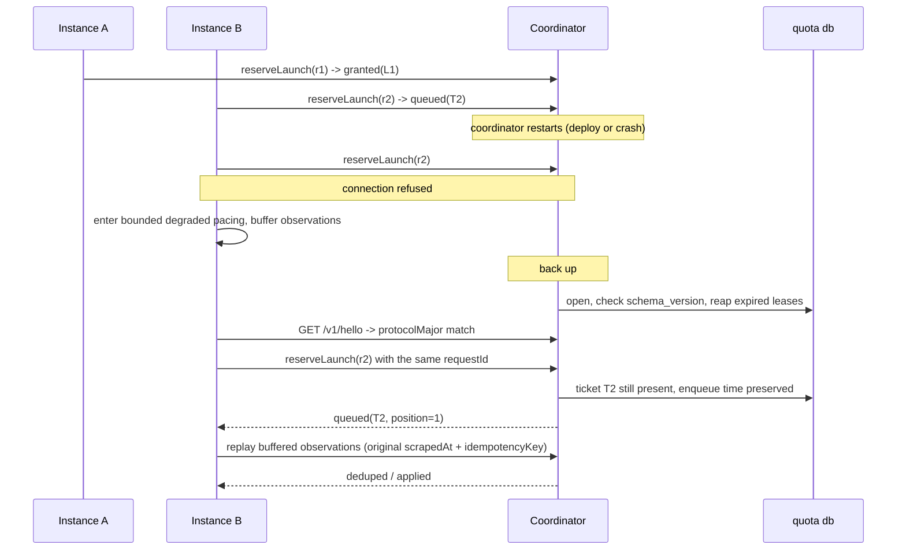

# Shared quota coordinator — design proposal

Design-only proposal for #178. It names a deployment model, states the
service contract, and defines the failure, compatibility and operational
semantics that must hold before any code moves. Nothing here is implemented.
No quota storage, schema, or pacing behaviour changes with this document.

Every source citation below is against `origin/staging` at `49656e2`. Paths are
repository-relative; line numbers are that commit's.

**Revision 2** incorporates review. Six things changed materially, and each is
recorded where it applies: the launch clock is now stamped on confirmation
rather than on grant (§5.5), which also removes the rollback machinery
entirely; the recommendation is conditional on the topology decision (§4.1);
multi-pool surface is gone (§5.1); degraded mode is bounded by pool size and
then fails closed (§5.7); old-writer exclusion is a path relocation rather than
a cooperative flag (§8.2); and the claim that centralising parsing reduces PTY
scrapes was wrong and is withdrawn (§3.2).

## Contents

1. [What exists today](#1-what-exists-today)
2. [Assumptions](#2-assumptions)
3. [The three options](#3-the-three-options)
4. [Recommendation](#4-recommendation)
5. [Service contract](#5-service-contract)
6. [Sequences](#6-sequences)
7. [Storage schema](#7-storage-schema)
8. [Compatibility and rollout](#8-compatibility-and-rollout)
9. [Operations](#9-operations)
10. [Test criteria](#10-test-criteria)
11. [Implementation issues this would cut](#11-implementation-issues-this-would-cut)
12. [Open questions](#12-open-questions)

---

## 1. What exists today

### 1.1 Storage is already shared; nothing else is

`quota.databasePath` is the sharing boundary, and it is a plain filesystem path
(`packages/rusa/src/config/types.ts:101-111`). `quota.poolId` was removed
outright, so the file *is* the pool identity today
(`packages/rusa/src/config/loader.ts:299-303`). A database path is mandatory
once pacing is enabled (`loader.ts:314-318`).

Each instance opens that file directly and keeps the connection for its whole
life (`packages/rusa/src/quota/shared-store.ts:182-192`): WAL, a 10 s
`busy_timeout` (`packages/rusa/src/db/wal.ts:4`), foreign keys on.

### 1.2 Observation ingestion is already idempotent — by slot

Observations are keyed `(provider, kind, observed_slot)` where a slot is five
minutes (`shared-store.ts:11`, `:236`). Two instances scraping the same window
inside one slot collapse to one row, and the winner is decided by a stated
rule — a reading with a valid reset beats one without, then later
`observed_at` wins (`shared-store.ts:705-710`). A row already marked
`processed` is never overwritten (`shared-store.ts:704`).

There is no caller-supplied idempotency key and no record of *which* instance
reported a reading. `recordRaw` mints a fresh `randomUUID` per call
(`shared-store.ts:302-303`), so a retried report is a second raw row.

### 1.3 Controller advancement is already atomic across processes

`advancePendingController` runs inside `BEGIN IMMEDIATE`
(`shared-store.ts:394-409`), and so does the ad-hoc column widening
(`shared-store.ts:257-272`). Every unprocessed observation is reasoned about
exactly once across all connections; the PID decision is written back onto the
observation row (`shared-store.ts:527-543`).

This matters for the comparison below: **cross-process atomicity is not the
missing piece.** SQLite already provides it, and the code already uses it.

### 1.4 The launch clock is per-process, and that is the gap

`ProviderPacer` holds `lastStartedAt` and `nextAvailableAt` as instance fields
in memory (`packages/rusa/src/actor/provider-pacer.ts:45-46`), set when a run
actually starts (`:288-290`). One pacer per lane per process, created lazily
(`packages/rusa/src/commands/start.ts:1285-1292`).

What the shared file distributes is the *interval*
(`shared-store.getProviderThrottle` → `recordQuotaThrottleTick` →
`pacer.setInterval`, `start.ts:1335-1358`). What it does not distribute is the
*clock*. Two instances configured against the same `quota.db` both learn
"space normal starts 600 s apart" and then both start a run immediately, because
each one's `nextAvailableAt` is `0` at boot. The effective launch rate is
`N × 1/interval`, not `1/interval`.

That is precisely the "cross-instance throttling is not free" caveat #178 was
filed on. There is no reservation, lease, or ticket concept anywhere in the
tree today — the only occurrences of "reserved" are SQLite's own lock states.

Two further behaviours the design has to preserve rather than invent:

- **The clock is stamped at the actual start.** `start()` sets `lastStartedAt`
  and `nextAvailableAt` at the moment the run really begins
  (`provider-pacer.ts:285-292`), not when the request was admitted. §5.5 keeps
  this property; an earlier revision of this document did not, and was wrong.
- **Responsive runs bypass pacing but still charge the clock.** A responsive
  request skips the queue entirely (`provider-pacer.ts:173-175`) and lands in
  `start()`, which advances the clock like any other start.
- **The lane FIFO is a user-visible surface.** `getQueueSnapshot`
  (`provider-pacer.ts:91-117`) is projected to the dashboard
  (`start.ts:3047-3057`) with an explicit "never fabricate a time" contract
  (`provider-pacer.ts:67-90`).

### 1.5 Probing, parsing and inference are per-instance — and can disagree

`QuotaService` owns a TTL cache in a plain in-memory `Map`
(`packages/rusa/src/mcp/quota-mcp.ts:700`), 5 min for claude/agy/kimi and
30 min for codex (`:768-786`). One service per process
(`start.ts:1118-1124`), shared between the `get_quota` MCP tool and the
dashboard endpoint. So *N* instances run *N* independent PTY scrapes of the
same provider panel — and those scrapes are expensive tmux-driven captures
(`packages/rusa/src/providers/agy-usage-scrape.ts:43-100`).

Parsing is an LLM call, not a regex, gated on `geminiApiKey`
(`quota-mcp.ts:493-540`).

The disagreement risk is concrete, not hypothetical, and it has two independent
mechanisms:

1. **Inference is stateful in client memory.** `inferQuotaState` takes
   `prevState` (`quota-mcp.ts:555`), and production passes the calling
   process's own TTL-cache entry (`quota-mcp.ts:725`, consumed at `:733`).
   Rules like `carried_forward_bad_read` and `assumed_window_starts_now`
   (`quota-mcp.ts:543-554`) therefore resolve differently in two instances that
   happen to hold different previous readings. Two instances can write
   *different canonical observations* from the same provider panel.

2. **Controller state is read through whatever schema the local build knows.**
   `SharedQuotaStore` evolves the shared file's schema itself, on every open, by
   every instance, outside the migration runner — the code says so
   (`shared-store.ts:251-256`). An older build opening a widened file does not
   see the new column; `advanceObservation` reads
   `previous?.controllerIntegral ?? 0` (`shared-store.ts:492`), so a row written
   without an integral reads as a zeroed integral rather than as "unknown". A
   mixed-version pair silently disagrees about pacing.

These are exactly the two concerns raised in #173: backwards-incompatible schema
changes reaching production, and behavioural changes making the systems disagree
about pacing.

### 1.6 Topology as configured

Instances are user-level systemd units. The two environments are `production`
and `staging`, resolving to `~/.rusa` and `~/.rusa-staging` under one user home
(`packages/rusa/src/commands/service-instance.ts:43-49`). Loopback-only binding is
the established posture: the MCP HTTP server defaults to `127.0.0.1`
(`packages/rusa/src/mcp/http-server.ts:165`) and so does the dashboard
(`start.ts:2835`).

Quota lanes exist for four providers — `claude`, `codex`, `agy`, `kimi`
(`start.ts:263`) — keyed by `providerThrottleKey`
(`packages/rusa/src/providers/registry.ts:64-68`), which fans config aliases of
one CLI onto one lane.

---

## 2. Assumptions

Stated so they can be corrected. Each one is load-bearing for the
recommendation, and §4.3 says what changes if it is wrong.

- **A1 — One host, one user session.** Every instance sharing provider
  credentials runs on the same host under the same user account, as it does
  today (§1.6). *Confidence: high for today, unverified for the roadmap.*
  **This assumption is not mine to confirm; it gates the recommendation
  (§4.1) and is Q1 in §12.**
- **A2 — Launch rate is low.** Normal starts are spaced by a controller
  interval capped at `maxIntervalSeconds`, default 3600
  (`config/types.ts:96`), and the sensor ticks every `tickSeconds`, default 300
  (`start.ts:3393`). A reservation RPC is therefore a low-rate operation, not a
  hot path. *Confidence: high — read directly from configuration defaults.*
- **A3 — A reservation must survive a client crash.** An instance can die
  between reserving and starting, so reservation state has to be durable and
  self-healing, not in-memory. *Confidence: high.*
- **A4 — Credential sharing, not provider identity, defines a pool.** Two
  instances contend only when the provider would bill the same account. This is
  what `quota.databasePath` already encodes.
- **A5 — Provider scrape collection stays in the instance.** The PTY/tmux/
  sandbox harness works where it is; moving it is a separate, larger change and
  #178 explicitly wants collection separable from pacing. **Consequence: the
  number of PTY scrapes does not change under this design.** See §3.1.
- **A6 — One short, scheduled write-quiesce is acceptable once.** Flipping
  ingestion ownership needs a moment with no instance writing. Seconds, once,
  planned.
- **A7 — The operator can state a maximum instance count for the pool.**
  Degraded-mode safety (§5.7) is derived from it, and it cannot be discovered
  at runtime by a client that has just lost its coordinator.

---

## 3. The three options

### Option 1 — Keep the shared SQLite library and path

Add a reservations table to `quota.db` and have every instance take leases
through `BEGIN IMMEDIATE`, exactly as `advancePendingController` already does
(`shared-store.ts:409`).

This *does* close the launch-clock gap. It is the cheapest possible change and
it needs no new process, port, socket, unit, or credential.

It does not close the rest of #178. Four required contract items are
unreachable by construction:

| #178 requirement | Why Option 1 cannot meet it |
| --- | --- |
| "Quota parsing, inference, controller state, and pacing policy should have one owner. Clients should not retain a second implementation that can disagree." | Every client links the implementation. The two disagreement mechanisms in §1.5 remain live. |
| "versioned request/response compatibility" | There are no requests. The only contract is a schema shared by N writers, widened ad hoc on open (`shared-store.ts:251-272`). |
| "server-owned clock semantics" | Each writer stamps with its own `Date.now()`. On one host this is *de facto* satisfied by the shared OS clock; it is not a property of the design. |
| "health/readiness signals" | Nothing is running to be healthy. |

It also cannot express "the coordinator is unavailable" — the file is either
openable or it is not — so the degraded-mode semantics #178 asks for have no
place to live.

### Option 2 — Same-host sidecar over a Unix domain socket

One additional in-repo process (`rusa quota-coordinator`, a fourth
`systemd --user` unit) owns the quota database. It hosts today's
`SharedQuotaStore` and the parse/inference half of today's `QuotaService`, and
serves a small versioned JSON API over a Unix domain socket in the user's
runtime directory. Instances become thin clients: they still collect raw
provider scrapes, and they report that raw text; they never open the database.

Filesystem permissions on the socket are the authentication boundary — the same
trust model the repo already uses for loopback MCP and the dashboard (§1.6),
with a strictly smaller attack surface than a TCP port, since a Unix socket is
not reachable off-host at all.

Costs: a third unit to install, supervise, upgrade and back up; a new failure
mode ("coordinator down") that must have defined behaviour; an IPC hop on a
path that is currently a function call; and one more process holding
`geminiApiKey` (§5.3).

### Option 3 — Networked coordinator

Option 2's contract over TCP, plus: a bind address that is not loopback, TLS or
a tunnel, a shared secret or mTLS, firewall/tailnet policy, clock-skew handling
between hosts, and an availability story for the network path itself.

Everything Option 3 adds is machinery for a hop that does not exist yet (A1).
The request/response contract in §5 is transport-agnostic and carries over
unchanged; what has to be built is the authentication and transport layer, not
a new protocol.

### 3.1 What centralising parse and inference does and does not buy

Centralising parse and inference buys the thing #178 asks for: one owner, one
`prevState`, so the divergence in §1.5(1) becomes structurally impossible. It does **not** reduce the number of PTY
scrapes. A5 leaves collection in every instance and §8.4 keeps today's
in-instance collector working unchanged, so nothing here elects a single
collector or suppresses the other instances' TTL-driven probes. N instances
still scrape N times.

It does not reduce the number of LLM parses either, by default: one parse per
submitted scrape is still N parses per slot. The coordinator *could* skip
parsing when it already holds a canonical observation for that
`(provider, kind, slot)` and return `deduped` — but that trades away the
existing winner rule, which needs both readings parsed in order to prefer the
one with a valid reset (`shared-store.ts:705-710`). That trade is available
later; it is not claimed as a benefit of Option 2 here, and the comparison in
§3.2 is assessed without it.

### 3.2 Comparison

| Dimension | 1 — Shared SQLite | 2 — Same-host sidecar (UDS) | 3 — Networked |
| --- | --- | --- | --- |
| **Deployment** | Nothing new | +1 `systemd --user` unit, same host/user | +1 unit, +transport config, +certs/secret |
| **Operations** | No new supervision | One process to supervise; ordering with instances | Above, plus network policy and cross-host rollout |
| **Compatibility** | N writers all carrying the schema; ad-hoc widening on open | One writer; versioned wire contract; clients carry no schema | Same as 2 |
| **Latency** | In-process SQLite call (µs) | UDS round trip (sub-ms), at ≤ one reservation per interval (A2) | Network RTT plus TLS; still negligible at A2 rates |
| **Availability** | No new dependency; a corrupt or locked file stops everyone anyway | New SPOF; needs an explicit degraded mode | Same SPOF plus network partitions |
| **Security** | Filesystem ACL on one file | Filesystem ACL on one socket; unreachable off-host; one more holder of `geminiApiKey` | Authn/authz, transport encryption, exposed port |
| **Scrape / parse cost** | N scrapes, N parses | **N scrapes, N parses — unchanged** | Same as 2 |
| **Backup** | One SQLite file, but no single process owns quiescing it | One SQLite file with exactly one writer that can quiesce and `VACUUM INTO` | Same as 2 |
| **Observability** | Per-instance logs; no aggregate view | One place that sees every lane, lease and waiter | Same as 2 |
| **Rollback** | Config revert; but mixed-version writers are the hazard being rolled back *from* | Per-instance for pacing adoption; one flag for ingestion ownership | Same as 2, over more moving parts |
| **Meets #178's contract** | No (4 items unreachable) | Yes | Yes, with unused capability |

---

## 4. Recommendation

### 4.1 Conditional: Option 2 if the one-host horizon is confirmed, otherwise Option 3

The recommendation is deliberately **conditional**, because its deciding input
is a fact about the roadmap that this document cannot establish. A1 is true of
the system as configured today (§1.6), but "unverified for the roadmap" is not
a basis for choosing a transport whose authentication model is *filesystem
permissions*. Topology is the decision input here, not an implementation
detail.

- **If the one-host, one-user horizon is confirmed (Q1) → Option 2.** It is
  then the smallest option that meets the contract #178 asks for.
- **If instances will run on more than one host within the horizon → Option 3
  directly.** Do not build Option 2 first and migrate: the wire contract
  survives, but the authentication model does not, and shipping a UDS
  boundary would mean building the auth layer under time pressure later.

Everything in §5 through §11 is written to hold under either answer. The wire
contract, the reservation semantics, the storage schema, the rollout and the
tests are transport-agnostic; only §5.2's listener and §5.3's authentication
differ between the two.

**No human communication establishing the one-host horizon is cited here,
because none is known to me.** The topology question is escalated and pending;
until it is answered, "Option 2" is a recommendation conditioned on an
assumption, not a decision.

Within Option 2, the recommendation is narrow:

- The coordinator is **one in-repo Node process**, not a service platform. It
  reuses `SharedQuotaStore` and the existing parse/infer functions rather than
  reimplementing them.
- It speaks **HTTP/JSON**, so the framing is the one the repo already knows
  (`packages/rusa/src/mcp/http-server.ts`) with the TCP listener swapped for a
  socket path. No new protocol, no new dependency.
- It **does not scrape**. Collection stays in the instance (A5), which satisfies
  #178's separability requirement by construction rather than by promise.

### 4.2 Implementation is staged, and stage 1 is Option 1's table

The reservation tables land in the quota database first, behind the
coordinator, before any instance stops writing directly. That means the
riskiest new logic — atomic grant, lease expiry, waiter ordering — is exercised
against the real file with the real `BEGIN IMMEDIATE` machinery before the
ownership flip, and can be tested with the multi-process harness that already
exists (`packages/rusa/src/quota/shared-store.test.ts:495`). Option 1 is a step
on the path, not a competing destination.

### 4.3 What would change this recommendation

- **A1 is false, now or within the roadmap** → Option 3, as above. This is the
  live question.
- **A3 is false** (a lost reservation is acceptable): Option 1 plus an
  in-memory advisory lock would do, and this proposal is over-built.
- **A6 is unacceptable** (no write-quiesce is ever schedulable): §8.3's
  ownership flip needs redesign — probably a coordinator that begins as a
  read-through proxy and takes the write lock only when it observes no other
  writer for a full tick. That is more machinery; it is not proposed here.
- **A7 is unacceptable** (no maximum instance count can be stated): degraded
  mode has no safe bound, and §5.7 should collapse to fail-closed immediately
  on disconnection.

---

## 5. Service contract

Everything below is versioned as **protocol v1**.

### 5.1 One coordinator, one database, one pool

**v1 has no pool identity on the wire.** One coordinator process binds one
socket and owns exactly one quota database, which *is* the pool — the same
thing `quota.databasePath` means today (§1.1), and the reason `quota.poolId`
was removed in the first place (`loader.ts:299-303`).

An earlier revision threaded a `poolId` through every RPC and every new table
so that one process could later serve several credential sets. That was
anticipatory surface, and it was also incoherent: `quota_coordinator_meta` is a
singleton, and the preserved `quota_observations` primary key
(`shared-store.ts:236`) has no pool dimension, so one coordinator over today's
one database could not actually have isolated two pools without the larger
schema change this design is committed to avoiding.

Two credential sets therefore mean two coordinators, two sockets and two
databases — which is what two `quota.databasePath` values mean today. If a
second real pool ever needs to share one process, multiplexing can be added
then, as a protocol-minor addition, with the observation key extended in the
same change.

A **lane** is `providerThrottleKey(provider, config)`, reusing
`registry.ts:64-68` unchanged so config aliases of one CLI keep collapsing onto
one lane, as they do now.

### 5.2 Transport, framing, versioning

- **Transport:** Unix domain socket at `quota.coordinator.socketPath`, default
  `$XDG_RUNTIME_DIR/rusa-quota/coordinator.sock`, mode `0600`, owned by the
  service user. Under Option 3 this is a TCP listener instead; nothing else in
  this section changes.
- **Framing:** HTTP/1.1 + JSON. Paths are prefixed `/v1/`.
- **Handshake:** `GET /v1/hello` → `{ protocolMajor, protocolMinor,
  serverVersion, schemaVersion, databasePath, serverTime }`. Every client calls
  it at startup and after every reconnect.
- **Compatibility rule:** `protocolMajor` must match exactly; a mismatch is a
  hard refusal on both sides with a message naming both versions.
  `protocolMinor` is additive-only — a client ignores response fields it does
  not know, and the server treats absent optional request fields as their
  documented defaults. No field is ever repurposed; removal requires a major
  bump.
- **Schema guard:** the coordinator refuses to open a database whose recorded
  `schema_version` is *newer* than the version it knows, and exits non-zero with
  that message. Note what this does and does not do: it stops a **rolled-back
  coordinator** from writing to a file a newer one has widened. It cannot stop
  a pre-coordinator build, which reads no version at all (§8.2).

### 5.3 Authentication and scope

v1 authenticates by **filesystem permission on the socket**: `0600`, service
user only. There is no token, because on a Unix socket a token would be a second
copy of the same fact.

The coordinator records the peer credentials of each connection (`SO_PEERCRED`)
on lease rows, so an operator can see which process holds what.

**Key exposure moves in the wrong direction, and should be stated plainly.**
The coordinator must hold `geminiApiKey` in order to parse
(`quota-mcp.ts:493-540`). Instances cannot drop it in exchange, because they
use the same key for unrelated features — dashboard avatar generation
(`packages/rusa/src/dashboard/api.ts:767-777`), ledger compaction
(`config/loader.ts:588`) and voice (`config/types.ts:385`). So the number of
processes holding the key goes from N to N+1, and the coordinator additionally
aggregates raw provider panel text from every instance, which today never
leaves the instance that scraped it. Both are same-user processes on one host,
so this is a concentration-of-blast-radius change rather than a new trust
boundary — but it is a real cost of Option 2 and it is counted as one in §3.2.

Under Option 3 this section is what grows: a per-instance shared secret in
config, presented as a bearer credential, over TLS or an existing private
tunnel — never an unauthenticated bind.

### 5.4 Clock

**The coordinator's clock is the only clock.** Every timestamp that participates
in a decision — start time, lease expiry, lane availability, staleness — is
stamped by the coordinator. Clients send `scrapedAt` for observations (because
only the client knows when its scrape ran) and the coordinator records both that
and its own `receivedAt`.

Clients never compare their own `Date.now()` to a coordinator timestamp. Waits
are expressed by the coordinator as **durations** (`retryAfterMs`,
`leaseTtlMs`), never as absolute instants, so client clock skew cannot make a
client start early. Absolute instants appear only in read-only display fields,
alongside `serverTime`, so the dashboard can render them honestly.

### 5.5 Operations

#### `POST /v1/observations`

Ingests raw provider evidence. The coordinator parses and infers; the client
does neither.

```jsonc
{
  "source": "rusa-staging",           // stable instance id, recorded on the row
  "provider": "claude",
  "scrapedAt": "2026-09-05T16:00:00.000Z",  // client's real scrape instant
  "rawOutput": "...",                 // the captured panel text
  "idempotencyKey": "..."             // caller-minted, stable across retries
}
```

Response: `{ "result": "applied" | "deduped" | "rejected", "observations": [...],
"reason": "..." }`.

- `idempotencyKey` is stored and unique per provider. A replay returns the
  *original* result without re-parsing — this is what makes the degraded-mode
  replay buffer (§5.7) safe, and it costs no LLM call.
- Beneath that, today's slot dedupe is retained unchanged: canonical rows stay
  keyed `(provider, kind, observed_slot)` with the existing winner rule
  (`shared-store.ts:236`, `:705-710`).
- `source` is new and is recorded. Today nothing knows which instance produced a
  reading; the coordinator will.
- **The coordinator holds the single `prevState`** used by `inferQuotaState`, so
  the divergence in §1.5(1) becomes structurally impossible. This is the whole
  point of the endpoint.

#### `GET /v1/snapshot?provider=`

Current quota/pacing snapshot. Returns today's `PersistedQuotaProviderStatus`
shape (`shared-store.ts:118`) plus freshness:

```jsonc
{
  "provider": "claude",
  "intervalSeconds": 612.4,
  "uncappedIntervalSeconds": 900.1,
  "governingBucketKey": "claude:weekly",
  "capped": true,
  "expired": false,
  "exhaustedUntil": null,
  "updatedAt": "...",
  "buckets": [ /* unchanged */ ],
  "freshness": { "observedAt": "...", "ageMs": 240000, "stale": false, "hardStale": false },
  "serverTime": "..."
}
```

Read-only and cheap; safe for the dashboard's stale-while-revalidate path, which
already refuses to probe in the request path (`start.ts:3087-3094`).

#### The reservation lifecycle

A grant is an **exclusive hold on a lane**, not a clock advance. The lane clock
is stamped when the launch is *confirmed*, using coordinator time.

This is the correction that matters most in this revision. Advancing the clock
at grant time does not bound the spacing between *actual* starts: a client
granted at `t=0` may not spawn until its lease is nearly expired, while the
next client becomes grantable at `t=interval` and spawns immediately, so two
real provider starts can land far closer together than one interval. Stamping
on confirmation is both simpler and correct, and it mirrors what the in-process
pacer already does (`provider-pacer.ts:285-292`, §1.4).

While a hold is live, **no other grant is issued for that lane.** At most one
unconfirmed launch exists per lane at a time, which is what keeps the reasoning
short.

#### `POST /v1/reserveLaunch`

```jsonc
{
  "source": "rusa-staging",
  "lane": "claude",
  "threadId": "...",         // for observability and the lane FIFO view
  "requestId": "...",        // caller-minted uuid; the idempotency key
  "mode": "normal"
}
```

Response is one of:

```jsonc
{ "status": "granted", "leaseId": "...", "leaseTtlMs": 120000 }
{ "status": "queued",  "ticketId": "...", "position": 1, "retryAfterMs": 30000 }
```

Semantics:

- A grant is one `BEGIN IMMEDIATE` transaction that, together: verifies no hold
  is live on the lane; verifies the ticket is the oldest waiter; verifies
  `now >= max(next_available_at, blocked_until)`; and writes a lease row with
  `state = 'granted'` and `expires_at = now + leaseTtlMs`. **It does not touch
  `next_available_at`.** Either all of it happens or none does — the same
  concurrency primitive the controller already relies on
  (`shared-store.ts:409`).
- **Ordering is FIFO by coordinator-stamped enqueue time**, ties broken by
  `ticketId`. Deterministic, and it generalises the per-process FIFO
  (`provider-pacer.ts:91-117`) to the pool.
- **`requestId` makes the call idempotent.** A retry after a lost response
  returns the same ticket or the same lease — never a second lease. This is the
  difference between an at-least-once transport and a double-spent allowance.
- **Where it sits in the launch path:** the client reserves *after* clearing its
  own mesh concurrency limiter and immediately before spawning the provider.
  That inverts today's order (pacer first, then mesh queue —
  `provider-pacer.ts:238-269`), and it is deliberate: it makes the hold
  short-lived, so a crashed client parks the lane for seconds rather than for a
  whole run. The cost is that cross-instance fairness is decided at the
  coordinator rather than at submission time; §12 Q4 asks whether that is
  acceptable.

#### `POST /v1/confirmLaunch`

`{ leaseId }`. **The provider process has actually started.** In one
transaction the coordinator sets `last_started_at = now`,
`next_available_at = now + interval_ms`, and closes the lease as `confirmed`,
releasing the hold. `now` is coordinator time (§5.4).

Idempotent by `leaseId`: a repeated confirm returns the first result and does
not advance the clock twice.

#### `POST /v1/cancelLaunch`

`{ leaseId }`. The client decided not to start — a stale provider re-gate
(`RunStartStaleProviderError`, `provider-pacer.ts:253-258`) or a cancellation.
The lease closes as `cancelled` and the hold is released. **The lane clock is
not touched, because the grant never touched it**, so there is nothing to roll
back and no pre-grant value to store.

This is the second benefit of stamping on confirmation: the compare-and-set
rollback, the `granted_lane_version` column, and the "which value do we
restore" problem all disappear rather than being solved.

A cancel is a client asserting that no provider was spawned, and it is trusted
as such. A client that spawns and then cancels has lied to the pool; that is a
client bug, and it is the only way to defeat the spacing bound below.

#### `POST /v1/renewLaunch`

`{ leaseId }` → `{ leaseTtlMs }`. For a client whose spawn is legitimately slow.
Bounded: renewable until `maxLeaseMs` (default 600 s) from the original grant,
then it expires regardless. Renewal no longer affects spacing — the clock is
stamped at the real start either way — so its only job is to stop a slow-but-
healthy spawn from being treated as a crash.

#### `POST /v1/recordLaunch`

`{ source, lane, threadId, requestId }`. **The responsive path.** A responsive
run never queues and is never held; it reports that it has started, and the
coordinator stamps `last_started_at`/`next_available_at` exactly as
`confirmLaunch` does. This mirrors today's behaviour, where a responsive request
skips the queue (`provider-pacer.ts:173-175`) but still charges the lane clock
(`:285-292`). Idempotent by `requestId`.

#### Expiry

A lease past `expires_at` is reaped by the coordinator (lazily on the next call
touching the lane, and by a sweep every `leaseSweepMs`). On expiry the lease
closes with `outcome: "expired"`, the hold is released, and:

```
next_available_at = expires_at + interval_ms
```

The clock advances **as if the launch had happened at the last possible
instant**. That asymmetry with `cancelLaunch` is deliberate: a cancel is a
client *telling* us it did not start; an expiry is silence, and silence is
compatible with "the client spawned the provider and then died". Advancing from
`expires_at` rather than from `granted_at` is what makes the spacing bound below
hold with no exception for the crash case.

The cost is bounded and easy to state: a crash between grant and spawn leaves
the lane idle for up to `leaseTtlMs` longer than necessary. `leaseTtlMs` is
therefore the tuning knob for "what a crash costs", which is a property worth
having explicitly. **Prefer idle to double-spent.**

#### The spacing bound

For any two consecutive confirmed or presumed starts on a lane, the second
starts at least `interval_ms` after the first. By case:

| First launch settles by | Clock set to | Actual first start | Spacing |
| --- | --- | --- | --- |
| `confirmLaunch` at `c` | `c + interval` | `c` | exactly `interval` |
| expiry at `e` | `e + interval` | somewhere in `[g, e]` | ≥ `interval` |
| `cancelLaunch` | untouched | none occurred | n/a |
| `recordLaunch` at `r` (responsive) | `r + interval` | `r` | exactly `interval` |

Because the hold is exclusive, no second grant exists during any of these
windows, so there is no third case to check. The cost of exclusivity is that a
lane's effective period is `interval + spawn latency` rather than `interval`;
at A2 rates (spawn seconds, interval hundreds of seconds) that is noise.

#### `GET /v1/lanes`

Read-only lane state and waiter list, for the dashboard's queue view. Mirrors
`getQueueSnapshot`'s contract (`provider-pacer.ts:67-90`) including its "render
`null` as unknown, never fabricate a time" rule.

#### `GET /v1/healthz` and `GET /v1/readyz`

- `healthz`: process alive, database open and writable. 200/503.
- `readyz`: schema version matches, meta row readable, and either at least one
  observation newer than `hardStaleAfterMs` **or** an explicit `"cold": true`.
  A cold coordinator is ready-but-cold, not ready-and-lying.

### 5.6 Errors and deterministic conflict handling

One error envelope: `{ "error": { "code": "...", "message": "...", "retryable": bool } }`.

| Code | Meaning | Client action |
| --- | --- | --- |
| `protocol_mismatch` | `protocolMajor` differs | Refuse to run normal launches; log loudly |
| `lane_unknown` | Lane not configured | Refuse |
| `lease_not_found` | Confirm/cancel/renew on a reaped or unknown lease | Treat as expired; do not retry |
| `lease_expired` | Renew after `maxLeaseMs` | Re-reserve |
| `stale_snapshot` | Read while hard-stale and caller demanded fresh | Use degraded pacing |
| `busy` | Write contention beyond `busy_timeout` | Retry with jittered backoff |

Every mutating call is safe to retry, because every mutating call carries a
caller-minted idempotency key (`idempotencyKey` for observations, `requestId`
for reservations and responsive records, `leaseId` for the lease lifecycle).

### 5.7 When the coordinator is unavailable or stale

**Stale** — the coordinator has the data but it is old:

- `stale` at `now - observedAt > staleAfterMs` (default `3 × tickSeconds` = 900 s):
  keep serving the last reasoned interval. This matches today's stated behaviour
  on a failed scrape — "keep the last persisted reasoned interval"
  (`start.ts:1380`) — and the snapshot says `stale: true` so the dashboard
  can show it.
- `hardStale` at `now - observedAt > hardStaleAfterMs` (default 3600 s): grants
  are spaced at `maxIntervalSeconds` rather than at the last reasoned interval.
  **The degradation is always toward slower, never faster.**

**Unavailable** — the socket is gone, the connection fails, or the handshake is
refused. An earlier revision proposed indefinite fail-slow at
`maxIntervalSeconds` per instance and justified it by comparison with today's
uncoordinated behaviour. That comparison was against the wrong baseline: the
promise being made is the *pool's* lane rate, and N instances each pacing
themselves at interval `D` produce an aggregate of `N/D`, which exceeds the
promised `1/interval` whenever `N × interval > D`. The revised behaviour is
bounded by construction and then stops:

1. **Bounded degraded pacing during a grace window.** A disconnected instance
   paces normal launches locally at

   ```
   degradedIntervalSeconds = poolInstances × max(lastKnownIntervalSeconds, maxIntervalSeconds)
   ```

   where `poolInstances` is required configuration (A7), not a default. The
   aggregate across the pool is then at most the promised lane rate, which is
   the property the earlier revision failed to establish. With two instances and
   a 3600 s cap this is a 7200 s spacing per instance — deliberately painful,
   because a disconnected coordinator is a thing to fix, not to live in.
2. **Then fail closed.** After `degradedGraceSeconds` with no successful
   handshake, the instance **stops starting normal runs** and says so in its
   health output and in chat. The grace window exists for one observed reason:
   a coordinator restart during an ordinary upgrade (§8.3) must not stop the
   pool. Its default is therefore sized to a restart (300 s), not to an outage.
   Everything beyond that window is anticipated availability optimisation, and
   this design declines to build it.
3. **Responsive launches are never blocked**, in any state. An operator's
   urgent wake must not depend on a sidecar. This is a deliberate, stated
   exposure rather than a bounded one: responsive runs are human-initiated and
   rate-limited by the human, and the alternative — an operator unable to wake
   the system because a sidecar is down — is worse. It is Q3 in §12.
4. **The client never writes to the quota database.** Not while degraded, not
   ever, once ownership has flipped (§8.2). This is the rule that makes "avoid
   concurrent old/new writers" enforceable rather than aspirational.
5. Observations are **buffered in memory** — a bounded ring, default 200 entries
   per provider, oldest dropped — and replayed on reconnect with their original
   `scrapedAt` and `idempotencyKey`. Slot dedupe plus the idempotency key make
   replay exactly-once in effect.

If `poolInstances` cannot be stated (A7 fails), step 1 has no safe bound and the
honest behaviour is to fail closed immediately on disconnection.

---

## 6. Sequences

### 6.1 Simultaneous launch requests from two instances

```mermaid
sequenceDiagram
    participant A as Instance A
    participant B as Instance B
    participant C as Coordinator
    participant D as quota db

    Note over A,B: both cleared their own mesh concurrency limiter
    A->>C: reserveLaunch(lane=claude, requestId=r1)
    B->>C: reserveLaunch(lane=claude, requestId=r2)
    C->>D: BEGIN IMMEDIATE (r1)
    Note over C,D: no hold live; now at or past next_available_at
    D-->>C: lease L1 granted, expires_at = now+120s
    Note over C,D: next_available_at deliberately NOT advanced
    C-->>A: granted(L1, leaseTtlMs=120000)
    C->>D: BEGIN IMMEDIATE (r2)
    Note over C,D: hold L1 is live on this lane
    D-->>C: ticket T2 enqueued
    C-->>B: queued(T2, position=1)
    A->>A: spawn provider (takes 4s)
    A->>C: confirmLaunch(L1)
    Note over C,D: last_started_at = now; next_available_at = now + 600s; hold released
    B->>C: reserveLaunch(requestId=r2) again (retry, same id)
    C-->>B: queued(T2, position=1, retryAfterMs=~600000)
    Note over B: same ticket, never a second one
    Note over B: ... the interval elapses ...
    B->>C: reserveLaunch(requestId=r2)
    C->>D: BEGIN IMMEDIATE (r2)
    D-->>C: lease L2 granted
    C-->>B: granted(L2)
    B->>C: confirmLaunch(L2)
    Note over C: B's real start is >= 600s after A's real start
```

**Invariant proved:** the clock is stamped from the *actual* start on both
sides, so the gap between two real provider starts is at least `interval_ms`.
The spawn latency between grant and confirm sits inside the interval rather than
being spent from it.

### 6.2 Client crash after reservation

```mermaid
sequenceDiagram
    participant A as Instance A
    participant C as Coordinator
    participant D as quota db

    A->>C: reserveLaunch(r1)
    C->>D: lease L1 granted, expires_at = now+120s; clock untouched
    C-->>A: granted(L1)
    Note over A: process dies - may or may not have spawned
    Note over C: t = expires_at, sweep
    C->>D: lease L1 -> "expired"; hold released
    C->>D: next_available_at = expires_at + interval_ms
    Note over C,D: advanced as if the launch happened at the last possible instant
    Note over C: so spacing holds even though the real start is unknown
    Note over C: cost is bounded - at most leaseTtlMs of extra idleness
    C->>C: metric quota_coordinator_leases_expired_total{lane} += 1
```

The two crash windows, stated explicitly:

- **Crashed before spawning.** The lane is idle for up to `leaseTtlMs` longer
  than it needed to be. This is the price of not being told.
- **Crashed after spawning, before confirming.** The real start was somewhere in
  `[granted_at, expires_at]`; the clock is advanced from `expires_at`, so the
  next start is at least `interval_ms` after the real one. No double spend.

Recovery: once A restarts it simply reserves again with a fresh `requestId`. It
inherits no state and needs none.

### 6.3 Stale observations

```mermaid
sequenceDiagram
    participant A as Instance A
    participant C as Coordinator

    Note over A: scrape fails (PTY timeout / provider panel unreadable)
    A->>C: (no observation reported)
    A->>C: reserveLaunch(r1)
    Note over C: age = 1000s > staleAfterMs (900s)
    C-->>A: granted, using the last reasoned interval; snapshot.stale = true
    Note over A,C: ... scrapes keep failing ...
    A->>C: reserveLaunch(r2)
    Note over C: age = 4000s > hardStaleAfterMs (3600s)
    C-->>A: granted, spacing at maxIntervalSeconds; snapshot.hardStale = true
    C->>C: metric quota_coordinator_snapshot_age_seconds{provider} = 4000
```

Degradation is monotone toward slower. A stale snapshot never speeds anything up.

### 6.4 Coordinator restart



**Invariant:** waiter order survives a restart, because tickets are rows and
their enqueue time is coordinator-stamped, not connection state. Holds survive
too; only their expiry timer is re-derived, from `expires_at`. A restart that
outlasts a hold's TTL settles it as an expiry, which is the conservative case
above — the restart itself can therefore cost at most one extra interval per
lane, never a double spend.

### 6.5 Transport failure

```mermaid
sequenceDiagram
    participant A as Instance A
    participant C as Coordinator

    A->>C: reserveLaunch(r1)
    Note over A,C: response lost in flight (socket reset)
    A->>A: unknown outcome - may or may not hold a lease
    A->>C: reserveLaunch(r1) with an identical requestId
    C-->>A: granted(L1) - the original lease, not a second one
    Note over A: idempotency turns an ambiguous failure into a certain one

    Note over A,C: socket stays down
    A->>A: bounded degraded pacing at poolInstances x interval
    Note over A: after degradedGraceSeconds, normal runs stop
    A->>A: responsive runs still launch; health degraded; alert raised
    Note over A: zero direct writes to the quota database, in every branch
```

---

## 7. Storage schema

Additive. `quota_scrapes` and `quota_observations` are **untouched** — the
existing observation and controller columns keep their current meaning
(`shared-store.ts:206-247`). New tables live in the same database. There is no
`pool_id` column anywhere, per §5.1.

```sql
-- Single source of truth for what version this file is at and who owns it.
CREATE TABLE IF NOT EXISTS quota_coordinator_meta (
  singleton          INTEGER PRIMARY KEY CHECK (singleton = 1),
  schema_version     INTEGER NOT NULL,
  protocol_major     INTEGER NOT NULL,
  owner_boot_id      TEXT,                 -- coordinator instance identity
  owner_started_at   TEXT
);

-- One row per lane. The durable form of ProviderPacer's fields.
CREATE TABLE IF NOT EXISTS quota_lanes (
  lane              TEXT PRIMARY KEY,      -- providerThrottleKey
  interval_ms       INTEGER NOT NULL DEFAULT 0,
  next_available_at TEXT,                  -- coordinator clock; advanced on settle
  last_started_at   TEXT,
  blocked_until     TEXT,                  -- exhaustion gate; cf. deferUntil()
  updated_at        TEXT    NOT NULL
);

-- One row per reservation attempt. Tickets and holds are the same row's
-- lifecycle, so ordering and grant are decided in one transaction.
CREATE TABLE IF NOT EXISTS quota_leases (
  id             TEXT PRIMARY KEY,
  lane           TEXT NOT NULL REFERENCES quota_lanes(lane),
  request_id     TEXT NOT NULL,            -- caller-minted idempotency key
  source         TEXT NOT NULL,            -- reporting instance id
  thread_id      TEXT,
  mode           TEXT NOT NULL CHECK (mode IN ('normal','responsive')),
  state          TEXT NOT NULL CHECK (state IN ('queued','granted','confirmed','cancelled','expired')),
  enqueued_at    TEXT NOT NULL,            -- FIFO key, coordinator clock
  granted_at     TEXT,
  expires_at     TEXT,
  settled_at     TEXT,                     -- confirm/cancel/expiry instant
  peer_uid       INTEGER,
  peer_pid       INTEGER,
  UNIQUE (lane, request_id)
);

CREATE INDEX IF NOT EXISTS idx_quota_leases_lane_queue
  ON quota_leases(lane, enqueued_at) WHERE state = 'queued';
-- At most one live hold per lane; the partial unique index enforces the
-- exclusivity that section 5.5's spacing bound depends on, in the schema
-- rather than in the handler.
CREATE UNIQUE INDEX IF NOT EXISTS idx_quota_leases_one_hold
  ON quota_leases(lane) WHERE state = 'granted';

-- Ingestion idempotency, so a replayed report costs no LLM parse.
CREATE TABLE IF NOT EXISTS quota_ingest_receipts (
  provider        TEXT NOT NULL,
  idempotency_key TEXT NOT NULL,
  source          TEXT NOT NULL,
  received_at     TEXT NOT NULL,
  result          TEXT NOT NULL,   -- applied | deduped | rejected
  scrape_id       TEXT,            -- quota_scrapes.id, when one was written
  PRIMARY KEY (provider, idempotency_key)
);
```

Notes:

- `UNIQUE (lane, request_id)` is what makes `reserveLaunch` idempotent at the
  storage layer, not merely in the handler.
- `idx_quota_leases_one_hold` makes "one outstanding launch per lane" a database
  invariant. A handler bug cannot produce two live holds.
- No `granted_lane_version` and no stored pre-grant clock value: §5.5 removed
  the rollback that would have needed them.
- The partial index on `state = 'queued'` keyed by `enqueued_at` makes "is this
  ticket the oldest waiter" a single indexed read inside the grant transaction.
- `quota_ingest_receipts` and `quota_scrapes` are both pruned on the retention
  schedule (§9.4), reusing the existing prune-on-write pattern
  (`shared-store.ts:273-300`).
- **The quota database stays separate from `mesh.db`.** `mesh.db` is opened and
  migrated per instance home (`packages/rusa/src/db/index.ts:41-57`); the quota
  database is shared across instances. Folding them would make the shared file
  instance-owned, which is the opposite of this design. #178 forbids it while
  this decision is open, and this design does not need it.

---

## 8. Compatibility and rollout

### 8.1 Existing observations and controller state are preserved

There is **no import and no export**. The coordinator opens the same database
the instances open today and inherits every `quota_scrapes` and
`quota_observations` row, including `controller_error`,
`controller_derivative`, `controller_integral`, `uncapped_interval_seconds` and
`interval_seconds`. The PID controller keeps its memory across the cutover
because the rows are never rewritten.

Stage 1 does **rename** the file (§8.2). A rename within a directory is atomic
and byte-preserving; it is not a migration, and it is what buys the old-writer
guarantee below.

### 8.2 No concurrent old and new writers

An earlier revision claimed this was "enforced, not promised" via an
`authoritative` flag in `quota_coordinator_meta`. **That claim was wrong, and it
is withdrawn.** Only a build that already contains the check would consult that
row; a genuinely old binary started by hand runs today's `ensureSchema()` and
writes, having read no version and no flag at all — the current store reads no
`user_version`, no `application_id` and no schema version of any kind
(`shared-store.ts:182-192`, `:206-272`). A flag in the file cannot fence a
writer that never looks at it. For the same reason, a "poison pill"
`schema_version` bump does not work either: it fences rolled-back *coordinators*
(§5.2), not pre-coordinator instances.

Filesystem permissions cannot fence it either, as the instances and the sidecar
run as the same user against the same path.

**The mechanism is the path, not a flag.** Stage 1 relocates the authoritative
database:

1. `quota.db` is renamed to `quota-coordinator.db` in the same directory —
   atomic, byte-preserving, all history intact.
2. The coordinator is configured with the new path. Instances lose
   `quota.databasePath` entirely and gain `quota.coordinator.socketPath`.
3. A **directory** is created at the old `quota.db` path. `new Database(path)`
   against a directory fails with `SQLITE_CANTOPEN`, so an old build started by
   hand dies at open instead of silently pacing from a freshly created empty
   database. That failure mode — an old instance quietly pacing off an empty
   file — is the one worth engineering against, because it is silent.

That is mechanical: it requires no cooperation from the old binary, because the
old binary cannot reach the file and cannot open what is in its place.

The `authoritative` flag is kept, demoted to what it honestly is: a clear,
fast error for a **new** build misconfigured back into direct mode against the
coordinator's file. It is a usability guard, not a fence.

If the operator wants ownership-level enforcement as well, the heavier
alternative is to run the coordinator as its own service user and `chown` the
database `0600` to it, so any instance process gets `EACCES`. That costs a
dedicated user account and complicates the current single-user `systemd --user`
model, so it is offered as an option rather than the default. It is Q6 in §12.

### 8.3 Canary and rollback

The flip has two independent axes, and only one of them needs coordination.
Separating them is what makes a one-instance canary possible.

**Axis 1 — ingestion ownership** (who writes observations and controller state).
This must flip for all instances at once, because it *is* the concurrent-writer
hazard.

**Axis 2 — reservation adoption** (who takes launch pacing from the
coordinator). This is per-instance, because lane reservation state is *new*
state. An instance that has not yet adopted it paces locally exactly as it does
today — it is not a writer of the reservation tables at all.

| Stage | Action | Verifies | Rollback |
| --- | --- | --- | --- |
| 0 | Install the unit; coordinator runs read-only against a **copy**. Instances unchanged. | Unit starts, socket appears with the right mode, `healthz`/`readyz`, backups run, metrics appear | Stop and remove the unit. Nothing touched. |
| 1 | Back up. Stop all instances. Rename the database, create the blocking directory at the old path, start the coordinator, start instances with `socketPath` set. | Observations flow through the coordinator; `quota_ingest_receipts` fills; no instance opens the file | Stop instances, remove the directory, rename back, restore `databasePath`, restart. The data never changed. |
| 2 | Canary: enable `quota.coordinator.reservations: true` on **one** instance. | Grants, queueing, confirm/cancel, expiry, and the lane view, under real traffic | Set it back to `false` and restart that one instance. Seconds, one process. |
| 3 | Enable reservations on the remaining instances. | Cross-instance spacing: the union of start timestamps respects the lane interval | Per-instance, as stage 2. |

During stage 2 the non-canary instance still paces on its own clock — which is
today's behaviour, so nothing regresses. Cross-instance enforcement simply is
not yet complete, and that is the honest description of a canary.

**Upgrade order, always:** coordinator first, instances second. The coordinator
must serve the old and the new `protocolMinor`; a `protocolMajor` bump means
stopping every instance, which is a deliberate cost that should be rare.

### 8.4 Scrape collection stays separable

The coordinator has no PTY, no tmux, no sandbox and no provider CLI. It receives
raw text over the socket. Consequences, stated as guarantees:

- Today's in-instance collector keeps working unchanged (A5). **The number of
  scrapes is unchanged**; see §3.1.
- A dedicated collector process could later report observations without owning
  pacing — it would just call `POST /v1/observations`. Electing a single
  collector, and thereby actually reducing scrape count, is that separate piece
  of work, not this one.
- A client that only *reads* (a dashboard, a report) needs `GET /v1/snapshot`
  and nothing else.

---

## 9. Operations

### 9.1 Ownership and units

A fourth `systemd --user` unit alongside the existing per-environment units
(`install-service.ts`). It should carry the same treatment the existing units
get: journal logging, restart policy, and a failure-alert companion unit
(`install-service.ts:346-351`).

Ordering: instances declare `After=` and `Wants=` the coordinator — not
`Requires=`, because §5.7's grace window is designed to make a coordinator
restart survivable.

Ownership follows the quota code: whoever owns `packages/rusa/src/quota/`.

### 9.2 Backup and restore

The coordinator is the only writer, which is the property that makes backup
correct for the first time. It runs a scheduled backup using SQLite's backup API
or `VACUUM INTO` — **never a file copy**, since the file is WAL-mode
(`shared-store.ts:187`) and copying the `.db` without its `-wal` produces a
silently truncated database.

- Cadence: daily, plus one mandatory backup immediately before stage 1 of §8.3.
- Retention: 14 daily copies, alongside the existing disk-usage alerting.
- Restore drill: stop instances, stop the coordinator, replace the file, start
  the coordinator, check `readyz` and lane state, start instances. This must be
  exercised once before stage 1, not first attempted during an incident.

### 9.3 Metrics and logs

Emitted through the structured logger landed for #177 (`packages/rusa/src/observability/logger.ts`), so this
lands with conventions rather than ad-hoc `console.log` (today's throttle
logging is exactly that — `start.ts:1327-1331`).

| Metric | Type | Labels |
| --- | --- | --- |
| `quota_coordinator_reservations_total` | counter | `lane`, `mode`, `outcome` |
| `quota_coordinator_leases_confirmed_total` | counter | `lane` |
| `quota_coordinator_leases_cancelled_total` | counter | `lane` |
| `quota_coordinator_leases_expired_total` | counter | `lane` |
| `quota_coordinator_hold_seconds` | histogram | `lane` (grant → settle) |
| `quota_coordinator_reservation_wait_seconds` | histogram | `lane` |
| `quota_coordinator_lane_interval_seconds` | gauge | `lane` |
| `quota_coordinator_lane_waiters` | gauge | `lane` |
| `quota_coordinator_observations_total` | counter | `provider`, `source`, `result` |
| `quota_coordinator_snapshot_age_seconds` | gauge | `provider` |
| `quota_coordinator_degraded_clients` | gauge | — |

Alert on: `leases_expired_total` rising (clients crashing between grant and
confirm, which now costs real idleness), `snapshot_age_seconds` past
`hardStaleAfterMs` (the sensor is blind), and `degraded_clients > 0` for longer
than `degradedGraceSeconds` (the pool has stopped launching normal runs).

`quota_coordinator_hold_seconds` is the one to watch during rollout: it is the
spawn latency now sitting inside each interval, and if it ever approaches
`interval_ms` the exclusivity cost in §5.5 has stopped being noise.

### 9.4 Retention

Unchanged for existing tables: 30 days for raw scrapes and observations
(`shared-store.ts:12`, `:24`), with the existing rule that the newest reasoned
observation per `(provider, kind)` is never pruned
(`shared-store.ts:279-299`) — the controller's memory must not be deleted out
from under it.

New: settled leases pruned after 7 days; `quota_ingest_receipts` pruned after
7 days, which must exceed the largest plausible degraded-buffer replay delay
(§5.7 caps that at `degradedGraceSeconds`, 300 s by default).

### 9.5 Rollback drill

Rehearse before stage 1, not during an incident: bring the coordinator down
mid-flight and confirm each of (a) normal runs continue at
`poolInstances × interval` during the grace window, (b) normal runs stop after
it, (c) responsive runs are unaffected throughout, (d) no instance writes to the
quota database, (e) buffered observations replay and dedupe on reconnect,
(f) `degraded_clients` fires.

---

## 10. Test criteria

Every criterion below is a statement about observable state, not about intent.
Items 1–11 are unit/integration tests in the package; item 12 is an end-to-end
check. The multi-process pattern already exists in
`packages/rusa/src/quota/shared-store.test.ts:495` (`startConcurrentOpener`
spawns a real second Node process against the same database file) and is the
right foundation for 1–6.

1. **Mutual exclusion.** Two client processes call `reserveLaunch` on one lane
   at the same instant. Exactly one is `granted`; the other is `queued`. No
   second grant is issued until the first lease settles.
2. **Spacing is measured from actual starts.** Grant A, wait most of
   `leaseTtlMs`, then `confirmLaunch`. B's subsequent grant-and-confirm must be
   at least `interval_ms` after **A's confirm**, not after A's grant. This is
   the criterion the grant-time design would have failed.
3. **Crash after grant is conservative.** Kill a granted client without confirm
   or cancel. After `leaseTtlMs` the lease reads `expired` and
   `next_available_at` equals `expires_at + interval_ms` — never earlier.
4. **Cancel touches no clock.** `cancelLaunch` releases the hold and leaves
   `next_available_at` byte-identical to its pre-grant value.
5. **Reservation idempotency.** Two `reserveLaunch` calls with one `requestId`
   yield one row in `quota_leases`; two `confirmLaunch` calls with one `leaseId`
   advance the clock exactly once.
6. **Restart preserves order.** With three waiters queued, restart the
   coordinator; grants follow the original `enqueued_at` order, and at no point
   do two rows for one lane hold `state = 'granted'` (the partial unique index
   should make this unfalsifiable — assert it anyway).
7. **Ingestion idempotency.** Replaying a buffered batch leaves
   `quota_observations` bit-identical (same `processed`, `interval_seconds`,
   `controller_integral`) and triggers no second parse.
8. **Staleness degrades one way.** With observations aged past
   `hardStaleAfterMs`, successive starts are spaced at `maxIntervalSeconds` —
   never at the last reasoned interval, never faster.
9. **Degraded mode is bounded, then closed.** Remove the socket. Assert: normal
   launches spaced at `poolInstances × interval`; normal launches stop after
   `degradedGraceSeconds`; responsive launches unaffected throughout;
   `quota_scrapes`/`quota_observations` row counts unchanged for the whole
   window; buffered observations replay and dedupe on reconnect.
10. **Old-writer exclusion is mechanical.** With the database renamed and a
    directory at the old path, a build containing **no** coordinator awareness
    fails at open with `SQLITE_CANTOPEN` and writes nothing. Assert on the real
    failure, not on a flag being read.
11. **Protocol and schema guards.** A client whose `protocolMajor` differs is
    refused at `hello` and starts no normal runs; a coordinator whose known
    `schema_version` is lower than the file's refuses to open it and exits
    non-zero.
12. **Two real instances.** Two full instances with separate homes, pointed at
    one coordinator. Assert the *union* of provider start timestamps across both
    instances is spaced by at least the lane interval. This is the criterion
    #178 asks for: concurrent clients cannot both consume the same allowance.
    Note that no two-instance fixture exists yet: `E2EInstanceManager` provisions
    a *single* sandboxed instance on a fixed port
    (`packages/rusa/src/actor/e2e-instance-manager.ts:48`, `:137-151`), so
    building the second one is part of this criterion's cost, not a given.

---

## 11. Implementation issues this would cut

Sequenced. None of these should be filed until this proposal is approved, and
none should be filed before Q1 is answered, since Q1 decides the transport.

1. **Reservation storage and lease lifecycle.** The three new tables (§7) and
   the grant/confirm/cancel/renew/expire transaction, behind `SharedQuotaStore`.
   Testable entirely with the existing multi-process harness. No process, no
   socket. Covers criteria 1–6.
2. **Coordinator process and v1 API.** `rusa quota-coordinator`, listener,
   handlers, `hello`/`healthz`/`readyz`, error envelope. Covers 11.
3. **Move parse and inference server-side.** `POST /v1/observations` accepting
   raw text; single `prevState`; `geminiApiKey` on the coordinator. Covers 7.
4. **Client mode in the instance.** `quota.coordinator.socketPath`; the client
   replaces the direct `SharedQuotaStore` (`start.ts:1111-1124`).
5. **Relocation and old-writer exclusion.** The stage-1 rename, the blocking
   placeholder, and the misconfiguration guard. Covers 10.
6. **Reservation adoption in the launch path.** `providerGate`
   (`start.ts:1663-1675`) reserves through the coordinator after mesh admission
   and confirms at spawn; responsive uses `recordLaunch`; the dashboard lane
   view reads `GET /v1/lanes`. Covers 2 and 8.
7. **Degraded mode.** Bounded local pacer, `poolInstances` config, grace window,
   fail-closed transition, observation ring buffer and replay, health surfacing.
   Covers 9.
8. **Operational packaging.** systemd unit and alert companion, backup job,
   metrics through the #177 logger, rollback drill documented.
9. **End-to-end two-instance test.** Covers 12.

---

## 12. Open questions

Each needs a decision before implementation issues are cut. Answers change the
design, not just the wording.

**Q1 — Will every instance sharing provider credentials run on one host, under
one user account, for the foreseeable roadmap?** This is the deciding input for
§4.1 and it is escalated rather than answered here. "Yes" → Option 2 as
specified. "No" or "not for long" → Option 3, and §5.3 must grow a real
credential and transport before anything ships. No implementation issue should
be cut until this is answered.

**Q2 — Is a fourth `systemd --user` unit acceptable operational weight?** The
alternative is an opt-in "this instance also hosts the coordinator" mode, which
removes a unit but introduces a leader-election problem the moment that instance
restarts. This proposal assumes the separate unit is the cheaper of the two.

**Q3 — Is an unbounded responsive path acceptable?** §5.7 keeps responsive
launches working in every degraded state, on the argument that an operator
unable to wake the system is worse than a quota overrun. That is a policy call,
and it is the one place this design deliberately declines to bound the rate.

**Q4 — Reserve after mesh admission, or before?** §5.5 recommends reserving
immediately before spawn, which keeps holds short but moves cross-instance
fairness to arrival order at the coordinator rather than submission order. The
alternative — reserve first, hold a long heartbeated lease — preserves
submission-order fairness at the cost of holds that outlive crashes for much
longer, and every second of hold is now real lane idleness.

**Q5 — What is `poolInstances`, and who maintains it?** A7 requires the operator
to state a maximum instance count so degraded mode has a safe bound (§5.7). If
that number cannot be kept accurate, degraded mode should fail closed
immediately instead.

**Q6 — Should the coordinator run as its own service user?** §8.2's path
relocation is sufficient to exclude old writers. A dedicated user with
`0600` ownership would add defence in depth at the cost of a user account and a
more complex systemd model. Worth it, or over-engineered for a single-operator
host?

**Q7 — Is the one scheduled write-quiesce in stage 1 acceptable?** It is the
only moment in the rollout that requires every instance to be stopped at once,
and it is what makes "no concurrent old and new writers" a guarantee rather
than a hope.
