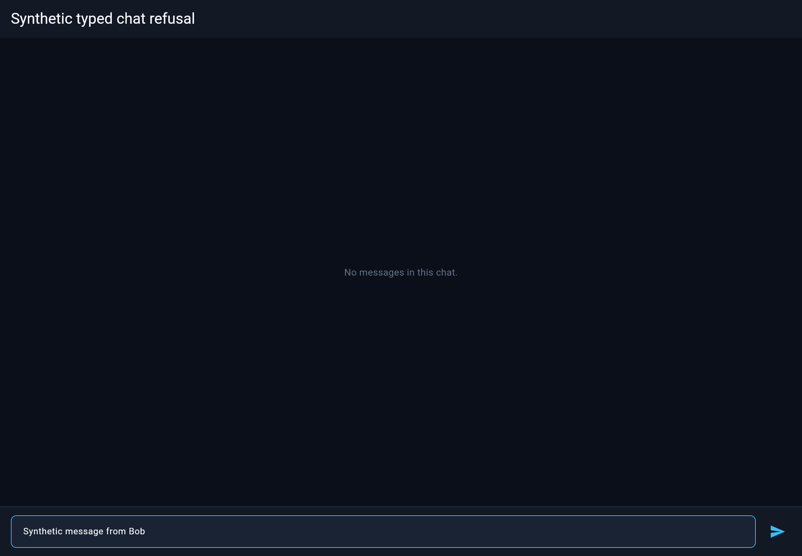
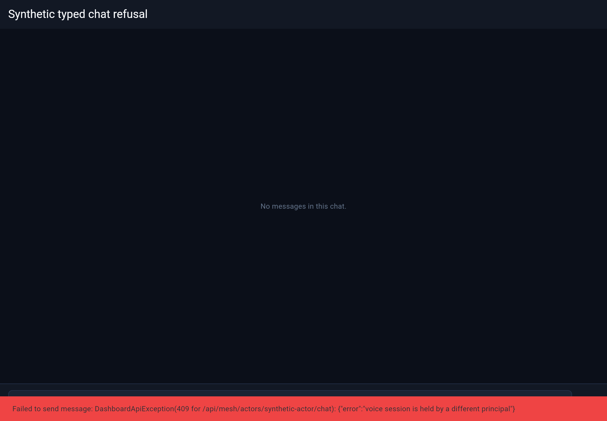
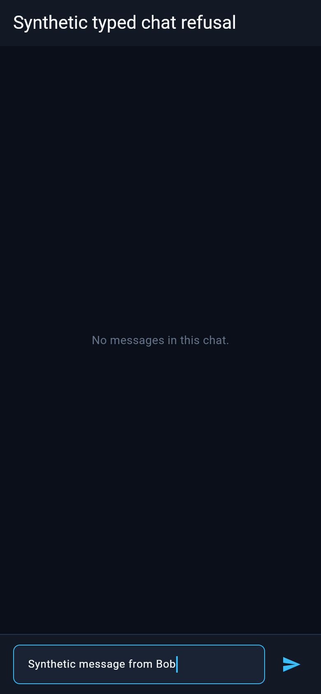
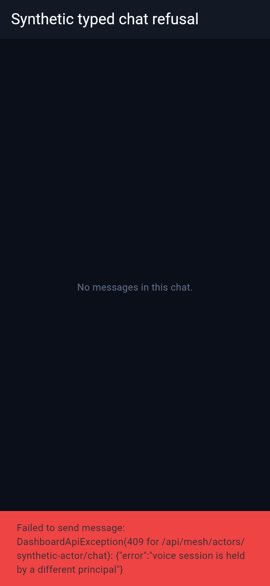

# Synthetic typed chat refusal

Product source: `c47e089c2b7ac1acd0963a0fc228fea742bb994a`. Flutter tree: `92062cdb6df8b2ab1cd7e0103031a87bf065d4aa`. No Flutter product edits.

The existing ChatTab, DashboardStore and DashboardApiException path receives the synthetic 409 response from FakeApi after the send button is clicked. This captures the caller-visible refusal with the draft retained. It supplements the authenticated HTTP → real ActorMesh → actual MCP reply regression; these screenshots do not exercise server authorization. All displayed content is synthetic.

| Viewport (CSS px, DPR 2) | Before send | Refused |
| --- | --- | --- |
| 1180 × 820 |  |  |
| 390 × 844 |  |  |

All four PNGs were visually inspected. The narrow snackbar wraps the complete refusal. The existing snackbar temporarily overlays the composer; the browser confirms the draft remains `Synthetic message from Bob`. The capture helper waits for the actual snackbar text and settled frames. It serves the installed local CanvasKit and a local SDK Roboto font, with external requests blocked.

Build: copy `refusal_web_capture.dart` temporarily into `flutter_dashboard/test/`, then `flutter build web --target=test/refusal_web_capture.dart --output=<private-evidence>/597-refusal-web --no-wasm-dry-run`. Copy the SDK `Roboto-Regular.ttf` to generated `assets/fonts/Roboto-Regular.ttf`; execute `node browser-capture.cjs` with Playwright installed and the sibling evidence paths shown in the helper. Remove the temporary Flutter harness after build. Build and final capture both exited 0; failed helper attempts were retained privately.

`source-pins.json` pins actual product sources, and `SHA256SUMS` pins these public assets. Technical review, Matt appearance approval, root rollout, PR3 copy-loss acceptance and landing gates remain.
