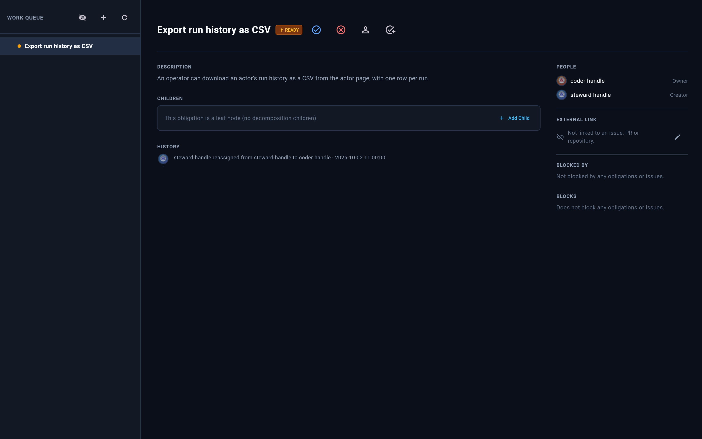
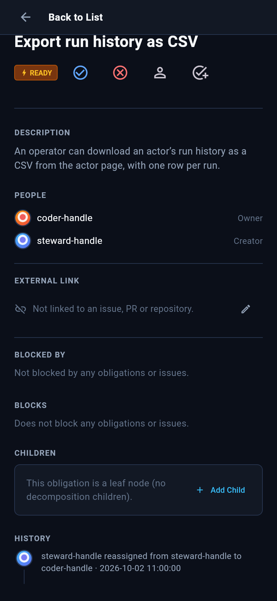
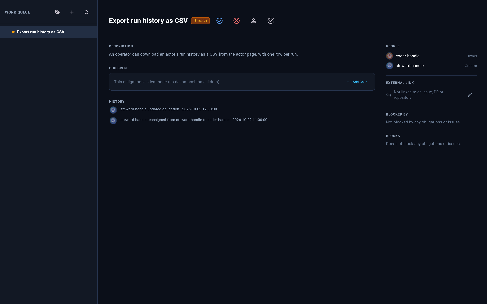
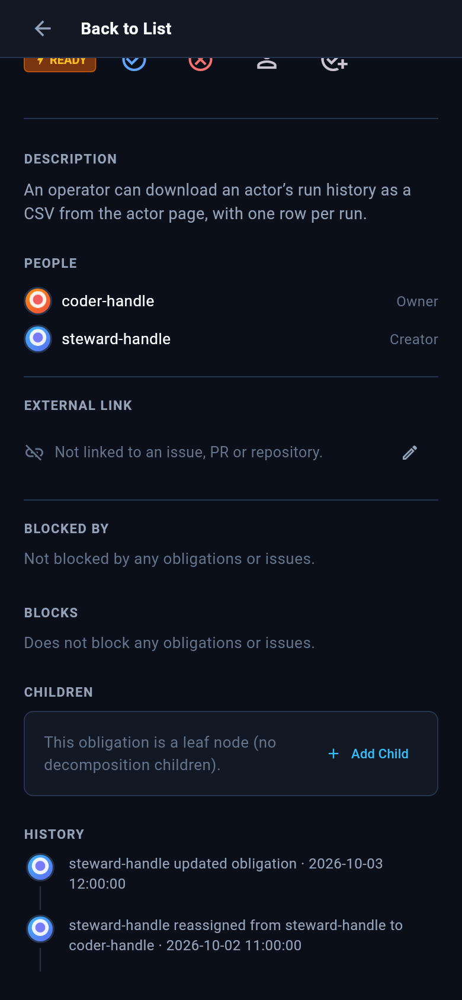

# #903 responsive-mark history: appearance evidence

Evidence for PR #943 at product head `44261ee23c4b445936df62be2ba35c8faa4af682`. This branch only hosts the evidence; it is not for merge.

These are real `WorkTab` obligation-detail renders, made with the repo's own screenshot support (`test/screenshot_support.dart`, fake API, bundled fonts), using synthetic data only. `capture_test.dart.txt` is the harness. Copy it into `packages/rusa/flutter_dashboard/test/` and run `flutter test --dart-define=PHASE=before|after <file>`.

The obligation is the same responsive, ready obligation in both phases:

- **before** (staging): marking it responsive writes no history row, so the trail shows only the earlier reassignment.
- **after** (#943): the mark appends one `responsive` history row. The unchanged Flutter `_historyLabel` has no case for this kind, so it renders through the generic fallback as "‹actor› updated obligation".

PR #943 changes no Flutter source.

| | wide (1600×1000) | narrow (390×844, scrolled to History) |
|---|---|---|
| before |  |  |
| after |  |  |

SHA256:
```
76d421d9c2175e2d32c78f8183262ec9802232f52f2570ff6365a4a2a30b7036  responsive_history_before_wide.png
409a62d262791e43c43c39e9a5de01e4aa3ca28b28b95ffde81c7dbdb624ef1e  responsive_history_before_narrow.png
71605c566ebd0ef215c7a9a2e9d8c5c67ac4627806279d99ea6317e07f58aeec  responsive_history_after_wide.png
d006bf4a489202349e47789e040ce47a7ae4f2b10de5e67e958a3615d3f9bf43  responsive_history_after_narrow.png
```
